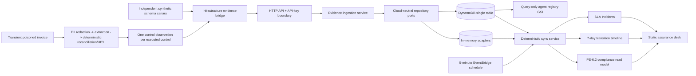

# ProofLoop

ProofLoop is an AWS-deployable implementation of **PS-6.2:
Runtime-to-Compliance Bridge**. It continuously reconciles runtime control
evidence into an agent compliance record, while refusing to show GREEN unless
every required control has fresh, correlated PASS evidence.

**Current status (2026-09-07):** The source is publicly available at
<https://github.com/sri-sruthi/proofloop>. The controlled-development AWS
deployment has been torn down, so there is currently no live API or hosted
dashboard. Before teardown, the deployment was verified end to end in
`ap-south-1`: HTTPS dashboard access, API-key rejection, one real Amazon
Bedrock Converse structured-output extraction, DynamoDB evidence persistence,
deterministic reconciliation, GREEN assurance, and scheduled EventBridge runs.

The repository retains the reproducible SAM and CloudFront/S3 infrastructure,
tests, offline demos and deployment/teardown instructions. The latest recorded
gate ran 414 tests with Python 3.12/3.13 CI, mypy, Ruff, Bandit and SAM
validation/build passing. Historical deployment evidence is not a claim that a
live service or production environment exists today.

## What the slice proves

- The compliance record exposes the assignment fields:
  `guardrails_active`, `last_violation_timestamp`,
  `pii_redaction_enabled`, `audit_logging_enabled`, `hitl_configured`, and
  `overall_compliance_status`, plus boundary identity, reasons, evidence
  references, evaluation time, control detail, and next safe action.
- Fresh PASS evidence produces GREEN. Quiet/stale evidence around 24 hours
  produces AMBER. Missing evidence never invents RED.
- A reserved synthetic canary with `synthetic=true` and
  `side_effects_absent=true` injects an explicit current FAIL at simulated hour
  48, producing RED with a supporting evidence reference. Canary evidence
  without those attestations is rejected.
- Re-enabling configuration alone returns AMBER; only fresh post-remediation
  PASS evidence can recover GREEN.
- Status transitions are append-only, queryable over seven days, and not
  duplicated by an identical repeat sync.
- Sustained AMBER/RED can create one deterministic incident; GREEN resolves it
  only with evidence references.
- Telemetry ingestion is boundary-validated and idempotent. Conflicting source
  event or evidence-reference reuse returns a safe conflict and retains a
  quarantine marker, so the next sync is AMBER rather than preserving GREEN.
  Evidence attributes are approved booleans only; free text, PII-shaped
  references, and raw invoice fields are rejected before persistence.
- The invoice workflow redacts email, phone, and account-like values before the
  model provider receives the untrusted channel. Prompt injection remains data;
  strict extraction validation, deterministic reconciliation/policy, and the
  HITL boundary retain authority. There is no payment tool.
- Each `ControlObservation` maps to exactly one runtime requirement. Extraction
  schema evidence and its synthetic no-side-effect canary are separate
  obligations, so runtime schema PASS is never mislabeled as canary proof.
- `POST /v1/agents/{agent_id}/runs/invoice` runs the workflow transiently,
  emits privacy-bounded evidence, synchronizes assurance, and returns only a
  bounded summary, usage counts, safe action, evidence receipts, and compliance.

## Architecture



The dependency direction is deliberate:

```text
domain <- application <- api-neutral invoice-run contract
                     <- infrastructure bridge -> agents
                     <- infrastructure memory / DynamoDB / Lambda / Bedrock adapter
```

The domain and application contracts import no AWS SDK. `boto3` is loaded only
inside the AWS composition root, and Lambda supplies it at runtime. Neither the
domain nor application imports `proofloop.agents`; the API receives the bridge
through dependency injection.

## Run the deterministic demo

No API key, network, cloud account, or waiting is required:

```bash
python scripts/demo_proofloop.py
```

Expected path:

```text
GREEN -> AMBER -> RED -> AMBER -> GREEN
```

The script advances an injected clock by 48 hours in milliseconds, prints each
customer-readable reason and next action, then prints the seven-day timeline and
resolved incident.

Run the fully integrated, offline agent demonstration:

```bash
python scripts/demo_agent_to_compliance.py
```

It demonstrates redaction before the fake provider, inert prompt injection,
duplicate/HITL routing, evidence-to-GREEN, exact replay, conflict AMBER,
malformed-model and tool failures, safe-canary RED, remediation-only AMBER,
fresh post-repair GREEN, bounded token/call accounting, timeline/incidents, and
the absence of a payment tool. It prints no invoice or PII content.

## Run the invoice workflow through live MCP tools

The MCP integration is an optional extra (it is not a Lambda runtime
dependency), so install it first:

```bash
python -m pip install -e ".[mcp]"
```

Then launch the MCP tool server as a subprocess and run the real invoice
workflow through it over the Model Context Protocol (offline fake model for
extraction; every reconciliation tool call travels over MCP):

```bash
python scripts/demo_mcp_invoice.py
```

The MCP tool server can also be launched standalone (it speaks MCP over
stdin/stdout, e.g. for an MCP host such as Claude Desktop):

```bash
python -m proofloop.agents.mcp.server
```

## Run the local API and dashboard

The supported Python range is `>=3.12,<3.14`. Install the project and development
tools in a virtual environment if they are not already available:

```bash
python -m venv .venv
source .venv/bin/activate
python -m pip install -e ".[dev]"
```

Set a local key in the current shell and start the API:

```bash
export PROOFLOOP_API_KEY="choose-a-local-development-key"
python -m proofloop.api.server
```

In another terminal, run one synthetic invoice through the integrated route so
the read-only dashboard has runtime evidence to display:

```bash
curl -sS -X POST \
  "http://127.0.0.1:8080/v1/agents/invoice-agent/runs/invoice?tenant_id=proofloop-demo&environment=LOCAL&assurance_boundary_id=proofloop-demo-local-invoices" \
  -H "X-API-Key: $PROOFLOOP_API_KEY" \
  -H "Content-Type: application/json" \
  --data '{"document_id":"synthetic-local-1","content_type":"TEXT_PLAIN","source_system":"local-demo","received_at":"2026-07-18T09:00:00Z","invoice_content":"Synthetic Acme Supplies invoice INV-9 for PO-1, total 105 USD."}'
```

Serve the static dashboard in a second terminal:

```bash
python -m http.server 8000 --directory dashboard
```

Open `http://localhost:8000`, enter the same API key, and use the prefilled demo
identity. The key is retained only in the browser tab's `sessionStorage`.

The API contract is generated at `GET /openapi.json`. Required routes are:

```text
GET  /healthz                                  (public)
POST /v1/evidence                              (API key)
POST /v1/agents/{agent_id}/sync                (API key)
POST /v1/agents/{agent_id}/runs/invoice        (API key; transient content)
GET  /v1/agents/{agent_id}/compliance          (API key)
GET  /v1/agents/{agent_id}/timeline            (API key)
GET  /v1/agents/{agent_id}/incidents           (API key)
```

Every response includes `X-Request-ID` and `X-Trace-ID`. Expected failures use a
stable envelope such as:

```json
{
  "error": {
    "code": "EVIDENCE_CONFLICT",
    "message": "The source event identifier was already used for different evidence.",
    "request_id": "request-...",
    "trace_id": "trace-..."
  }
}
```

## Verify locally

```bash
python -m pytest -q
python -m mypy src/proofloop tests
python -m compileall -q src tests scripts infra/scripts
python scripts/demo_proofloop.py
python scripts/demo_agent_to_compliance.py
python infra/scripts/validate_template.py
node --check dashboard/app.js
```

The latest recorded CI gate used CPython 3.13.7 and pytest 9.1.1 locally
with 414 tests, plus mypy, Ruff, Bandit, strict project dependency audit,
compile/import, both demos, template validation and dashboard syntax passing.
GitHub Actions runs passed on Python 3.12.13 (x64) and native
ARM64 Python 3.13.14, both running the full 414-test suite. SAM CLI 1.163.0 strictly validated
the template and built both Lambda artifacts locally and on the ARM64 Linux
job, and both built handlers imported successfully. The isolated SAM CLI itself
currently pins a vulnerable Click 8.1.8; see the final G1.6 handoff. Docker
build is not claimed; native ARM64 CI provides target-architecture evidence.

## AWS SAM package

The current SAM template packages two ARM64 Python 3.13 Lambdas, one HTTP API,
one PAY_PER_REQUEST DynamoDB table with TTL, a five-minute EventBridge schedule,
a query-only agent registry GSI, bounded EventBridge/Lambda retries with two SQS
failure destinations, model-ID/ARN/region/limit parameters, a single
model-ARN-scoped `bedrock:InvokeModel` grant for the API Lambda, and 30-day
structured log groups. It now requires an exact non-wildcard `AllowedOrigin`,
requires an alarm-notification email, creates a stack-managed SNS topic/email
subscription, and defines ten five-minute development alarms. The schedule
parameter defaults to disabled and is enabled only by a reviewed stack update
after smoke checks. The evidence table deletes with the stack but is retained if an
update replaces it, which trades intentional development teardown for possible
orphan-storage cost during replacement. The scheduled function refreshes the
model-free schema canary before sync; SDK retries are disabled so hidden client
attempts cannot bypass the agent call cap. The backend stack itself creates no
hosted dashboard, NAT Gateway, OpenSearch, EKS, ECS, or always-on compute — the
dashboard is a separate, optional CloudFormation stack (`infra/web-template.yaml`,
see below).

The template passed the Python 3.12/3.13 CI/SAM gate and the
reviewed CloudFormation updates were executed through the deployment role. The
schedule parameter is explicitly represented by an `AWS::Events::Rule` `State`,
so a future reviewed update can reliably enable or disable it.

Build/validate without creating resources:

```bash
python infra/scripts/validate_template.py
sam validate --template-file infra/template.yaml
sam build -t infra/template.yaml
```

Full deployment and deletion commands, exact parameters, and the IAM
identity/role chain used are documented in
[`infra/README.md`](infra/README.md). Deploying to your own AWS account
requires your own approved parameters (API key, alarm email, Bedrock
model/ARN, allowed origin) — never reuse the values in this repository.

## Deploy the hosted dashboard

The dashboard is a separate, optional stack: a private, encrypted S3 bucket
served only through CloudFront (Origin Access Control, no public bucket
access), with a strict Content-Security-Policy response-headers policy and a
no-cache runtime-config path that carries only the public API base URL —
never a secret.

```bash
infra/scripts/deploy_dashboard.sh \
  --api-base-url https://<your-backend-api-id>.execute-api.<region>.amazonaws.com \
  --profile <your-deployment-profile> --region <your-region> \
  --stack-name proofloop-dashboard-dev
```

The script validates the template, deploys the CloudFormation stack, renders
`runtime-config.js` with your exact backend URL, syncs the dashboard assets to
the private bucket, and invalidates the CloudFront cache. The command prints
the resulting `DashboardUrl`. After deploying the dashboard, update the
backend's `AllowedOrigin` parameter to that exact HTTPS origin (never a
wildcard) with a reviewed stack update.

## Teardown

```bash
infra/scripts/delete_dashboard.sh --profile <your-profile> --region <your-region>
sam delete --stack-name <your-backend-stack-name>
```

Deleting the backend stack deletes the DynamoDB evidence table's live data
(its `DeletionPolicy` is `Delete`, by design for a controlled-development
environment). Deleting the dashboard stack empties and removes its S3 bucket
first, then the CloudFormation stack.

## Cost

The entire stack is pay-per-use serverless: on-demand DynamoDB, per-invocation
Lambda, and a per-request-capped Bedrock call (hard call and output-token
caps). The reconciliation schedule never invokes Bedrock. The only material
fixed monthly cost is the ten CloudWatch alarms (roughly USD 0.10 each at
standard public rates). There is no reserved capacity, always-on compute, or
NAT/VPC cost.

## Current limitations

- No AWS resources are currently running; deploy the documented stacks in your
  own account to reproduce the former live environment.
- API-key authentication and the regex PII redactor are controlled-demo
  boundaries, not enterprise identity or comprehensive DLP.
- The included MCP integration is local; the AWS Lambda deployment uses the
  in-memory business adapters and is not connected to a production finance system.
- The real Bedrock smoke proved integration, not production-scale accuracy,
  throughput, concurrency or resilience.
