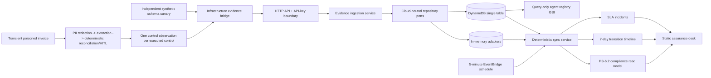

# ProofLoop

ProofLoop is a locally working, AWS-packageable implementation of **PS-6.2:
Runtime-to-Compliance Bridge**. It continuously reconciles runtime control
evidence into an agent compliance record, while refusing to show GREEN unless
every required control has fresh, correlated PASS evidence.

**Current status (2026-07-18):** domain, application spine, corrected invoice
agents, and the agent-to-assurance integration are implemented. The clean local
Python 3.13 gate, private GitHub Actions matrix on Python 3.12 and native ARM64
Python 3.13, and local/CI SAM validation and build all pass. The Bedrock path is
stub-client tested and SAM-packaged, but no real model or AWS resource was
invoked. **Not deployed and not claimed production-ready.** Three accepted
infrastructure blockers identified in G1.5 are implemented in Track G1.6:
explicit allowed-origin injection, an initially disabled schedule activation
control, and ten essential operational alarms routed to a stack-managed SNS
topic. The changed package still requires the complete local/private-CI gate
before any AWS preflight or non-executed change set.

## What the slice proves

- The compliance record exposes the assignment fields:
  `guardrails_active`, `last_violation_timestamp`,
  `pii_redaction_enabled`, `audit_logging_enabled`, `hitl_configured`, and
  `overall_compliance_status`, plus boundary identity, reasons, evidence
  references, evaluation time, control detail, and next safe action.
- Fresh PASS evidence produces GREEN. Quiet/stale evidence around 24 hours
  produces AMBER. Missing evidence never invents RED.
- A reserved synthetic canary with `synthetic=true` and
  `side_effects_absent=true` injects an explicit current FAIL at simulated hour
  48, producing RED with a supporting evidence reference. Canary evidence
  without those attestations is rejected.
- Re-enabling configuration alone returns AMBER; only fresh post-remediation
  PASS evidence can recover GREEN.
- Status transitions are append-only, queryable over seven days, and not
  duplicated by an identical repeat sync.
- Sustained AMBER/RED can create one deterministic incident; GREEN resolves it
  only with evidence references.
- Telemetry ingestion is boundary-validated and idempotent. Conflicting source
  event or evidence-reference reuse returns a safe conflict and retains a
  quarantine marker, so the next sync is AMBER rather than preserving GREEN.
  Evidence attributes are approved booleans only; free text, PII-shaped
  references, and raw invoice fields are rejected before persistence.
- The invoice workflow redacts email, phone, and account-like values before the
  model provider receives the untrusted channel. Prompt injection remains data;
  strict extraction validation, deterministic reconciliation/policy, and the
  HITL boundary retain authority. There is no payment tool.
- Each `ControlObservation` maps to exactly one runtime requirement. Extraction
  schema evidence and its synthetic no-side-effect canary are separate
  obligations, so runtime schema PASS is never mislabeled as canary proof.
- `POST /v1/agents/{agent_id}/runs/invoice` runs the workflow transiently,
  emits privacy-bounded evidence, synchronizes assurance, and returns only a
  bounded summary, usage counts, safe action, evidence receipts, and compliance.

## Architecture



The dependency direction is deliberate:

```text
domain <- application <- api-neutral invoice-run contract
                     <- infrastructure bridge -> agents
                     <- infrastructure memory / DynamoDB / Lambda / Bedrock adapter
```

The domain and application contracts import no AWS SDK. `boto3` is loaded only
inside the AWS composition root, and Lambda supplies it at runtime. Neither the
domain nor application imports `proofloop.agents`; the API receives the bridge
through dependency injection.

## Run the deterministic demo

No API key, network, cloud account, or waiting is required:

```bash
python scripts/demo_proofloop.py
```

Expected path:

```text
GREEN -> AMBER -> RED -> AMBER -> GREEN
```

The script advances an injected clock by 48 hours in milliseconds, prints each
customer-readable reason and next action, then prints the seven-day timeline and
resolved incident.

Run the fully integrated, offline agent demonstration:

```bash
python scripts/demo_agent_to_compliance.py
```

It demonstrates redaction before the fake provider, inert prompt injection,
duplicate/HITL routing, evidence-to-GREEN, exact replay, conflict AMBER,
malformed-model and tool failures, safe-canary RED, remediation-only AMBER,
fresh post-repair GREEN, bounded token/call accounting, timeline/incidents, and
the absence of a payment tool. It prints no invoice or PII content.

## Run the local API and dashboard

The supported Python range is `>=3.12,<3.14`. Install the project and development
tools in a virtual environment if they are not already available:

```bash
python -m venv .venv
source .venv/bin/activate
python -m pip install -e ".[dev]"
```

Set a local key in the current shell and start the API:

```bash
export PROOFLOOP_API_KEY="choose-a-local-development-key"
python -m proofloop.api.server
```

In another terminal, run one synthetic invoice through the integrated route so
the read-only dashboard has runtime evidence to display:

```bash
curl -sS -X POST \
  "http://127.0.0.1:8080/v1/agents/invoice-agent/runs/invoice?tenant_id=proofloop-demo&environment=LOCAL&assurance_boundary_id=proofloop-demo-local-invoices" \
  -H "X-API-Key: $PROOFLOOP_API_KEY" \
  -H "Content-Type: application/json" \
  --data '{"document_id":"synthetic-local-1","content_type":"TEXT_PLAIN","source_system":"local-demo","received_at":"2026-07-18T09:00:00Z","invoice_content":"Synthetic Acme Supplies invoice INV-9 for PO-1, total 105 USD."}'
```

Serve the static dashboard in a second terminal:

```bash
python -m http.server 8000 --directory dashboard
```

Open `http://localhost:8000`, enter the same API key, and use the prefilled demo
identity. The key is retained only in the browser tab's `sessionStorage`.

The API contract is generated at `GET /openapi.json`. Required routes are:

```text
GET  /healthz                                  (public)
POST /v1/evidence                              (API key)
POST /v1/agents/{agent_id}/sync                (API key)
POST /v1/agents/{agent_id}/runs/invoice        (API key; transient content)
GET  /v1/agents/{agent_id}/compliance          (API key)
GET  /v1/agents/{agent_id}/timeline            (API key)
GET  /v1/agents/{agent_id}/incidents           (API key)
```

Every response includes `X-Request-ID` and `X-Trace-ID`. Expected failures use a
stable envelope such as:

```json
{
  "error": {
    "code": "EVIDENCE_CONFLICT",
    "message": "The source event identifier was already used for different evidence.",
    "request_id": "request-...",
    "trace_id": "trace-..."
  }
}
```

## Verify locally

```bash
python -m pytest -q
python -m mypy src/proofloop tests
python -m compileall -q src tests scripts infra/scripts
python scripts/demo_proofloop.py
python scripts/demo_agent_to_compliance.py
python infra/scripts/validate_template.py
node --check dashboard/app.js
```

Track F2 evidence records CPython 3.13.7 and pytest 9.1.1 locally with 266 tests,
plus mypy, Ruff, Bandit, strict dependency audit, compile/import, both demos,
template validation and dashboard syntax passing. Private GitHub Actions run
`29640732187` passed on Python 3.12.13 and native ARM64 Python 3.13.14. SAM CLI
1.163.0 validated and built both Lambda artifacts locally and on the ARM64
Linux job, and both built handlers imported successfully. The attempted local
Docker build is not claimed as passing; the native ARM64 CI build provides the
target-architecture packaging evidence.

## AWS SAM package

The current SAM template packages two ARM64 Python 3.13 Lambdas, one HTTP API,
one PAY_PER_REQUEST DynamoDB table with TTL, a five-minute EventBridge schedule,
a query-only agent registry GSI, bounded EventBridge/Lambda retries with two SQS
failure destinations, model-ID/ARN/region/limit parameters, a single
model-ARN-scoped `bedrock:InvokeModel` grant for the API Lambda, and 30-day
structured log groups. It now requires an exact non-wildcard `AllowedOrigin`,
requires an alarm-notification email, creates a stack-managed SNS topic/email
subscription, and defines ten five-minute development alarms. The schedule is
disabled by default and may be enabled only by a reviewed stack update after
smoke checks. The evidence table deletes with the stack but is retained if an
update replaces it, which trades intentional development teardown for possible
orphan-storage cost during replacement. The scheduled function refreshes the
model-free schema canary before sync; SDK retries are disabled so hidden client
attempts cannot bypass the agent call cap. It creates no hosted dashboard, NAT
Gateway, OpenSearch, EKS, ECS, or always-on compute. See
[`codex/handovers/FINAL_AWS_EXECUTION_READINESS_REVIEW.md`](codex/handovers/FINAL_AWS_EXECUTION_READINESS_REVIEW.md).

Do not create a change set until the changed template has passed the complete
local and private Python 3.12/3.13 CI/SAM gate and G2 is separately authorized.

Build/validate without creating resources:

```bash
python infra/scripts/validate_template.py
sam validate --template-file infra/template.yaml
sam build -t infra/template.yaml
```

Deployment and deletion commands are documented in
[`infra/README.md`](infra/README.md). **Do not run `sam deploy` until the product
owner explicitly authorizes DEPLOY.**

## Important limitations

- API-key authentication is intentionally minimal and is not a replacement for
  production IAM, identity/authorization, rotation, throttling, or per-role
  policy. It is a controlled development/demo boundary only.
- DynamoDB behavior is contract-tested with a deterministic transactional table
  fake; evidence/idempotency and compliance/timeline/incident mutations use
  optimistic transactions. A per-agent monotonic aggregate revision orders
  same-timestamp transitions and participates in the atomic state commit. These
  paths have not been verified against a deployed table under throttling,
  transaction cancellation, or high concurrency.
- Registry discovery is a paginated GSI query rather than a full-table scan.
  Per-agent reconciliation still reads that agent's retained eight-day evidence
  prefix, so production needs quotas/backpressure and load-tested volume limits.
- The local WSGI server is for demonstration, not production traffic.
- The dashboard is static, does not mutate compliance state, and is not hosted
  by the SAM stack. The controlled deployment plan uses no hosted dashboard for
  backend smoke and then serves it locally for the assignment demo.
- No raw or redacted invoice, prompt, model output, tool payload, observation
  reason, PII finding, or PII count is persisted or returned; evidence retains
  opaque references and approved booleans only.
- The deterministic in-memory business tools are demonstration adapters. There
  is no MCP runtime and no production finance-system integration.
- FakeModelProvider and an injected Bedrock stub client are tested. No real
  Bedrock request or model-accuracy evaluation has been executed.
- Bedrock composition creates a fresh provider adapter per request so transient
  diagnostic request data is not retained by the warm application.
- The bounded regex redactor covers a demo subset of PII formats and is not a
  complete production DLP system.
- Evidence re-emission and human-review writes are idempotent, but the invoice
  endpoint does not yet expose a caller run key for deduplicating command retries.
- No cloud resource was created, no deployment was run, and no production-ready
  claim is made.

See [`docs/PROOFLOOP_BUILD_AND_INTERVIEW_GUIDE.md`](docs/PROOFLOOP_BUILD_AND_INTERVIEW_GUIDE.md)
for architecture decisions, beginner explanations, interview answers, test
evidence, demo narration, and production risks.
