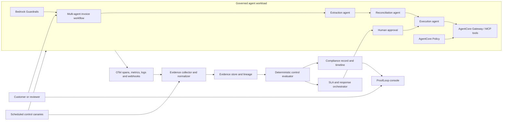
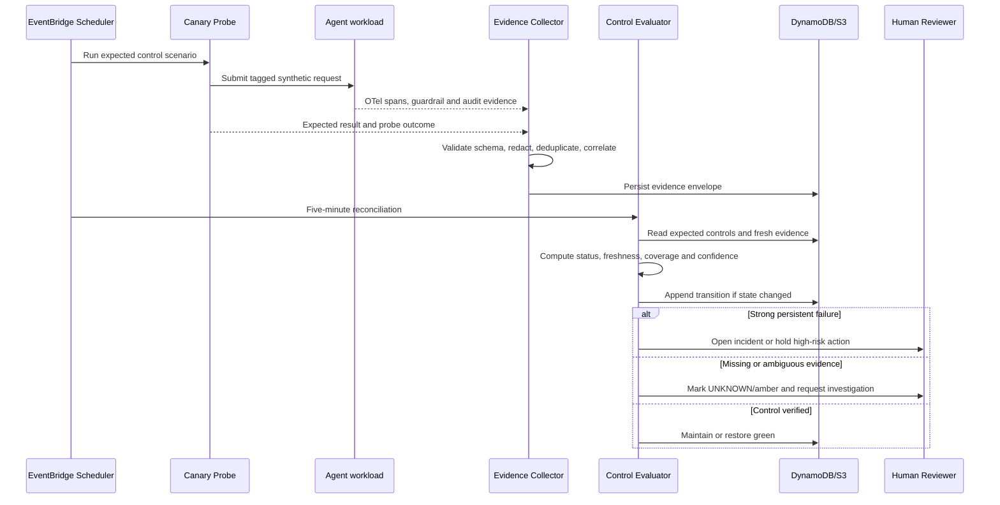
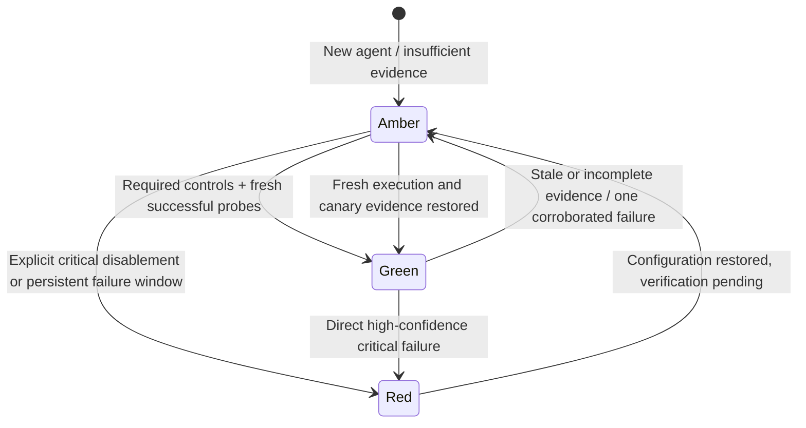

# Alternative Problem Selection: PS-6.2 ProofLoop

**Research date:** 2026-07-16  
**Status:** Research and design proposal only; no implementation has been started  
**Original problem statement:** PS-6.2 — Runtime-to-Compliance Bridge  
**Product framing:** **ProofLoop — continuous runtime evidence and active control assurance for AI agents**  
**Relationship to the earlier recommendation:** Separate alternative to PS-5.1 AegisFlow; the existing AegisFlow research remains unchanged

## Executive decision

Yes—there is one other problem statement I would seriously consider, and after incorporating the user's lack of interest in cybersecurity, it may be the better personal choice:

> **Choose PS-6.2 and build ProofLoop: a customer-deployed system that continuously proves whether an AI agent's controls are actually working in production.**

This is not a second-best “easy compliance dashboard.” It is a Day-2 AI assurance product that turns live OpenTelemetry, Amazon Bedrock AgentCore, CloudWatch, guardrail, audit and human-oversight signals into an evidence-backed compliance state.

The assignment's basic version checks whether fields such as `guardrails_active`, `pii_redaction_enabled`, `audit_logging_enabled` and `hitl_configured` are green, amber or red. ProofLoop should go further in six defensible ways:

1. **Active control canaries:** scheduled probes exercise the actual guardrail, redaction, audit and HITL paths instead of trusting configuration alone.
2. **No false green:** evidence has freshness, coverage and confidence; missing or stale telemetry is explicitly `UNKNOWN` and maps to amber, never green.
3. **Traffic-aware silence detection:** zero violations is not evidence of failure when the agent had zero relevant traffic.
4. **Versioned evidence lineage:** every claim points to the agent, prompt, model, tool graph, policy version, deployment version and source event that supports it.
5. **Replayable compliance:** historical telemetry can be replayed through a proposed ruleset to show which status decisions would change before rollout.
6. **Customer-controlled response:** automatic actions are proportional, explainable, reversible and configurable; weak signals do not cause a blind kill switch.

This direction is unusually coherent with Aivar's own language: “Day 2 problem of AI, led by Governance & Integration,” “No Black Boxes,” production ownership, AWS depth and continuous monitoring. It is also less security-centric than PS-5.1 while still displaying agentic AI, multi-agent workflows, MCP, APIs, cloud architecture, observability, evaluation, data science and production ML engineering.

## Final comparison with AegisFlow

Both projects can be excellent. The choice is about the kind of engineer the submission should portray.

| Decision factor | PS-5.1 AegisFlow | PS-6.2 ProofLoop |
|---|---:|---:|
| Direct Aivar/AWS alignment | 9.5/10 | **10/10** |
| Customer-first story | 9.5/10 | **10/10** |
| Current agentic-AI relevance | **10/10** | 9.5/10 |
| Data-science and evaluation fit | 8.5/10 | **9.5/10** |
| Production/Day-2 engineering signal | 9.5/10 | **10/10** |
| Cybersecurity dependence | High | **Low to medium** |
| Market crowding | High for generic WAFs | High for broad governance suites |
| Focused differentiation | Stateful business effects | **Active evidence and canary assurance** |
| Five-to-eight-minute demo clarity | **10/10** | 9/10 |
| Feasible vertical slice | 8/10 | **9/10** |
| Overall fit for this user | 92/100 | **95/100** |

### My recommendation

- If the user is genuinely excited by controlling invoice actions and wants the most dramatic live block/approve demo, retain **AegisFlow**.
- If the user wants the strongest match to Aivar's production-governance identity, her data-science background and a non-cybersecurity role, switch to **ProofLoop**.
- Given everything the user has now clarified, **I would choose ProofLoop**.

This change is not based on ProofLoop being easier. It is based on product-company coherence and the likelihood that the user can explain every design decision with conviction.

## Why PS-6.2 matters now

The industry has largely accepted that pre-deployment tests are insufficient:

- NIST's 2026 report says post-deployment monitoring is necessary to validate real-world reliability, detect unexpected outcomes and understand consequences, while also noting that practices and terminology remain fragmented.
- NIST AI RMF says risk management should be continuous and timely across the lifecycle and explicitly calls for post-deployment monitoring, incident response, recovery and change management.
- The EU AI Act requires post-market monitoring for high-risk systems and systematic collection, documentation and analysis of performance data to evaluate continuous compliance. ProofLoop can support evidence collection; it cannot certify legal compliance.
- Amazon Bedrock AgentCore now provides production sessions, traces, spans, policy metrics and online evaluations in CloudWatch.
- Databricks' 2026 agent report says enterprises using evaluation and governance tools put substantially more AI projects into production; its private guides repeatedly connect production quality with lifecycle evaluation, monitoring and governance.
- ServiceNow, IBM and OneTrust now market live AI assurance and continuous risk scoring. That validates the business need, but also means a generic “sync telemetry into a dashboard” submission will not differentiate.

The opportunity is the gap between **having telemetry** and **being able to prove that a specific customer control is currently operating as intended**.

## Why this is specific to Aivar

Aivar's public positioning provides unusually direct evidence for this problem:

| Aivar signal | ProofLoop response |
|---|---|
| “Let's solve the Day 2 problem of AI, led by Governance & Integration.” | ProofLoop exists entirely after deployment and integrates runtime evidence with governance state. |
| “No Black Boxes” and full auditability | Every status has source evidence, ruleset version, confidence and an inspectable timeline. |
| “Deployed Faster. Governed Tighter. Proven outcomes.” | A reusable control pack can govern new AgentCore workloads quickly while measuring business and assurance outcomes. |
| AWS Advanced Tier and L400 depth | The vertical slice uses AgentCore, CloudWatch, EventBridge, Lambda, SQS, DynamoDB, S3 and IAM deliberately. |
| Customer is the fifth element | Customers select control objectives, freshness, escalation, retention and acceptable automation. |
| Production systems, not POCs | The design includes tenancy, APIs, health, retries, DLQs, IaC, CI/CD, SLOs, replay and failure injection. |
| Reva.ai policy-governance case | ProofLoop complements policy definition by verifying that deployed enforcement still matches intent. |
| Velogent document workflows | A governed multi-agent invoice workflow provides a realistic reference workload. |

ProofLoop could become a reusable Aivar accelerator across Convogent, Velogent and other customer agents. The core evidence schema and control engine stay stable; adapters and control packs change by workload.

## Exact assignment coverage

The original PS-6.2 requirements are preserved.

| Assignment requirement | ProofLoop implementation design |
|---|---|
| Compliance record schema | Stores all required fields plus evidence freshness, coverage, confidence, versions and reason codes. |
| Poll or receive webhooks | Event-driven ingestion is primary; a five-minute reconciliation poll detects missed events. |
| Update every five minutes | EventBridge Scheduler triggers idempotent reconciliation every five minutes. |
| Zero events for 24 hours | Preserved as a policy rule but made traffic-aware and corroborated by active canaries. |
| Green → amber in 24 hours; red in 48 | Implemented with configurable policy windows and a virtual clock for test/demo acceleration. |
| Seven-day timeline | Stores append-only status transitions and renders trigger evidence for at least seven days. |
| Restore green next sync | Restoration requires a fresh successful probe plus telemetry recovery at the next sync. |
| Bonus compliance SLA | Creates an incident, assigns an owner and proposes evidence-linked remediation after the configured SLA. |

### Important design correction to the assignment

“Zero guardrail events for 24 hours” is ambiguous. A healthy guardrail may produce zero violation events because no violations occurred—or because no relevant traffic occurred.

ProofLoop separates four signals:

1. **configuration evidence:** the guardrail is attached and enabled;
2. **execution evidence:** relevant requests traversed the guardrail path;
3. **outcome evidence:** allow, block, redact or review decisions were emitted;
4. **canary evidence:** a known synthetic input produced the expected control outcome.

Only the combination supports a strong claim. This prevents the two most dangerous errors:

- false green: assuming configured means functioning;
- false red: assuming no violations means the control is dead.

## Product promise

For each customer-controlled AI agent, ProofLoop answers:

1. Which controls are expected to be active right now?
2. What fresh runtime evidence proves each control executed?
3. Is the evidence complete enough to support the claim?
4. What changed, when, why and under which deployment/policy version?
5. Which customer workflow is exposed if the control is degraded?
6. What is the smallest safe and reversible response?
7. Has the fix been independently verified before returning to green?

## User and customer personas

| Persona | Primary need | Product decision |
|---|---|---|
| AI/ML engineer | Debug why status changed without searching many consoles | Trace-to-control evidence view with correlation IDs and versions |
| Platform/SRE engineer | Know whether ProofLoop itself is healthy | Ingestion lag, missing spans, DLQ depth, probe health and reconciliation metrics |
| Compliance reviewer | Understand state without reading raw traces | Plain-language control status, evidence links and seven-day timeline |
| Business owner | Know customer impact and service exposure | Workflow/SLA impact, not just a technical severity score |
| Human reviewer | Take proportionate action quickly | Approve, defer, request evidence, hold high-risk actions or restore after verification |
| Customer administrator | Retain ownership and avoid lock-in | Deployment in the customer's AWS account, export API and open evidence schema |

## Reference workload: multi-agent invoice assurance

Multi-agent is included where it adds a real authority boundary, not as decoration.

1. **Extraction agent:** reads an invoice and produces structured fields.
2. **Reconciliation agent:** compares invoice, purchase order, vendor and rate-card evidence.
3. **Execution agent:** may request approval or initiate a mock payment only after prerequisites are satisfied.

The workflow uses Strands Agents on AgentCore Runtime. Tools are exposed through AgentCore Gateway using MCP/OpenAPI adapters. Bedrock Guardrails redacts PII; AgentCore Policy constrains tool calls; human approval gates high-impact actions. Each control emits structured telemetry.

ProofLoop governs this system from the outside. It does not let the agents mark themselves compliant.

## System boundary



## End-to-end runtime workflow



## Proposed architecture and technology stack

### Governed agent workload

| Layer | Choice | Reason |
|---|---|---|
| Agent framework | Strands Agents SDK | AWS-native, current, supports explicit graph and multi-agent patterns |
| Runtime | Amazon Bedrock AgentCore Runtime | Serverless, versioned, session-isolated and framework/model agnostic |
| Model | Low-cost Bedrock model for demo; configurable provider adapter | Runtime choice should not be locked to a subscription or one vendor |
| Tool plane | AgentCore Gateway with MCP/OpenAPI tools | Demonstrates current MCP/API integration while keeping typed contracts |
| Guardrails | Amazon Bedrock Guardrails | Provides a real PII/safety control and traceable outcomes |
| Tool policy | AgentCore Policy in `LOG_ONLY`, then `ACTIVE` for calibrated rules | Demonstrates shadow rollout before enforcement |
| Human review | API-backed approval queue | Meaningful human control for consequential actions |
| Memory | AgentCore short-term session state only where needed | Avoids retaining unnecessary customer data |

### ProofLoop control plane

| Layer | Choice | Reason |
|---|---|---|
| Telemetry standard | OpenTelemetry/ADOT | Portable, vendor-neutral sessions/traces/spans and current GenAI conventions |
| Native signal source | AgentCore Observability and CloudWatch | Real agent, policy and evaluation metrics rather than mocked status |
| Event routing | Amazon EventBridge | Decoupled routing and scheduled reconciliation/probes |
| Buffer and failure isolation | Amazon SQS with DLQ | At-least-once delivery, backpressure and inspectable failures |
| Compute | AWS Lambda | Low idle cost, concurrency and simple event-driven scaling |
| Current state | DynamoDB | Conditional writes, TTL, low operational burden and usable free tier |
| Evidence archive | Versioned Amazon S3 objects | Cheap historical replay and exportable evidence bundles |
| API | API Gateway HTTP API + Lambda/FastAPI adapter | Queryable API, auth, throttling and OpenAPI contract |
| Live updates | API Gateway WebSocket or short polling | Real-time timeline without a continuously running server |
| Front end | React + TypeScript on S3/CloudFront | Reviewer-friendly production UI; no localhost-only submission |
| Authentication | Amazon Cognito or IAM-authenticated demo roles | Separates admin, reviewer and read-only roles |
| Secrets | AWS Secrets Manager/SSM Parameter Store | No secrets in source or CI |
| Encryption | AWS-managed encryption initially; optional customer KMS key | Low-cost default with an enterprise upgrade path |
| IaC | Terraform | Repeatable customer-account deployment and readable resource plan |
| CI/CD | GitHub Actions with AWS OIDC | Short-lived deployment identity; no long-lived AWS key in CI |
| Tests | Pytest, Hypothesis, Locust and Playwright | Logic, invariants, concurrency and UI/API verification |
| Optional AI explanation | Bedrock model generating grounded incident summaries | Improves usability but cannot determine compliance status |

### A deliberate AWS non-choice

Do not make AWS Audit Manager a required dependency. AWS states that Audit Manager entered maintenance mode and new accounts cannot set it up after 2026-04-30. ProofLoop should instead export a neutral evidence bundle and provide optional adapters for existing Audit Manager customers or external GRC systems.

That decision demonstrates current AWS awareness and avoids building the core on a service new reviewers may not be able to enable.

## Canonical evidence model

The core object is not a log line. It is a versioned, normalized evidence envelope.

```json
{
  "evidence_id": "evt_01...",
  "tenant_id": "customer_a",
  "agent_id": "invoice_workflow",
  "control_id": "PII_REDACTION_OUTPUT",
  "source": "bedrock_guardrail",
  "source_event_id": "...",
  "observed_at": "2026-07-16T12:00:00Z",
  "ingested_at": "2026-07-16T12:00:02Z",
  "event_type": "CONTROL_EXECUTION",
  "outcome": "REDACTED",
  "deployment_version": "agent-v7",
  "policy_version": "policy-git-sha",
  "model_id": "provider/model/version",
  "trace_id": "...",
  "session_id": "...",
  "probe_id": null,
  "payload_hash": "sha256:...",
  "schema_version": "1.0",
  "redaction_state": "sanitized"
}
```

### Required domain objects

| Object | Responsibility |
|---|---|
| `AgentControlProfile` | Declares required controls, owners, evidence sources, freshness and response policy |
| `ControlEvidence` | Normalized immutable observation with provenance and versions |
| `ProbeDefinition` | Synthetic input, expected signal path and expected outcome |
| `ProbeRun` | Actual control-canary result and infrastructure health |
| `ComplianceRecord` | Current assignment-required fields plus evidence quality |
| `StatusTransition` | Append-only before/after state, reason, policy and evidence IDs |
| `Incident` | SLA, customer impact, owner, proposed remediation and resolution evidence |
| `EvidenceBundle` | Portable signed manifest of evidence and hashes for audit/export |

## Compliance record design

```json
{
  "agent_id": "invoice_workflow",
  "guardrails_active": true,
  "last_violation_timestamp": "2026-07-16T10:32:00Z",
  "pii_redaction_enabled": true,
  "audit_logging_enabled": true,
  "hitl_configured": true,
  "overall_compliance_status": "AMBER",
  "evidence_state": "UNKNOWN",
  "evidence_freshness_seconds": 842,
  "evidence_coverage": 0.75,
  "confidence": 0.61,
  "reason_codes": ["AUDIT_HEARTBEAT_STALE"],
  "evaluated_at": "2026-07-16T12:05:00Z",
  "ruleset_version": "controls-v3",
  "deployment_version": "agent-v7"
}
```

The assignment permits only green, amber and red for the overall status. ProofLoop adds an evidence state of `UNKNOWN` and maps it to amber with a precise reason. This preserves compatibility without pretending that missing evidence proves either health or failure.

## Deterministic state machine



### Status rules

| Situation | Evidence state | Overall | Response |
|---|---|---|---|
| Config present, relevant traffic observed, probe passes, evidence fresh | Verified | Green | Continue and record |
| No relevant production traffic, but canary passes | Verified with limited production coverage | Green with note | Continue; show coverage |
| No traffic and no fresh canary | Unknown | Amber | Request evidence; do not claim failure |
| Telemetry source or collector is down | Unknown | Amber | Alert platform owner; no false green |
| One canary fails but control config remains enabled | Degraded | Amber | Retry once through independent path; investigate |
| Guardrail explicitly disabled | Failed | Red | Hold configured high-risk actions; incident |
| Failure persists beyond configured 48-hour window | Failed | Red | Escalate under compliance SLA |
| Fix deployed but no successful validation yet | Recovering | Amber | Keep restriction until fresh proof |
| Fix plus successful probe and execution evidence | Verified | Green | Close incident with evidence |

## Active control canaries

This is ProofLoop's clearest innovation.

| Control | Canary | Expected evidence |
|---|---|---|
| PII redaction | Synthetic invoice contains a reserved fake email/account value | Guardrail detects and masks it; sanitized output carries probe ID |
| Audit logging | Tagged no-op tool call | Agent span, policy decision and audit event correlate to one trace |
| HITL | Synthetic invoice exceeds customer approval threshold | Workflow enters review; mutation is not executed before approval |
| Tool policy | Execution agent requests a disallowed mock operation | AgentCore Policy emits deny in active mode or would-deny in shadow mode |
| Model approval | Canary routes through requested model | Actual model/version matches approved profile or emits substitution event |

Synthetic values must be clearly reserved so no probe can trigger a real payment, email or customer mutation. Canary tools point to sandbox/no-op endpoints only.

## Data-science contribution

ProofLoop should not use ML where a deterministic rule is more reliable. Data science belongs in calibration and monitoring.

### Statistical features

- expected control-event counts conditioned on relevant request volume;
- change-point detection for sudden changes in block/redaction/HITL rates;
- robust baselines by agent version and task type;
- telemetry coverage and late-arrival distributions;
- calibrated thresholds for “silence” under sparse traffic;
- confidence intervals and abstention instead of forced binary labels.

### Evaluation dataset

Generate labeled scenarios across:

- healthy control with normal traffic;
- healthy control with zero traffic;
- collector outage;
- guardrail disabled;
- guardrail attached to only one of two paths;
- delayed and out-of-order spans;
- duplicate webhook delivery;
- schema drift;
- failed probe infrastructure;
- control failure followed by partial and full recovery;
- model/prompt/policy version change;
- multi-tenant cross-talk attempt.

### Metrics that matter

| Metric | Why it matters |
|---|---|
| Control-failure recall | ProofLoop must detect real failures |
| False amber/red rate | Excess noise destroys reviewer trust |
| Mean time to detect | Shows operational value |
| Evidence freshness p95 | Measures how current the claim is |
| Evidence coverage | Shows whether all required paths were observed |
| Time in `UNKNOWN` | Prevents hidden observability debt |
| Status-transition accuracy | Compares state machine output with labeled truth |
| Recovery verification time | Measures how fast a proven fix returns to service |
| Compliance debt hours | Time-weighted duration and severity of degraded controls |
| Human review burden | Ensures governance does not become a bottleneck |
| Cost per governed workflow | Connects assurance to unit economics |

LLM-generated incident summaries require separate groundedness and evidence-citation tests. An LLM summary failure must never alter the deterministic state.

## Failure-mode engineering

| Failure mode | Required behavior |
|---|---|
| Duplicate events | Deduplicate by tenant, source and source-event ID; writes are idempotent |
| Out-of-order events | Evaluate by event time with bounded lateness; never rewrite history silently |
| Missing spans | Lower coverage and move to unknown/amber when required evidence is absent |
| Collector crash | SQS retains events; Lambda retry and DLQ preserve inspectability |
| Schema drift | Quarantine unknown versions; alert; never coerce fields into false evidence |
| Source API throttling | Exponential backoff with jitter; retain last-known state but age its freshness |
| Probe timeout | Distinguish probe-infrastructure failure from target-control failure |
| Dashboard/API outage | Evidence ingestion and evaluation continue independently |
| GRC destination outage | Queue outbound sync; core state remains authoritative |
| Evaluator exception | Preserve previous record as stale/unknown; never default to green |
| Bad ruleset deployment | CI validation, replay, shadow comparison and atomic version promotion |
| Region outage | Restore from IaC and S3/DynamoDB backups; document RTO/RPO |
| Excess telemetry cost | Sample ordinary traces, never canaries, critical controls or transition evidence |
| PII in traces | Redact before persistence; store minimal sanitized evidence and hashes |
| Tenant mix-up | Tenant-scoped partition keys, IAM conditions and isolation tests |

## ProofLoop must monitor itself

A compliance monitor that silently stops is worse than no monitor because it creates false assurance.

Required self-observability:

- last successful source read and reconciliation per tenant;
- ingestion lag and late-event rate;
- SQS age of oldest message and DLQ depth;
- accepted, rejected, duplicate and quarantined event counts;
- probe scheduler health and probe execution latency;
- state-evaluation errors;
- API latency/error rate and UI freshness;
- evidence archive failures;
- cost and budget alarms;
- explicit `monitor_health` displayed next to every compliance claim.

## API surface

The API is a first-class deliverable, not a UI implementation detail.

| Method | Endpoint | Purpose |
|---|---|---|
| `POST` | `/v1/evidence` | Authenticated normalized evidence ingestion |
| `POST` | `/v1/webhooks/{source}` | Source-specific adapter endpoint |
| `GET` | `/v1/agents/{id}/compliance` | Current compliance record |
| `GET` | `/v1/agents/{id}/timeline` | Seven-day status and triggering evidence |
| `GET` | `/v1/controls/{id}/evidence` | Evidence lineage and freshness |
| `POST` | `/v1/probes/{id}/run` | Authorized manual canary execution |
| `POST` | `/v1/rulesets/simulate` | Replay historical evidence without enforcement |
| `POST` | `/v1/incidents/{id}/actions` | Approve proportionate customer response |
| `GET` | `/health/live` | Process liveness |
| `GET` | `/health/ready` | Dependencies, queue and evidence readiness |

Every mutation accepts an idempotency key and returns a correlation ID. OpenAPI documentation, error schemas, pagination, tenant authorization, rate limits and versioning are required.

## MCP, RAG, memory and loops: where they belong

### MCP

MCP is justified for the governed workload's tool plane and for read-only inspection tools such as `get_control_status`, `get_evidence_timeline` and `run_safe_probe`. It is not a replacement for the external administration API.

### RAG

RAG is optional and should not be forced into the compliance decision. A small, cited control-library RAG can explain how a customer control maps to NIST AI RMF or the EU AI Act, but the deterministic status engine must operate without it. If time is limited, omit RAG and state why.

### Memory

Conversational memory is not needed in the ProofLoop core. The product needs versioned operational memory: evidence, transitions, incidents and reviewer decisions with retention and provenance. The demonstration agent may use short-term session memory; long-term memory should be opt-in, minimized and customer-controlled.

### Agent loops

The agent workload has explicit limits on steps, retries, tokens, tool calls, elapsed time and cost. ProofLoop's five-minute reconciliation is a deterministic scheduled loop with retry/DLQ controls, not an open-ended LLM loop. A “Ralph loop” is useful for development verification, not a production compliance decision mechanism.

## Production SLO proposal

These are design targets to validate, not claims already achieved.

| SLO | Target |
|---|---:|
| Reconciliation completion | 99.9% of five-minute windows |
| Fresh evidence ingestion | p95 under 60 seconds for event sources |
| Critical direct failure detection | p95 under five minutes |
| Required assignment silence transition | amber by 24 hours; red by 48 hours |
| Compliance API availability | 99.9% during demo/prod-like window |
| Evidence ingestion loss | zero for accepted events under tested failure scenarios |
| Cross-tenant leakage | zero in automated isolation suite |
| False red under zero traffic | zero in labeled test suite |
| Recovery | green only on next reconciliation after successful verification |

The five-minute, 24-hour and 48-hour windows must be represented by a configurable clock. Unit and demo modes can accelerate time while preserving the same transition logic. The video must disclose the accelerated clock rather than pretending to wait 48 hours.

## Security and privacy baseline

This is not a cybersecurity project, but production governance still requires a baseline:

- least-privilege IAM per Lambda and workload component;
- no public evidence buckets or databases;
- encryption in transit and at rest;
- short-lived GitHub OIDC deployment credentials;
- secrets outside code and logs;
- sanitized parameters and data minimization;
- role-separated admin, reviewer and auditor access;
- tenant-aware authorization on every read and write;
- append-only transition records and evidence hashes;
- retention/TTL policies and deletion workflows;
- dependency, secret and IaC scanning in CI.

Do not store hidden model chain-of-thought. Store observable inputs, outputs, tool actions, decisions, versions and concise generated explanations.

## Customer-first decision framework

Every major design decision should be documented in a short record with these questions:

1. What customer outcome or harm does this address?
2. What evidence supports the need?
3. What is the smallest reliable control?
4. What false-positive or workflow burden could it create?
5. Can the customer configure or override it safely?
6. Is the response reversible?
7. How will effectiveness and cost be measured?
8. What data leaves the customer boundary?
9. How will the customer independently verify the claim?

### Customer promises

1. **No unsupported green:** every green status has fresh evidence.
2. **No surprise shutdown:** ambiguous signals request review; only strong configured evidence triggers a hold.
3. **No lock-in:** OTel input, open schemas, exportable evidence and adapters.
4. **No black-box score:** status, confidence and reason codes are inspectable.
5. **No hidden cost:** telemetry volume, model calls and monthly spend are visible and budgeted.
6. **No unsafe probe:** canaries use reserved synthetic data and no-op tools.
7. **No premature recovery:** a fix must be proven before green is restored.

## Market comparison

The project must never claim that continuous AI governance does not exist.

| Existing solution | What it already does | ProofLoop's focused distinction |
|---|---|---|
| ServiceNow AI Control Tower | Discovers AI assets, monitors runtime performance, integrates observability, risk, compliance, identity and workflow response | Lightweight customer-account deployment; active canaries, explicit evidence confidence and replay without requiring ServiceNow CMDB/workflows |
| IBM watsonx.governance | Factsheets, model/agent inventory, evaluations, drift/safety monitoring and GRC integration | Control-execution proof for AgentCore/MCP paths, active verification and neutral evidence bundles rather than a broad governance suite |
| OneTrust Dynamic Risk Scoring | Connects production signals and governance context to dynamic risk and enforcement | Transparent per-control evidence state and deterministic status rules suitable for an inspectable engineering submission |
| AWS AgentCore + CloudWatch | Rich runtime sessions, traces, spans, policy metrics and online evaluations | Converts those signals into portable control claims, canaries, status history, SLA incidents and customer-owned evidence |
| MLflow | Open-source tracing, production evaluation, feedback and model/agent quality monitoring | Uses traces as one source but focuses on whether governance controls executed and remain provable |
| LangSmith/Arize/Datadog class | Agent observability and online evaluation | ProofLoop is not another trace viewer; it binds evidence to governance state and recovery criteria |

### Honest competitive claim

ProofLoop does not surpass IBM or ServiceNow in breadth, integrations or enterprise workflow maturity. It can surpass them in a deliberately narrow evaluation slice:

- how clearly a status is proven;
- how quickly a customer can deploy it to one AWS agent workload;
- how it handles missing evidence without false assurance;
- whether controls are actively exercised rather than merely configured;
- whether historical decisions can be replayed and independently verified;
- whether the customer can operate it at low cost without a broad GRC platform.

That is a credible and defensible comparison.

## Demonstration script for the required video

The first 90 seconds should show outcomes, not slides.

1. Open the deployed dashboard. The invoice workflow is green and each control shows fresh evidence.
2. Submit an invoice containing reserved synthetic PII. Show extraction, reconciliation and HITL/tool traces.
3. Disable PII redaction or route one execution path around it through a controlled failure toggle.
4. Run the canary. Show configuration still appearing enabled while execution/canary evidence fails.
5. Show ProofLoop move to amber, identify the affected path and display the exact evidence gap.
6. Advance the disclosed virtual clock or inject a persisted failure to demonstrate red at the required 48-hour window.
7. Show the configured response: hold only the high-risk execution action, not all read-only agent work.
8. Restore the control. Show red → amber while verification is pending.
9. Run a fresh successful canary and five-minute reconciliation; show amber → green.
10. End with the evidence bundle, API, AWS architecture and measured metrics.

The remaining video can cover architecture, design trade-offs, market differentiation, failure handling and cost.

## Low-cost design

### Cost principles

- Use serverless event-driven components; no always-on EKS, OpenSearch or Kafka for the submission.
- Keep ordinary trace sampling configurable; never sample required canaries or state transitions.
- Use DynamoDB's free-tier-friendly provisioned mode for the demo and S3 for history.
- Keep CloudWatch log retention short for verbose traces and archive only sanitized evidence needed for replay.
- Make the LLM incident summary optional and asynchronous.
- Use a cheap Bedrock model for summaries; deterministic evaluation should make zero LLM calls.
- Tag every resource and install AWS Budget alarms before load tests.
- Provide `terraform destroy` and a post-demo cleanup checklist.

### Current free/low-cost facts

At the research date:

- AWS's current Free Tier gives eligible new customers up to USD 200 in credits; eligibility and account plan matter.
- Lambda includes one million requests and 400,000 GB-seconds per month in its free tier.
- DynamoDB's free tier includes 25 GB and provisioned read/write capacity.
- CloudWatch includes 5 GB of logs-related usage in its free tier, but verbose tracing can become the main cost risk.
- API Gateway includes new-customer free-tier request allowances.
- EventBridge Scheduler has a free-tier allowance.
- AgentCore uses consumption-based pricing and new-customer credits can apply, but model usage is separate.

Do not promise “free.” Use an AWS Pricing Calculator estimate for the chosen region and a hard monthly budget alarm. The realistic submission target is **under USD 10 for a small demo workload**, excluding any credits, and the report should show the actual bill-to-date.

### Subscription boundary

Claude Code and ChatGPT/Codex subscriptions are development tools. They should not be presented as production API credits. The deployed product should use explicit Bedrock/API billing, or run its deterministic core without an LLM when summaries are disabled.

## CI/CD and engineering gates

```mermaid
flowchart LR
    Change["Code, ruleset or IaC change"] --> Static["Format, lint, type and schema checks"]
    Static --> Unit["Unit and property tests"]
    Unit --> Replay["Historical evidence replay"]
    Replay --> Integration["AWS integration and failure-injection tests"]
    Integration --> Plan["Terraform plan + policy checks"]
    Plan --> Dev["Deploy dev via OIDC"]
    Dev --> Canary["Run control canaries and smoke tests"]
    Canary --> Review["Manual environment approval"]
    Review --> ProdLike["Promote immutable artifact"]
```



Required gates:

- Python formatting, linting and type checking;
- JSON Schema/OpenAPI compatibility checks;
- deterministic state-machine and property tests;
- ruleset replay against golden scenarios;
- Terraform formatting, validation and static checks;
- secret and dependency scans;
- container/image scan if container deployment is used;
- integration tests against real AWS development resources;
- load and concurrency tests;
- post-deploy canaries and rollback runbook.

## Test strategy

### Unit and property tests

- no stale evidence can produce green;
- red cannot return directly to green;
- duplicate events cannot create duplicate transitions;
- one tenant's evidence cannot affect another tenant;
- event-time ordering produces deterministic history;
- a critical explicit disablement always produces the configured severity;
- an evaluator error never defaults to green.

### Integration tests

- AgentCore/CloudWatch signal ingestion;
- Bedrock Guardrails PII control and limitations;
- AgentCore Policy `LOG_ONLY` and `ACTIVE` metrics;
- Scheduler retry and SQS DLQ behavior;
- IAM/Cognito role boundaries;
- S3 evidence bundle generation;
- restoration after a disabled control;
- GRC adapter outage without evidence loss.

### Failure-injection tests

- kill the collector Lambda permission;
- delay events beyond one reconciliation window;
- send duplicated and malformed webhooks;
- disable a guardrail on only one tool path;
- make the probe endpoint fail while the control remains healthy;
- deploy a ruleset with a missing field;
- exceed a source API rate limit;
- exhaust the configured telemetry budget.

### Load tests

Test concurrent evidence ingestion, API queries and reconciliation with realistic event sizes. Record throughput, p95 latency, throttles, retries, DLQ behavior and cost. The goal is not an inflated request number; it is predictable degradation and no incorrect status under load.

## Documentation package

The final private ZIP should include:

1. `README.md` with one-command deployment, verification and teardown;
2. problem statement and customer story;
3. architecture and sequence diagrams;
4. threat/privacy model and data classification;
5. API/OpenAPI documentation;
6. evidence and compliance schemas;
7. state-machine and ruleset specification;
8. evaluation plan and results with confusion matrix/latency/cost;
9. failure-mode analysis and runbooks;
10. market comparison with honest boundaries;
11. AWS cost estimate and actual spend;
12. automated deployment scripts/IaC;
13. test commands and captured test report;
14. five-to-eight-minute video beginning with the live demo;
15. PDF write-up covering all assignment submission requirements.

The source must remain private because the assignment explicitly prohibits public sharing.

## Delivery scope

### Must-have vertical slice

- one deployed multi-agent invoice workflow;
- four real controls: guardrail, PII redaction, audit logging and HITL;
- OTel/AgentCore/CloudWatch telemetry ingestion;
- five-minute reconciliation;
- assignment-compatible record and seven-day timeline;
- active canary for at least two controls;
- traffic-aware missing-evidence logic;
- green/amber/red with explicit unknown evidence state;
- compliance SLA incident;
- API, deployed UI, health endpoints, logs, retries and DLQ;
- Terraform and CI/CD;
- automated tests and one controlled failure/recovery demonstration.

### Strong extensions if the vertical slice is stable

- evidence bundle signing/verification;
- proposed-ruleset replay;
- model substitution control evidence;
- MLflow adapter;
- read-only MCP inspection server;
- grounded incident summary;
- multi-account or second-framework adapter.

### Do not add unless required by measured need

- EKS;
- Kafka/Kinesis;
- OpenSearch;
- a broad regulation knowledge base;
- autonomous remediation agents;
- blockchain;
- five or more business agents;
- a second cloud;
- custom model training.

These would increase surface area without strengthening the core claim.

## What would impress senior ex-AWS reviewers

Not the number of AWS logos. The strongest signals are:

1. identifying the false inference in “zero events means inactive”;
2. distinguishing configuration, execution, outcome and canary evidence;
3. using an explicit unknown state to prevent false compliance;
4. handling at-least-once delivery, ordering, idempotency and schema drift;
5. monitoring the monitor itself;
6. choosing serverless components because of the load and budget, not fashion;
7. avoiding Audit Manager after its 2026 availability change;
8. preserving a portable OTel/evidence schema despite the AWS-native deployment;
9. making recovery require proof, not a manual green toggle;
10. showing actual cost, failure-injection results and customer-impact metrics;
11. being candid about competitors and focused differentiation;
12. giving the customer ownership, configurability and exportability.

## Resume coherence

ProofLoop extends rather than contradicts the resume:

| Existing evidence | New signal ProofLoop adds |
|---|---|
| FastAPI and REST APIs | Versioned production control-plane API |
| Streamlit/deployed analytics | React dashboard plus event-driven backend |
| Gemini/Groq fallback logic | Model/version evidence and substitution governance |
| Multi-agent newsletter pipeline | Governed multi-agent workflow with typed authority boundaries |
| Clinical LLM evaluation | Continuous agent/control evaluation with abstention and calibration |
| Domain adaptation and distribution shift | Change-point/drift analysis for runtime evidence |
| Machine-unlearning multi-metric framework | Multi-objective assurance metrics and trade-off reporting |
| W&B/Optuna/evaluation rigor | Reproducible experiments, golden scenarios and threshold calibration |
| Azure cloud workshop | Deep, deployed AWS serverless/IaC/operations experience |

The interview narrative becomes:

> “I had already evaluated models and built multi-agent/API systems. ProofLoop taught me to operate them responsibly: not just to log production, but to prove controls were functioning, handle missing evidence without false assurance, and connect technical state to customer impact.”

## Recommended Coursera Plus course

### Best single course

**Building AI Agent Harnesses with Strands Agents — Amazon Web Services**  
https://www.coursera.org/learn/build-ai-agents

At the research date, the Coursera page showed inclusion with Coursera Plus, a six-hour duration and a July 2026 update. It directly covers:

- the agent loop and harness architecture;
- model providers and tools;
- MCP;
- hooks, plugins, skills and steering;
- context engineering, sessions and memory;
- agents-as-tools, graph workflows and swarms;
- trajectory and multi-turn evaluation;
- cloud deployment and Amazon Bedrock AgentCore.

It is the best single course because it explains the governed workload ProofLoop must observe and the current AWS agent stack the reviewer is likely to recognize.

### Optional second course

**DevOps and AI on AWS: CI/CD for Generative AI Applications**  
https://www.coursera.org/learn/cicd-generative-ai-apps

The page also showed Coursera Plus inclusion. Take it only if time permits; it strengthens CI/CD, reliable automation, deployment, monitoring and observability. It complements rather than replaces the Strands course.

Coursera catalog inclusion can change. Verify the “Included with Coursera Plus” badge while signed in before enrollment.

## How to use Claude Code and Codex on this project

Keep ownership boundaries explicit and never have both tools edit the same files simultaneously.

| Workstream | Primary | Independent check |
|---|---|---|
| Requirements and customer traceability | Codex | Claude reviews omissions |
| AWS/IaC implementation later | Claude Code | Codex reviews failure modes and least privilege |
| State-machine and evidence schemas | Codex | Claude implements only after approval |
| Agent workflow and Strands integration | Claude Code | Codex tests scope and trend relevance |
| Data-science calibration/evaluation | Codex | Claude reviews reproducibility |
| Tests and debugging | Tool that did not write the feature | Original author fixes verified issues |
| Documentation and demo narrative | Codex | Claude checks against running system |

Use separate branches or folders, a shared issue ledger and short handoff notes containing changed files, assumptions, commands run, evidence and remaining risks. Subscriptions help development; they do not remove the need for tests, review or runtime cloud/API budgeting.

## Risks and mitigations

| Risk | Mitigation |
|---|---|
| Looks like a dashboard | Lead with active canaries, unknown state, evidence lineage and replay |
| Too many AWS services | Keep the must-have serverless path; every service must solve a named failure mode |
| Multi-agent feels decorative | Use distinct extraction, reconciliation and execution authority boundaries |
| Compliance claims are legally risky | Say evidence support and framework mapping, never certification or legal advice |
| LLM summary hallucinates | Ground to evidence IDs, evaluate separately and exclude from state decisions |
| False alerts under sparse traffic | Condition silence on relevant volume and synthetic canaries |
| ProofLoop itself fails silently | Self-health and evidence freshness are part of every claim |
| Telemetry becomes expensive | Sampling tiers, short retention, evidence-only archive and AWS budgets |
| Scope grows beyond the deadline | Freeze must-have vertical slice; defer adapters and autonomous remediation |
| Reviewers see IBM/ServiceNow overlap | Compare honestly and demonstrate the focused assurance gap |

## Final answer

PS-6.2 is not merely “also good.” It is the strongest alternative and, for this user, my revised first choice.

Build **ProofLoop** as an active evidence assurance layer around a real multi-agent invoice workflow. The core innovation is not generative text. It is a production guarantee:

> A control is never called healthy because a document or configuration says so. It is healthy only while fresh, attributable runtime evidence proves that it is executing as the customer intended.

That message is difficult, current, deeply AWS/Aivar-aligned, customer-first and defensible under senior engineering scrutiny.

## Approval gate

No implementation or detailed code plan should begin until the user chooses between:

1. **ProofLoop / PS-6.2 — recommended for the best overall fit**, or
2. **AegisFlow / PS-5.1 — retain if the WAF scenario is the one the user most wants to build and explain**.

The companion source register contains the exact market, AWS, standards, Databricks, cost and course sources used for this recommendation.
