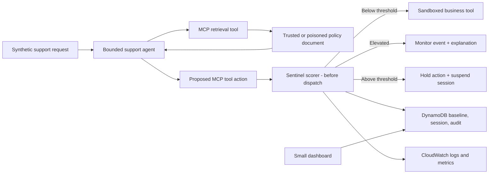

# Resume-Aligned Problem Statement Research and Final Decision

**Candidate:** Sri Sruthi M N  
**Decision date:** 2026-07-13  
**Submission target:** Saturday night, 2026-07-18, ahead of the Sunday deadline and TCS test  
**Purpose:** Re-evaluate all 25 Aivar problem statements against the candidate's verified resume evidence, current industry direction, available time, cost constraints, and likely senior-engineer scrutiny.

> **Final decision:** Submit **PS-3.2 - Prompt Injection Behavioral Detector**. Build a narrow, deployed, production-oriented reference implementation called **Sentinel**. Do **not** build the full PS-5.1 Agent WAF and do **not** combine two full problem statements.

---

## 1. Direct answer

Yes. There is a problem statement that is much more coherent with the skills already demonstrated in the resume: **PS-3.2**.

The initial PS-5.1 recommendation optimized for the strongest cold product pitch and the widest collection of current AI-engineering technologies. It did not optimize enough for this candidate's evidence, the four-evening build window, or the exact questions senior engineers are likely to ask.

PS-3.2 is the better hiring decision because it combines:

- the candidate's existing strengths in evaluation, distribution shift, feature fusion, calibration, APIs, and agent workflows;
- a current and consequential agent-security problem;
- a dramatic but bounded demo;
- enough new engineering - MCP, AWS, runtime instrumentation, and production controls - to show growth;
- a core that becomes more defensible, not less defensible, when reviewers ask about thresholds, false positives, drift, and limitations.

This does **not** mean the candidate has already built a sequence-anomaly detector. The accurate claim is that the earlier projects provide strong adjacent foundations; PS-3.2 adds new agent-security and cloud-engineering skills.

---

## 2. Evidence reviewed

This decision is based on:

1. The complete 30-page `Problem_Statements_Aivar.docx`, including all 25 statements, success criteria, production-readiness expectations, and submission rules.
2. The supplied LaTeX resume.
3. The canonical resume-evidence notes for IoT IDS, deepfake detection, clinical LLM evaluation, the newsletter agent, HopeChain, and machine unlearning.
4. Every existing Markdown plan and decision document in this repository.
5. Current official material from Aivar, AWS, Anthropic, OWASP, MCP, OpenTelemetry, OpenAI, and Coursera where relevant.

### Important resume-evidence warning

The choice must be grounded in verified work, not only polished resume wording.

- `Video Competitor Intelligence` is marked **Not started / Not verified** in the canonical evidence index. Until it is re-audited, its deployment, Docker, fallback, and analytics claims must not be used as proof during this task or interview.
- The current machine-unlearning resume bullets contain final performance conclusions that the canonical evidence note does not support. The verified evidence supports the framework, methods, and evaluation utilities - not the current numerical outcome claims.

These issues do not erase the candidate's strengths, but they should be corrected before a technical interview. A senior reviewer is more likely to reject an unsupported claim than a modest, accurately scoped project.

---

## 3. Full problem-statement scan

The score is a decision aid, not a scientific measurement. It weights verified resume evidence, gap safety, interview defensibility, customer impact, current trend value, and finishability within the actual deadline.

| Rank | Problem statement | Fit score | Candidate-specific judgment |
|---:|---|---:|---|
| 1 | **PS-3.2 Prompt Injection Behavioral Detector** | **95/100** | Best balance of DS rigor, agent security, demo impact, and defensibility |
| 2 | **PS-4.1 Agent Behavioral Baseline Builder** | **92/100** | Excellent evaluation/drift fit, but broader and less distinctive under the deadline |
| 3 | **PS-5.3 Semantic Data Exfiltration Detector** | **88/100** | Strong NLP/embedding fit; factual-leakage claims are harder to validate convincingly |
| 4 | PS-9.1 Graduated Autonomy Engine | 84/100 | Good risk-scoring and customer-control story; weaker personal technical narrative |
| 5 | PS-4.3 Cross-Session Adversarial Pattern Detector | 83/100 | Strong anomaly-detection fit; adds user-identity, privacy, and multi-session complexity |
| 6 | PS-3.3 Cross-Provider Guardrail Engine | 81/100 | Strong NLP/API fit; two providers increase cost and adapter complexity |
| 7 | PS-8.1 Agent Budget Controller | 79/100 | Useful loop/cost story; core is distributed metering rather than ML evaluation |
| 8 | PS-3.1 Action Guardrail | 78/100 | Finishable and impactful; mainly a deterministic rule-engine project |
| 9 | PS-8.2 Model Substitution Tracker | 77/100 | Coherent with API fallback experience; weaker DS depth and subjective risk profiles |
| 10 | PS-7.1 Decision Path Auditor | 75/100 | Agent/API/NLP fit; hidden reasoning must not be assumed available or stored |
| 11 | PS-10.2 Dynamic Policy Engine | 74/100 | Good rules and context project; DSL and enforcement dominate the work |
| 12 | PS-7.2 Governed Audit Log | 72/100 | Good PII and API fit; retention, tokenization, and access control expand the surface |
| 13 | PS-9.2 HITL SLA Queue | 71/100 | Customer-useful and finishable; more workflow/backend than AI/ML |
| 14 | PS-2.2 Tool Permission Enforcer | 70/100 | Strong agent-security use case; authorization semantics are a new systems core |
| 15 | PS-6.1 Compliance Card Generator | 68/100 | Safe scope and document generation; less distinctive ML/AI-engineering signal |
| 16 | PS-4.2 Governance-Linked Observability | 67/100 | Valuable production pattern; OTel/state-machine engineering is mostly new |
| 17 | PS-1.3 Governance Graph Builder | 65/100 | Good visualization potential; graph modeling is not supported by current evidence |
| 18 | PS-6.2 Runtime-to-Compliance Bridge | 63/100 | Practical, but mostly polling, state transitions, and compliance mapping |
| 19 | PS-1.2 MCP Server Risk Scanner | 62/100 | Very current, but security scanning/network exposure is not a demonstrated strength |
| 20 | **PS-5.1 Agent WAF** | **61/100** | Excellent cold pitch; high duplication and systems-scrutiny risk for this candidate |
| 21 | PS-10.1 Policy-as-Code | 59/100 | Strong DevSecOps signal; CI/policy-runtime depth is mostly new |
| 22 | PS-2.3 Delegation Chain Governor | 55/100 | Cryptographic delegation and multi-agent authorization are a large new surface |
| 23 | PS-5.2 Inter-Agent Trust Verifier | 54/100 | High impact, but PKI, revocation, and trust semantics dominate |
| 24 | PS-2.1 Agent Identity Card | 52/100 | IAM/OIDC/rotation is valuable but weakly connected to existing projects |
| 25 | PS-1.1 AI Asset Crawler | 50/100 | Cloud-event discovery is mostly new and difficult to prove deeply in four evenings |

### The real shortlist

**PS-3.2 is the best overall choice.**

PS-4.1 is the safest fallback if the security scenario proves unexpectedly difficult. It is highly aligned with evaluation and drift, but its required synthetic scenario generator, production monitor, and baseline-refresh workflow create a broader system.

PS-5.3 is the strongest NLP alternative. It would use embeddings, clinical-NLP-style evaluation, and calibrated thresholds, but a senior reviewer can challenge whether semantic similarity or an LLM judge truly proves exfiltration rather than topical overlap.

---

## 4. Why PS-3.2 matches the verified resume

| PS-3.2 work | Verified transferable evidence | New skill that must be learned honestly |
|---|---|---|
| Define behavioral features and measure distribution shift | IoT IDS quantified cross-domain degradation from F1 0.9994 to 0.3869 and improvement to 0.7223 | Agent trajectory representation and one-class sequence anomaly scoring |
| Fuse multiple weak signals | Deepfake project combined CNN embeddings, handcrafted features, and model scores | Fuse tool-transition, tool-rarity, parameter-scope, and repetition signals |
| Set and defend a threshold | Deepfake probabilities were calibrated; clinical evaluation showed metric sensitivity to matching rules | Normal-only anomaly calibration and a held-out false-positive measurement |
| Evaluate a stochastic LLM system | Clinical LLM project compared four models across multiple datasets and evaluation settings | Repeated trials of a tool-using agent and attack-family evaluation |
| Operate an agent with real APIs | Newsletter project orchestrated LLM analysis plus Gmail, GitHub, Notion, and Google Docs APIs | MCP tool transport, runtime tracing, and indirect-injection instrumentation |
| Expose an API and usable interface | HopeChain provides verified FastAPI and Streamlit experience | AWS Lambda, API Gateway, DynamoDB, SAM, IAM, and CloudWatch |
| Explain customer risk | HopeChain included consent, PII redaction, and risk scoring | Security threat model, monitor/enforce modes, and safe containment |

The correct interview framing is:

> "My earlier work taught me how quickly model behavior can fail under distribution shift, how evaluation choices change reported performance, and why thresholds must be calibrated. This project applies those lessons to a new object: an agent's proposed tool actions after it consumes untrusted data. MCP, AWS, and runtime behavioral instrumentation are the new skills I learned here."

Do not say that IoT IDS already proves an agent behavioral baseline. It proves the reasoning habits and evaluation discipline needed to build one.

---

## 5. Why not build PS-5.1 now

PS-5.1 is a strong abstract product, but it is the wrong risk profile for this candidate and deadline.

### 5.1 It overlaps a current AWS product

Amazon Bedrock AgentCore Policy is generally available and already intercepts AgentCore Gateway tool calls, evaluates deterministic Cedar policies, logs decisions, and supports policy monitoring. Aivar's founders and senior reviewers are likely to know this product deeply.

A candidate WAF can still be differentiated, but only by proving portable policy semantics, distributed rate-limit correctness, sequence-state correctness, authorization, fail-open/fail-closed behavior, replay, and operational reliability. Those are systems-engineering questions the current resume does not yet answer.

### 5.2 The feature surface is too wide

A credible PS-5.1 implementation needs a proxy, rule engine, rate limits, state, parameter validation, data scope, sequence rules, dashboard, concurrency, failure semantics, and security controls. Adding a behavioral detector on top produces two projects, not one.

### 5.3 It creates the wrong scrutiny

With PS-5.1, the deepest questions are likely to be about distributed counters, race conditions, authorization, IAM, session ordering, and policy-service failure. With PS-3.2, the deepest questions are about baselines, false positives, stochastic trials, drift, and generalization - areas much closer to verified work.

### Decision

Keep PS-5.1 in the market-comparison and roadmap sections. Do not make it the submission's center of gravity. A thin containment action after a PS-3.2 detection is production safety, not a second Agent WAF.

---

## 6. Current industry relevance - with honest differentiation

PS-3.2 is current, but the market claim must be precise.

### What current sources establish

- The **OWASP Top 10 for Agentic Applications 2026** identifies Agent Goal Hijack, Tool Misuse, and Memory/Context Poisoning as central agent risks. Indirect instructions can enter through retrieved documents, tool outputs, APIs, or persistent context.
- The **AWS Well-Architected Agentic AI Lens**, published June 10, 2026, says stochastic agent behavior requires behavioral monitoring, evaluation, graceful degradation, traceability, explicit limits, and proportionate oversight. It includes behavioral anomaly detection and agent containment as a security practice.
- **Anthropic's January 2026 agent-evaluation guidance** recommends starting with roughly 20-50 tasks, using repeated trials for nondeterministic behavior, balancing positive and negative cases, preferring deterministic outcome graders where possible, and combining offline evals with production monitoring.
- **Amazon Bedrock AgentCore Evaluations** already supports online trace evaluation, tool-use evaluation, behavioral assertions, expected tool sequences, custom evaluators, and production monitoring.
- **AgentCore Policy** already provides deterministic pre-action authorization. Content guardrails and deterministic policy therefore remain complementary defenses.

### The defensible differentiation

Do **not** say "nothing else monitors agent behavior" or "AgentCore cannot analyze behavior."

The submission's differentiator is narrower:

> **Sentinel is an attack-specific, behavior-only detector that scores a proposed MCP tool action synchronously before dispatch, explains which behavioral signals changed, calibrates against task-conditioned normal behavior, and can hold a simulated side effect before it reaches the tool.**

This is a productionized reference pattern, not an invented category. It complements:

- content guardrails, which inspect text;
- deterministic authorization, which enforces known rules;
- asynchronous trace evaluation, which measures behavior after or alongside execution.

### Safe claims

- "Detected behavioral deviations associated with the evaluated indirect-injection attacks."
- "Scored proposed tool actions before dispatch."
- "Measured on held-out normal scenarios and repeated attack trials."
- "Complements content filters and deterministic authorization."
- "Designed around MCP and OpenTelemetry-shaped event schemas; validated on the named runtime."
- "A deployed, production-oriented reference implementation validated at submission scale."

### Claims to avoid

- "First," "unique," or "nothing else does this."
- "Detects all prompt injections."
- "Generalizes to every model, workflow, or agent."
- "Zero false positives."
- "AgentCore cannot evaluate behavior."
- "Enterprise production-proven."
- "OpenTelemetry GenAI conventions are finalized."
- Any claim that hidden chain-of-thought is stored or required.

---

## 7. The exact product to build

### Product statement

**Sentinel - an MCP-native, pre-action behavioral detector for agent goal hijacking.**

### Bounded customer scenario

Build one customer-support/refund agent with five synthetic tools:

1. `search_refund_policy` - retrieves a small policy document corpus;
2. `get_customer` - reads the current synthetic customer's record;
3. `verify_eligibility` - checks deterministic refund rules;
4. `issue_refund` - performs a sandboxed refund action;
5. `send_notification` - sends a simulated internal or external notification.

One retrieved policy document contains an indirect prompt injection. The agent consumes the document and proposes a dangerous next action. Sentinel intercepts the proposed action, scores the behavioral deviation, explains the contributing signals, and holds the side effect before execution.

### Three required injection families

1. **Unexpected capability/destination:** an injected document causes an external email or an unrelated tool call.
2. **Unsafe order:** the agent proposes a refund before customer retrieval and eligibility verification.
3. **Abnormal scope or repetition:** the agent proposes a cross-customer lookup, excessive refund value, or repeated tool loop.

All customer records, messages, and money movements are synthetic. The LLM decision is real; the side effects are sandboxed.

### Architecture



### Deployment shape

- **FastAPI scorer/API on AWS Lambda + API Gateway**, deployed with AWS SAM.
- **DynamoDB** for versioned baseline metadata, event IDs, session state, scores, and audit records.
- **CloudWatch** for structured redacted logs, metrics, alarms, and measured latency.
- **S3** only if needed for the tiny retrieval corpus and immutable evaluation artifacts.
- A small HTML/JavaScript dashboard served by the same application; no React build is required.
- One real LLM provider through a thin adapter. Prefer Amazon Bedrock Converse for AWS coherence if account access works; otherwise use the Anthropic API and state that runtime billing is separate.
- One MCP server with the five typed synthetic tools. MCP is the standardized tool envelope and interception point; it is not itself a security control.

---

## 8. Data-science and evaluation design

The statistical design is the signature. Keep it interpretable because 20-30 baseline runs are too small to justify a deep sequence model.

### Dataset split

- **30 curated normal traces** establish the behavioral profile. Generate them across legitimate intents and use leave-one-out normal scoring to estimate the normal-score distribution.
- **20 held-out normal runs** measure false positives and satisfy the problem statement's calibration demonstration.
- **Three injection families x three stochastic trials** produce nine attack trials. Report both family-level and trial-level outcomes; do not hide failed trials.
- Replay fixtures preserve representative traces so the detector and tests can run without repeated live-provider calls.

### Task-conditioned profiles

Maintain separate normal profiles for retrieval, lookup, refund, and communication intents. A single global sequence baseline would punish legitimate workflow diversity and inflate false positives.

### Interpretable score

Start with a preregistered composite:

```text
score = 0.35 * transition_surprise
      + 0.25 * tool_rarity
      + 0.30 * parameter_scope_deviation
      + 0.10 * repetition_signal
```

Each component is normalized to `[0, 1]` and included in the alert explanation.

- `transition_surprise`: smoothed rarity of `previous_tool -> proposed_tool` for the task intent;
- `tool_rarity`: rarity or novelty of the proposed tool for that intent;
- `parameter_scope_deviation`: categorical novelty and robust numerical deviation for customer scope, amount, and destination;
- `repetition_signal`: abnormal repeated calls or loop-like behavior.

The weights are an initial threat-model hypothesis. Freeze them before viewing attack results, run an ablation, and document any change. Do not tune weights only until the three known attacks pass.

### Threshold

Choose the threshold from normal-only scores and freeze it before final attack evaluation. Report:

- held-out normal false-positive rate;
- attack-family and trial detection rate;
- median and p95 scoring latency;
- time from poisoned tool response to held/flagged proposed action;
- score distributions and a worked example;
- bootstrap uncertainty or a clear small-sample limitation.

Three successful examples satisfy the assignment; they do not prove general security. Say so.

### Drift and baseline safety

Key every baseline by:

- model/provider version;
- system-prompt hash;
- MCP tool-schema hash;
- scenario-set version;
- scorer version.

When one changes, mark the prior baseline incompatible and return to monitor mode. Do not automatically learn from unreviewed production traffic; that would allow baseline poisoning.

### Bonus only after the core passes

Implement the problem statement's suspicion accumulator with bounded decay and reset. Do not add automatic rebaselining, a neural detector, or a broad adversarial ML platform.

---

## 9. What "industry grade" should mean here

The assignment explicitly rewards production readiness, so a localhost-only notebook is not enough. But production quality is not the same as product breadth.

Use this description:

> **A deployed, production-oriented reference implementation validated at submission scale.**

It should include:

- a real agent and real LLM provider;
- persistent, session-isolated state;
- usable API and small dashboard;
- infrastructure as code plus deploy and teardown commands;
- health endpoint and dependency readiness check;
- structured redacted logging and correlation IDs;
- retries, timeouts, bounded agent turns, and a per-run cost cap;
- idempotent event ingestion using event IDs and conditional writes;
- tests named after every success criterion;
- replayable evaluation fixtures;
- measured latency, concurrency, detection, false-positive, and cost results;
- an honest limitations section.

### Features that would look overbuilt in this deadline

Do not implement:

- a full Agent WAF rule engine;
- a multi-agent swarm;
- a broad vector-database RAG platform;
- EKS, microservices, VPC/NAT, Step Functions, or SQS unless a measured need appears;
- a React dashboard;
- cross-provider routing;
- a policy DSL, Cedar, or OPA;
- hash-chained audit ledgers;
- automatic baseline refresh;
- a general memory platform;
- hidden chain-of-thought capture.

These may appear as labeled roadmap items. Every additional service creates another question the candidate must defend.

---

## 10. Customer-first engineering

Aivar's customer focus should be visible in tests and product behavior, not only in a paragraph.

| Customer need | Product decision | Evidence to show |
|---|---|---|
| Avoid harmful side effects | Score the proposed action before dispatch; hold high-risk synthetic writes | Attack demo shows the tool was never executed |
| Avoid false-alarm fatigue | Task-conditioned profiles, held-out normal set, monitor mode | Normal-score distribution and measured false-positive rate |
| Understand every alert | Return per-signal contribution and baseline version | Dashboard alert with a worked trace |
| Adopt safely | Start in monitor mode; promote to enforcement only after a measured gate | Configuration and promotion test |
| Protect customer data | Store redacted features rather than raw PII or full tool payloads | Log inspection and redaction tests |
| Prevent poisoned learning | Curated immutable baseline; reviewed version promotion | Baseline manifest and failed unauthorized update test |
| Preserve reliability | Idempotent events, timeouts, replay, explicit degraded behavior | Duplicate-event and dependency-failure tests |
| Control cost | Bounded turns/tool calls, AWS budget alarm, teardown script | Cost estimate from actual runs and clean teardown |

The product should never silently claim safety. When the detector is unavailable, the implemented behavior must be explicit. Under this demo, sandboxed high-impact actions can be held; low-risk reads can degrade with an audit alert. Document the choice and test it.

---

## 11. Current AI trends included coherently

| Trend | Coherent use in Sentinel |
|---|---|
| Agentic AI | One bounded tool-using support agent with explicit turn, tool, time, and cost limits |
| MCP | Typed tool interface and observable interception point |
| RAG | A small retrieved policy corpus supplies the indirect-injection vector; do not claim an enterprise RAG platform |
| Memory | DynamoDB session suspicion state and versioned behavioral profiles; no unrelated long-term personal memory |
| Agent loops | Explicit termination conditions and loop/repetition signal |
| Agent evals | Normal and adversarial scenario suites, repeated trials, outcome graders, replay fixtures |
| ML in production | Baselines, normal-only calibration, held-out testing, drift/version checks, ablation, monitoring |
| APIs | FastAPI/OpenAPI plus typed MCP schemas and one real LLM provider |
| Observability | OpenTelemetry-shaped events, CloudWatch metrics, trace/session IDs, sensitive-field minimization |
| AWS | Lambda, API Gateway, DynamoDB, CloudWatch, SAM; S3 only when needed |
| Human oversight | Monitor-to-enforce promotion and hold/review for high-risk synthetic actions |
| Claude Code Skills | Repeatable development workflows for evaluation, evidence, deployment, and teardown |

Not every trend belongs in the runtime. Anthropic memory tools, context editing, and Claude Code `/loop` are useful current concepts, but adding them solely for trend coverage would weaken coherence. Context editing solves long-context pressure, which this bounded demo does not have. Long-term memory adds a poisoning surface the task does not require.

---

## 12. How to use Claude Code and ChatGPT Plus without weakening authorship

The problem statement explicitly permits AI coding tools. The scrutiny risk is not AI assistance; it is a gap between the artifact and the author.

### Candidate responsibilities

The candidate must personally own and be able to derive:

- the threat model;
- feature definitions and score equation;
- threshold and dataset split;
- scenario labels and expected outcomes;
- failure semantics;
- AWS service choices;
- measured evidence;
- limitations and roadmap.

### Claude Code responsibilities

Use Claude Code for scaffolding, TDD implementation, refactoring, SAM templates, documentation, and repetitive test generation under an approved plan.

Create only a few project Skills during implementation:

- `/eval` - run the fixed evaluation suite and produce a versioned evidence report;
- `/evidence-check` - verify every README/PDF claim against an artifact;
- `/deploy-sandbox` - user-invoked test, build, deploy, smoke test;
- `/teardown` - user-invoked resource cleanup.

Current Claude Code custom commands are Skills stored at `.claude/skills/<name>/SKILL.md` and can still be invoked with `/name`. Side-effecting deployment and teardown Skills should disable model-initiated invocation. Deterministic hooks may enforce formatting or tests, but hooks are not a substitute for understanding.

### ChatGPT Plus responsibilities

Use ChatGPT Plus as an independent reviewer:

- challenge the threat model and score;
- generate reviewer questions;
- inspect test evidence and look for overclaims;
- rehearse explanations until they can be answered without notes.

Do not add an OpenAI API dependency merely because ChatGPT Plus exists.

### Billing reality

- Claude Code can use the Claude subscription within its plan limits, but production Anthropic API access is billed separately.
- ChatGPT Plus does not include OpenAI API usage; API billing is separate.
- For the deployed runtime, use one provider, set a hard budget, disable automatic top-ups where applicable, and record actual spend.

---

## 13. Four-evening workflow

The Wednesday placement gate remains the first priority. Implementation starts after it.

### Wednesday night - proof of the vertical slice

- Freeze the one-agent/five-tool scope and threat model.
- Implement the typed event schema and one normal trace.
- Deliver one poisoned retrieval -> anomalous proposed tool call -> score -> held action path locally.
- Write the first success-criterion tests before expanding.

**Exit:** the core story works end to end with a replay fixture.

### Thursday - data-science core

- Build the 30 normal traces and task-conditioned profiles.
- Implement the four score components and leave-one-out normal scoring.
- Freeze the threshold before final attack evaluation.
- Run the three attack families across repeated trials.
- Add held-out normal runs and score explanations.

**Exit:** every required PS-3.2 criterion passes locally or the gap is explicitly known.

### Friday - deployment and operational proof

- Deploy with SAM to Lambda/API Gateway/DynamoDB/CloudWatch.
- Add idempotency, redacted logs, health/readiness, timeouts, and cost/turn caps.
- Add the small dashboard.
- Run deployed smoke, duplicate-event, dependency-failure, and concurrency tests.

**Checkpoint:** if AWS remains blocked late Friday, deploy the verified app to Render/Railway as the allowed cloud equivalent and state the deviation honestly. Do not present unverified AWS templates as a successful AWS deployment.

### Saturday - evidence, explanation, and submission

- Re-run the frozen evaluation and export raw evidence.
- Record actual p50/p95 latency, false positives, attack outcomes, cost, and limitations.
- Finish README, automated deployment/teardown, architecture diagrams, and PDF.
- Record the 5-8 minute video with the demo first.
- Run the evidence checker, assemble the zip, verify it on a clean environment, and submit Saturday night.

No new feature is allowed on Saturday unless it fixes a failed requirement.

---

## 14. What senior reviewers are likely to scrutinize

The candidate should be able to answer these without asking Claude:

1. Why PS-3.2 instead of PS-5.1?
2. Which parts transfer from earlier projects, and which are newly learned?
3. What exactly counts as a successful indirect injection?
4. Why score behavior rather than the input text?
5. Why score before tool execution?
6. What is the exact score equation, and what does each term mean?
7. How was the threshold selected without attack leakage?
8. Why are baseline and held-out normal runs separated?
9. How is legitimate variation kept from becoming a false positive?
10. What does three-of-three attack-family success prove - and not prove?
11. What happens after a model, prompt, or tool-schema change?
12. How is baseline poisoning prevented?
13. What does MCP contribute, and what security does it not provide?
14. How are concurrent sessions isolated and duplicate events rejected?
15. What happens if DynamoDB, the detector, or the LLM provider is unavailable?
16. What are the measured p95 score latency and deployed concurrency results?
17. How are secrets and synthetic customer data protected?
18. How is this different from AgentCore Policy and AgentCore Evaluations?
19. What did Claude Code generate, and what decisions did the candidate make?
20. What would be required before a real enterprise rollout?

The strongest closing narrative is:

> "I did not imitate an entire enterprise platform in four evenings. I built the smallest deployable behavioral-control slice, measured it rigorously, and made every trade-off visible from the customer's point of view."

---

## 15. Deliverables that prove ownership

Include these in the private submission zip:

- a one-page decision log with rejected alternatives;
- threat model and trust-boundary diagram;
- exact scoring equation and one worked trace;
- raw normal and injected score tables;
- baseline manifest tied to model, prompt, tool schemas, scenarios, and scorer version;
- replay fixtures that do not require live API calls;
- named tests mapped to each Aivar success criterion;
- measured deployment, latency, concurrency, and cost evidence;
- an honest limitations and pre-enterprise checklist;
- one-command deploy and teardown documentation;
- a concise AI-assistance disclosure if requested: Claude Code accelerated implementation and review; the candidate owned the threat model, methodology, experiments, evidence, and trade-offs.

---

## 16. Cost position

Do not promise `$0/month`.

- New AWS customers can receive an initial `$100` credit and earn up to another `$100`; the free account plan ends after six months or when credits are exhausted.
- Lambda, API Gateway, DynamoDB, S3, and CloudWatch can be very inexpensive under a short demo workload, but eligibility and limits depend on the account and usage.
- Set an AWS Budget alert before deployment and provide a teardown command.
- Use one low-cost LLM and replay fixtures so tests do not repeatedly spend tokens.
- Describe cost as **near-zero under measured submission load**, followed by the actual amount.

---

## 17. Final recommendation

Proceed with **pure PS-3.2**.

Use [PROJECT_PLAN_PS3.2_BehavioralDetector.md](PROJECT_PLAN_PS3.2_BehavioralDetector.md) as background, but execute the narrower scope in this memo. Reuse production disciplines from [PROJECT_PLAN.md](PROJECT_PLAN.md) - health checks, persistence, observability, IaC, error handling, and customer traceability - without implementing the full Agent WAF.

The project will stand out because it joins three things in one coherent story:

1. **candidate evidence:** evaluation, distribution shift, calibration, and API/agent work;
2. **current industry need:** agent goal hijacking, behavioral monitoring, MCP tooling, and cloud operations;
3. **customer value:** detect and contain a harmful behavioral deviation without drowning teams in unexplained false alarms.

The standard is not "the biggest system Claude Code can generate." The standard is **the strongest system Sri Sruthi can explain, measure, and defend personally.**

---

## 18. Sources

### Candidate and assignment sources

- `/Users/srisruthi/Downloads/Problem_Statements_Aivar.docx` - complete Aivar task document.
- `/Users/srisruthi/.codex/attachments/d4bc27dd-f65e-45a8-b605-96cf7730e9db/pasted-text.txt` - supplied resume.
- `/Users/srisruthi/Documents/Resume and Projects/docs/resume_evidence/` - canonical project-evidence notes.
- Existing repository documents: [DECISION_BRIEF.md](DECISION_BRIEF.md), [PROJECT_PLAN.md](PROJECT_PLAN.md), [PROJECT_PLAN_PS3.2_BehavioralDetector.md](PROJECT_PLAN_PS3.2_BehavioralDetector.md), and [CODEX_AEGISGATE_AND_SYNTHESIS.md](CODEX_AEGISGATE_AND_SYNTHESIS.md).

### Company and industry sources - verified 2026-07-13

- [Aivar - Governed Agentic AI Stack for Enterprise](https://www.aivar.tech/)
- [Aivar AWS Partner profile](https://partners.amazonaws.com/partners/001aq000007wYZxAAM/Aivar%20Innovations%20Private%20Limited)
- [Aivar Velogent AI](https://www.aivar.tech/velogent-ai)
- [AWS - Agentic AI Lens](https://docs.aws.amazon.com/wellarchitected/latest/agentic-ai-lens/agentic-ai-lens.html)
- [AWS - Agentic AI Lens design principles](https://docs.aws.amazon.com/wellarchitected/latest/agentic-ai-lens/design-principles.html)
- [AWS - Behavioral anomaly detection and containment](https://docs.aws.amazon.com/wellarchitected/latest/agentic-ai-lens/agentsec07-bp04.html)
- [AWS - AgentCore Policy](https://docs.aws.amazon.com/bedrock-agentcore/latest/devguide/policy.html)
- [AWS - AgentCore Evaluations](https://docs.aws.amazon.com/bedrock-agentcore/latest/devguide/evaluations.html)
- [AWS - AgentCore Evaluations GA announcement](https://aws.amazon.com/about-aws/whats-new/2026/03/agentcore-evaluations-generally-available/)
- [AWS - Secure agents with Policy and Lambda interceptors](https://aws.amazon.com/blogs/machine-learning/secure-ai-agents-with-policy-and-lambda-interceptors-in-amazon-bedrock-agentcore-gateway/)
- [OWASP - Top 10 for Agentic Applications 2026](https://genai.owasp.org/resource/owasp-top-10-for-agentic-applications-for-2026/)
- [OWASP - LLM01 Prompt Injection](https://genai.owasp.org/llmrisk/llm01-prompt-injection/)
- [Anthropic - Demystifying evals for AI agents](https://www.anthropic.com/engineering/demystifying-evals-for-ai-agents)
- [Anthropic - Prompt injection defenses](https://www.anthropic.com/research/prompt-injection-defenses)
- [Anthropic - Tool-use contract](https://platform.claude.com/docs/en/agents-and-tools/tool-use/how-tool-use-works)
- [Anthropic - Memory tool](https://platform.claude.com/docs/en/agents-and-tools/tool-use/memory-tool)
- [Claude Code - Skills](https://code.claude.com/docs/en/slash-commands)
- [Claude Code - Hooks](https://code.claude.com/docs/en/hooks)
- [MCP specification 2025-11-25 - key changes](https://modelcontextprotocol.io/specification/2025-11-25/changelog)
- [MCP security best practices](https://modelcontextprotocol.io/specification/2025-11-25/basic/security_best_practices)
- [MCP authorization](https://modelcontextprotocol.io/specification/2025-11-25/basic/authorization)
- [OpenTelemetry GenAI semantic conventions registry](https://opentelemetry.io/docs/specs/semconv/registry/attributes/gen-ai/)
- [AWS Free Tier credits and six-month plan](https://aws.amazon.com/about-aws/whats-new/2025/07/aws-free-tier-credits-month-free-plan/)
- [OpenAI - ChatGPT Plus does not include API usage](https://help.openai.com/en/articles/6950777-what-is-chatgpt)
- [Anthropic - Claude subscription and API Console are separate](https://support.anthropic.com/en/articles/9876003-i-subscribe-to-a-paid-claude-ai-plan-why-do-i-have-to-pay-separately-for-api-usage-on-console)

