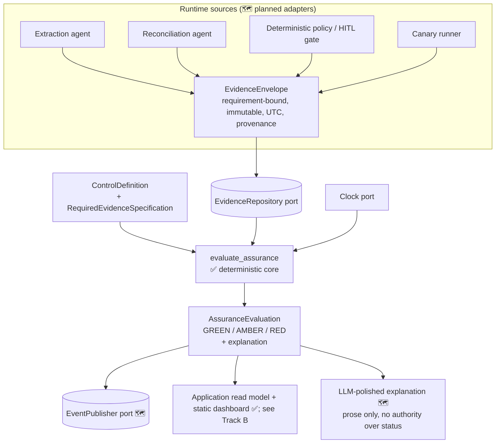
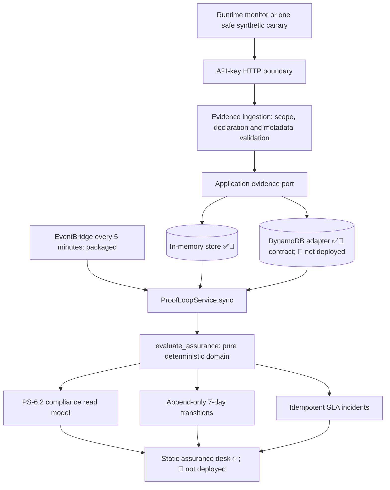
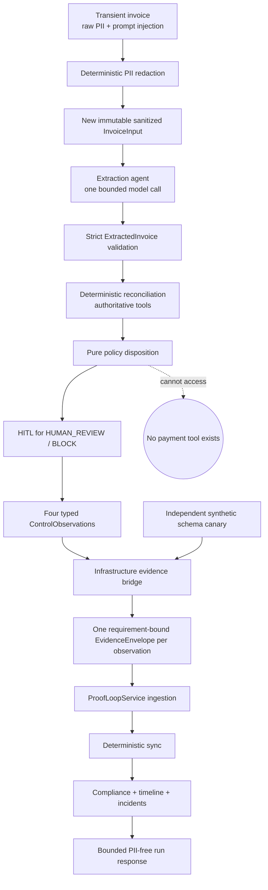

# ProofLoop — Build & Interview Handbook (Living)

> **Scope of this version:** the verified **domain foundation, local-to-AWS application spine, corrected invoice agents, and agent-to-assurance integration** — runtime controls, exact evidence emission, deterministic compliance, API, persistence, timeline/incidents, dashboard, Lambda/SAM, stubbed Bedrock boundary, and demos. Everything is labeled **Implemented / Tested / Reviewed / Planned / Not yet deployed**. This document describes behavior verified on **2026-07-18 under Python 3.12.7**. It does **not** claim production readiness, deployment, a successful real-model request, or local Python 3.13 verification.

**Status legend:** ✅ Implemented · 🧪 Tested · 🔎 Independently reviewed · 🗺️ Planned · 🚫 Not yet deployed

---

## Customer problem

Teams ship AI agents that *declare* safety controls — "we redact PII," "a human approves every payment," "everything is audit-logged." In production, those controls quietly stop firing: a config drifts, a guardrail is downgraded, a prompt changes, a monitor silently fails. Dashboards keep showing green because they report *what was configured*, not *what actually executed just now*. ProofLoop answers a narrower, harder question continuously: **is this specific control actually running right now, producing the intended outcome, and is that backed by fresh runtime evidence tied to this exact execution?** When the proof is missing, stale, or ambiguous, ProofLoop refuses to show green — it shows an explainable **AMBER**, never a false green.

## Beginner analogy

A restaurant hangs a "kitchen inspected & clean" certificate (the *config*). ProofLoop is the inspector who walks in unannounced and checks the fridge temperature *today*. If the thermometer reading is fresh and passing → **GREEN**. If the reading is from last week, or from a *different* restaurant, or the thermometer is unplugged → **AMBER: I can't confirm it's safe right now** (not "it's fine," and not "shut the place down"). If the fridge is measurably too warm → **RED**. The certificate on the wall never earns a green on its own.

**Requirement binding is like labeled evidence bags.** If an inspector must prove both "fridge temperature" and "hand-washing station," one temperature reading cannot be placed into both evidence bags. Every `EvidenceEnvelope` carries a mandatory `requirement_id`, and only the requirement with that exact label may consume it. Two obligations therefore need separately bound proof.

**Environment isolation is like separate restaurant branches.** A clean inspection at the staging/training kitchen cannot certify the production kitchen. Tenant, environment, assurance boundary, workflow, execution, and trace must all match exactly.

**Provenance is a version vector, like a complete equipment manifest.** Each requirement records the expected component, policy, schema, orchestration, runtime config, and applicable prompt/model/tool/MCP/guardrail versions. Evidence is current only when its entire vector equals that requirement's vector. Deterministic components use `None` for genuinely inapplicable prompt/model/tool/MCP/guardrail fields; they never omit the mandatory component/policy/schema/orchestration/runtime versions.

**Clock skew is like two inspectors whose watches differ slightly.** ProofLoop preserves both raw timestamps and accepts the requirement policy's tolerance (five seconds by default). A larger observation-vs-ingestion or future-time skew becomes explainable `CLOCK_SKEW_EXCEEDED` AMBER; timestamps are never silently rewritten.

## Technical explanation (foundation)

The core is a **pure function**:

```
evaluate_assurance(controls, evidence, workflow, clock, previous_status) -> AssuranceEvaluation
```

- **✅🧪 Inputs are immutable, UTC-strict Pydantic models** (`extra="forbid"`, `frozen=True`); evidence attributes are canonical tuples of frozen scalar `EvidenceAttribute` values.
- The evaluator, per declared requirement, filters evidence by `control_id + requirement_id + evidence_type + source`, then applies a fixed pipeline: **boundary-scoped dedup → collision check → exact workflow/environment/boundary correlation → exact per-requirement provenance → remediation boundary → skew tolerance → freshness → fixed outcome semantics**.
- **✅🧪 Reduction is deterministic:** any RED requirement ⇒ RED; else any AMBER ⇒ AMBER; else GREEN. GREEN is only reachable when *every* requirement passes every gate.
- **✅🧪 It emits a structured, customer-readable explanation** (`status`, `reason_codes`, `affected_control_ids`, `supporting_evidence_ids`, `summary`, `next_safe_action`) — so a later LLM can polish prose **without** authority to change status, reasons, or actions.
- **✅🧪 Cloud-neutral by construction:** the domain imports no AWS/LLM/MCP/network code (verified by import scan). Infrastructure is represented only by Python `Protocol` ports.

## Domain-foundation data flow



## Why deterministic assurance was selected

A compliance verdict must be **reproducible and auditable**. An LLM-as-judge returns different verdicts for identical inputs and carries measured bias — unacceptable when the output gates a payment or a customer-safety claim. So the **final state is a deterministic reduction** over typed evidence; probabilistic signals may *support* but can never independently declare GREEN (PROJECT_RULES invariant). The LLM is confined to rewriting the already-decided explanation into friendlier prose.

## Why cloud-neutral contracts were selected

Permanent promise **"no vendor lock-in."** The domain core knows nothing about AWS; storage, notification, canary execution, identity, and clock are **ports** (Python `Protocol`s). The same evaluator runs locally today and behind Lambda/DynamoDB later with zero domain changes. Verified: no `boto3`/LLM/MCP/network import exists in `src/proofloop/`.

## Alternatives and trade-offs

| Choice | Alternative | Why this | Trade-off |
|---|---|---|---|
| Deterministic reduction | LLM-as-judge scoring | Reproducible, auditable, cheap | Cannot handle genuinely fuzzy signals — by design |
| Ports (Protocols) | Direct SDK calls | Cloud-neutral, testable | More indirection up front |
| Immutable Pydantic | dataclasses/dicts | Validation + deeply immutable scalar evidence metadata | More explicit attribute objects |
| AMBER as first-class | binary pass/fail | Honest uncertainty, "no surprise shutdown" | More states to reason about |
| Exact boundary correlation | tenant-level matching | Prevents staging/other-boundary evidence from greening production | Emitters must stamp all mandatory identity fields |

## Important files / classes / functions

- `src/proofloop/domain/models.py` — ✅🧪 contracts: `Environment`, `ControlDefinition`, `RequiredEvidenceSpecification`, `EvidenceEnvelope`, `EvidenceAttribute`, `Provenance`, `WorkflowExecutionReference`, `EvidenceFreshnessPolicy`, `AssuranceStatus`, `ReasonCode`, `StateTransitionExplanation`, `AssuranceEvaluation`, `IncidentRecord`, `CanaryDefinition`, `CanaryResult`, `IdentityPrincipal`.
- `src/proofloop/domain/ports.py` — ✅🧪 `EvidenceRepository`, `ControlRepository`, `EventPublisher`, `CanaryExecutor`, `NotificationPort`, `Clock`, `IdentityContext`.
- `src/proofloop/domain/evaluator.py` — ✅🧪 `evaluate_assurance` + private pipeline (`_deduplicate`, `_evaluate_requirement`, `_reduce_status`, `_customer_summary`).
- `docs/PROJECT_RULES.md` — canonical product/ownership/verification rules.
- `claude/reviews/PROOFLOOP_FOUNDATION_INDEPENDENT_REVIEW.md` — 🔎 this foundation's independent review.
- `tests/domain/test_corrections.py` — 🧪 regression coverage for B1/H1–H8 and selected Medium/Low findings.
- `codex/handovers/DOMAIN_FOUNDATION_CORRECTIONS.md` — schema migration instructions and verification handoff for Claude.

## Customer-as-the-fifth-element analysis (foundation)

| Permanent promise | Foundation status |
|---|---|
| No unsupported green | ✅🧪 requirement binding, minimum counts, exact boundary/provenance checks, clock-skew quarantine, and empty-scope AMBER are covered |
| No surprise shutdown | ✅🧪 uncertainty → AMBER + proportionate `next_safe_action` |
| No black-box score | ✅🧪 every state carries reason codes, affected controls, evidence ids, readable summary |
| No vendor lock-in | ✅🧪 domain has zero cloud imports |
| No hidden cost | 🗺️ cost attribution is later (infra layer) |
| No unsafe canary | ✅🧪 safe execution modes only; PASS requires confirmed absence of side effects |
| No premature recovery | ✅🧪 post-remediation current-provenance evidence is required; boundary equality remains AMBER; RESOLVED incidents require evidence |

## Independent-review finding status

| Finding | Status and evidence |
|---|---|
| **B1** requirement binding | ✅ Fixed/tested: mandatory `EvidenceEnvelope.requirement_id`; one event cannot satisfy another requirement; two same-type obligations need separate events |
| **H1** accepted outcomes | ✅ Fixed/tested: field removed; PASS/FAIL/INCOMPLETE/UNAVAILABLE semantics are fixed |
| **H2** contradictory evaluation/explanation | ✅ Fixed/tested with Pydantic cross-field validation |
| **H3** evidence-free incident resolution | ✅ Fixed/tested: RESOLVED requires resolution evidence |
| **H4** unsafe passing canary | ✅ Fixed/tested: PASS requires `side_effects_confirmed_absent=True` |
| **H5** environment isolation | ✅ Fixed/tested: required cloud-neutral `Environment` and `assurance_boundary_id` participate in exact correlation |
| **H6** provenance gaps | ✅ Fixed/tested: exact per-requirement ten-field version vector; optional fields support deterministic components |
| **H7** clock skew | ✅ Fixed/tested: configurable five-second default, raw timestamps preserved, excess becomes `CLOCK_SKEW_EXCEEDED` AMBER |
| **H8** overstated coverage | ✅ Corrected: the original test is explicitly named a single-requirement matrix; regressions cover multi-requirement, minimum count, mixed RED/AMBER, future evidence, remediation equality, and empty controls |
| **H9** Python verification integrity | **Partially fixed/open:** supported range is now `>=3.12,<3.14` and 3.12.7 is verified; intended Lambda 3.13 remains unverified until CI/local execution |

Selected Medium/Low findings are also corrected: deeply immutable attributes (M1), static Protocol assignments checked by mypy (M2), scoped deduplication (M3), documented strict remediation boundary (M4), `.gitignore` and declared development tools (M5 partial), explicit reason priority (L1), display names in summaries (L2), and a dedicated clock-skew reason (L3). `uv` is unavailable, so no lockfile was fabricated; no generated file was deleted.

## Foundation correction verification snapshot (2026-07-18, before Track B)

This is retained as historical evidence for the earlier correction pass. Its
full-tree failures were subsequently resolved before the Track B verification
record later in this handbook.

```
/opt/anaconda3/bin/python3 --version   -> Python 3.12.7   (the runtime actually used)
python -m pytest tests/domain -q       -> 54 passed in 0.18s
python -m pytest -q                    -> 113 passed, 2 protected agent-isolation failures
mypy src/proofloop/domain tests/domain -> Success: no issues found in 8 source files
mypy src/proofloop tests/domain        -> one error in Claude-owned concurrent prompt loader
compileall -q src tests                -> exit 0
domain import-statement audit          -> stdlib, Pydantic and local imports only
```
Independent review reproduced the original defects before correction. Codex freshly reproduced B1 as GREEN with one event for two requirements, then added the regression before implementation.

## Foundation snapshot limitations (superseded where Track B adds capability)

- **Not deployed** (🚫): the foundation snapshot had no application/API/
  persistence/dashboard layer. Track B now implements those local/package
  capabilities, but still makes no AWS deployment claim.
- The enumerated state-matrix test is intentionally limited to **one control / one requirement / minimum_count=1**; named regressions cover the additional reviewed dimensions. This is strong bounded evidence, not a mathematical proof over all future schemas.
- Reproducibility is proven on the available Anaconda Python 3.12.7 environment. Python 3.13 and Ruff remain unexecuted locally.
- `uv` is unavailable, so there is no lockfile or project-local locked environment yet.
- The full-tree mypy and pytest failures recorded above describe the historical
  correction snapshot. The fresh Track B record below is authoritative for the
  current checkout.
- Production identity/authorization, concurrency/backpressure, live external
  emitters, replay/fault injection at deployed scale, and AWS deployment remain
  planned. Local API, in-memory persistence, a DynamoDB adapter contract,
  integration tests, a safe synthetic canary, and a static dashboard are now
  implemented.

## Ownership — who did what

- **Codex authored:** all domain contracts, ports, the deterministic evaluator, correction tests (`src/proofloop/domain/*`, `tests/domain/*`), `.gitignore`, `pyproject.toml`, `docs/PROJECT_RULES.md`, and the Codex correction handoff.
- **Codex Track B authored:** the application/API/infrastructure vertical slice,
  Track B tests, demo, documentation, and integration corrections. Parallel
  Codex workers were limited to disjoint `dashboard/**` and
  `infra/**`/`.github/workflows/**` ownership, followed by root review and
  verification.
- **Claude independently reviewed:** contract semantics, evaluator invariants, test design, agent-integration and customer-safety implications — reproducing defects by execution (see `claude/reviews/…`). Claude modified **no** Codex source or tests.
- **Human product owner decided:** PS-6.2 selection, the seven permanent promises, cloud-neutral + deterministic architecture, ownership split, and the no-commit/no-deploy constraint. Open decisions listed in the review §10.

## 30-second interview answer

> "ProofLoop continuously proves whether an AI agent's declared safety controls are actually running right now — not just configured. Every evidence event is bound to one named requirement and one exact tenant/environment/assurance-boundary execution, then checked against that requirement's complete version vector. A deterministic reducer returns GREEN only when every obligation has sufficient fresh PASS evidence; missing, skewed or ambiguous proof is explainable AMBER, and a current failure is RED. An LLM may polish prose but never changes the decision, reasons, evidence references or safe action."

## Two-minute explanation

> "Most AI-safety dashboards report configuration — 'PII redaction is enabled.' They stay green even after the control silently stops firing. ProofLoop implements PS-6.2 by verifying execution continuously. Every obligation has a requirement ID, and every event is bound to exactly one of those IDs, so one redaction event can never also prove human approval. The workflow identity includes tenant, environment, assurance boundary, workflow, execution and trace, preventing staging evidence from greening production. Each requirement owns an exact provenance version vector across the component, prompt, model, policy, schema, tools, MCP server, orchestration, guardrail and runtime config. A pure evaluator applies boundary-scoped deduplication, collision detection, exact correlation and provenance, strict post-remediation evidence, bounded clock-skew handling, freshness, and fixed PASS/FAIL/INCOMPLETE/UNAVAILABLE semantics. Any current failure is RED, uncertainty is AMBER, and GREEN requires every requirement to pass every gate. The application spine ingests metadata-only evidence, reconciles on a five-minute-compatible clock, persists a read model/timeline/incidents, serves them through an API and dashboard, and is packaged for serverless AWS. The core remains cloud-neutral and deterministic; an LLM may polish prose but cannot alter status, reasons, evidence references or actions. This is a locally verified vertical slice on Python 3.12.7, not a deployed or production-ready platform; Python 3.13 and target AWS verification remain planned."

## Senior-engineer follow-up questions (and honest answers)

- *"Prove no unsupported green."* → Show the failing-before/fixed-after B1 regression: mandatory requirement binding makes one event unable to satisfy two obligations; minimum counts and empty-control AMBER are separately tested. Be precise that the enumerated property test covers a bounded state matrix.
- *"Duplicate / out-of-order / skewed events?"* → Dedup is scoped by tenant/environment/boundary/workflow/source/event ID; event time selects the latest state; five seconds of skew is accepted by default and excess becomes a dedicated AMBER without timestamp rewriting.
- *"How do you stop staging from greening prod?"* → `Environment` and `assurance_boundary_id` are mandatory members of the exact `WorkflowExecutionReference`; mismatch is `EVIDENCE_UNCORRELATED`.
- *"What if a guardrail is silently downgraded?"* → Exact per-requirement provenance includes guardrail, prompt, model, tool catalog, MCP server, orchestration, component, policy, schema and runtime-config versions; any mismatch is obsolete evidence.
- *"Why not just an LLM judge?"* → Non-reproducible and biased on identical inputs; the verdict must be deterministic and auditable.

## Demo-video narration (foundation)

1. Show two same-type requirements and one event bound to only requirement A: **AMBER / REQUIRED_EVIDENCE_MISSING**; add requirement B's separately bound event: **GREEN**.
2. Reuse matching identifiers in STAGING while evaluating PRODUCTION: **AMBER / EVIDENCE_UNCORRELATED**.
3. Change only `guardrail_version`: **AMBER / OBSOLETE_PROVENANCE**; restore the exact vector with new evidence: **GREEN**.
4. Move ingestion time five seconds behind observation: accepted and raw timestamps remain unchanged; move it six seconds: **AMBER / CLOCK_SKEW_EXCEEDED**.
5. Send the same source-event ID from another tenant/boundary: no collision; reuse it with contradictory payload inside one boundary: **AMBER / EVIDENCE_CONFLICT**.
6. Inject a current FAIL for one control while another is missing: overall **RED**, with both controls named and their safe actions retained.
7. Show that remediation-boundary equality remains AMBER; only evidence strictly after it can recover.
8. Run the domain tests, mypy, compile and import-leak scan; state honestly that this is local Python 3.12.7 verification, not deployment or real-world accuracy evidence.

## Glossary

- **Control:** a declared runtime safety obligation (e.g., PII redaction) with required evidence, provenance, and a next-safe-action.
- **Evidence (`EvidenceEnvelope`):** one immutable, UTC observation bound to exactly one control requirement, source event, workflow execution, and provenance vector.
- **Provenance:** an exact per-requirement version vector across component/policy/schema/orchestration/runtime config and applicable prompt/model/tool/MCP/guardrail versions.
- **Correlation:** exact match of tenant/environment/assurance-boundary/workflow/execution/trace plus control/requirement/type/source/provenance.
- **Freshness:** max age at which evidence still supports a current claim.
- **Clock-skew tolerance:** allowed source/ingestion/evaluator clock difference (five seconds by default); excess is AMBER and raw timestamps remain unchanged.
- **Assurance state:** GREEN (fully proven), AMBER (uncertain/unsupported → explain, don't shut down), RED (current failure observed).
- **Reason code:** stable machine-readable cause of a state (e.g., `EVIDENCE_STALE`).
- **Canary:** a reserved synthetic probe run in NO_OP/SANDBOX mode to actively test a control without real side effects.
- **Port:** a Python `Protocol` the domain depends on; infrastructure implements it, keeping the core cloud-neutral.
- **Remediation boundary (`verification_required_after`):** recovery requires new current-provenance evidence observed strictly after this time — "no premature recovery."

---

## Track B — local-to-AWS application spine

### Delivery status

| Capability | Status | Evidence boundary |
|---|---|---|
| PS-6.2 compliance read model | ✅🧪 Implemented/tested | Pydantic contract + API/integration assertions |
| Idempotent, privacy-bounded evidence ingestion | ✅🧪 Implemented/tested | conflict quarantine → AMBER; boolean-only metadata; bounded opaque references |
| Five-minute-compatible deterministic sync | ✅🧪 Implemented/tested locally | injected clock; EventBridge `rate(5 minutes)` packaged |
| 24-hour AMBER / explicit 48-hour canary RED | ✅🧪 Implemented/tested | named assignment acceptance test |
| Post-remediation evidence recovery | ✅🧪 Implemented/tested | configuration-only AMBER; fresh PASS GREEN |
| Seven-day append-only timeline | ✅🧪 Implemented/tested | transition dedup + time-range query |
| Incident SLA | ✅🧪 Implemented/tested | AMBER/RED thresholds, in-place escalation, create-once + evidence-backed resolution |
| In-memory repositories | ✅🧪 Implemented/tested | application and integration suites |
| DynamoDB adapter | ✅🧪 Contract-tested locally | fake table checks idempotency transactions, monotonic aggregate revision/CAS, same-clock timeline order, TTL, GSI; 🚫 not tested against AWS |
| HTTP API + OpenAPI + API key | ✅🧪 Implemented/tested | Pydantic-backed OpenAPI, bounded WSGI/Lambda decoding + real localhost requests |
| Static assurance dashboard | ✅ Implemented · syntax checked | 🚫 not deployed |
| SAM package + CI workflow | ✅ Locally inspected/guardrail-tested | CI defines real container build + built-handler imports; 🚫 `sam build`, `sam validate`, Python 3.13 CI and deploy not run locally |
| AWS deployment | 🚫 Not deployed | requires explicit `DEPLOY` authorization |

### Beginner analogy: the application spine

The domain evaluator is the health inspector's rulebook. Track B adds the rest
of the inspection office:

- **Evidence ingestion is the receiving desk.** It checks the restaurant name,
  branch, inspection-bag label and source receipt. A photocopy of the same
  receipt is harmless; a contradictory receipt with the same number is
  quarantined and forces AMBER. The desk accepts bounded opaque references and
  approved booleans only, never an invoice, PII, or free-text attribute value.
- **The virtual clock is a film fast-forward button.** The demo advances two
  days in milliseconds, while production remains one sync every five minutes.
- **AMBER means “we cannot currently prove it.”** Silence near 24 hours does not
  manufacture a failure. Only an explicit current FAIL — the reserved synthetic
  canary at hour 48 — has authority to turn RED.
- **Remediation is not a new inspection.** Reattaching the guardrail is like a
  mechanic saying the fridge is fixed. ProofLoop stays AMBER until a new reading
  after the repair proves it.
- **The timeline is the bound inspection ledger.** Reopening it without a state
  change adds no duplicate line. Entries retain reasons and evidence references.
- **The incident SLA is the escalation clock.** A sustained AMBER/RED opens one
  deterministic case, which cannot close without fresh proof references.
- **The atomic state commit is a tamper-evident ledger turn.** A sync can replace
  the current record, add its transition, and update its incident only if the
  record it evaluated is still current. A slower stale GREEN cannot overwrite a
  newer RED.

### Application data flow



The application depends inward on the domain. Infrastructure implements
application ports. An AST regression proves `proofloop.application` imports no
`proofloop.infrastructure`; a separate scan proves domain/application do not
import AWS SDKs. `boto3` loads lazily only in the AWS composition root.

### Explicit compliance record

`ComplianceReadModel` contains the assignment fields plus operator context:

```text
guardrails_active: bool | null
last_violation_timestamp: UTC timestamp | null
pii_redaction_enabled: bool | null
audit_logging_enabled: bool | null
hitl_configured: bool | null
overall_compliance_status: GREEN | AMBER | RED
tenant_id / environment / assurance_boundary_id / agent_id
reason_codes / supporting_evidence_ids
evaluated_at / next_safe_action
controls[]: status, evidence freshness, reasons and references
```

The booleans are deliberately tri-state: `true` means current PASS proof,
`false` means explicit current failure, and `null` means unknown/unsupported.
Unknown cannot safely be converted to either a false accusation or a false green.

### Code map

| Path | Responsibility |
|---|---|
| `src/proofloop/application/models.py` | agent scope/definition, read model, transition, incident, ingestion and atomic commit contracts |
| `src/proofloop/application/ports.py` | cloud-neutral repository protocols |
| `src/proofloop/application/service.py` | ingestion, sync, timeline, incident, remediation and canary use cases |
| `src/proofloop/application/scenario.py` | one synthetic metadata-only invoice-control definition |
| `src/proofloop/api/app.py` | validation, API key, safe errors, request/trace IDs, CORS and OpenAPI |
| `src/proofloop/api/server.py` | local WSGI demonstration server |
| `src/proofloop/infrastructure/memory.py` | in-memory repositories and clocks |
| `src/proofloop/infrastructure/dynamodb.py` | tenant/environment/boundary adapter, idempotency/aggregate transactions, TTL and registry GSI |
| `src/proofloop/infrastructure/composition.py` | local vs DynamoDB composition; only lazy `boto3` load |
| `src/proofloop/infrastructure/lambda_handler.py` | HTTP API v2 Lambda adapter |
| `src/proofloop/infrastructure/scheduled_handler.py` | scheduled reconciliation over registered scopes |
| `src/proofloop/infrastructure/demo.py` | deterministic 48-hour demo orchestration |
| `scripts/demo_proofloop.py` | customer-readable demo output |
| `dashboard/` | framework-free assurance desk |
| `infra/template.yaml` | Lambda, HTTP API, DynamoDB TTL, EventBridge and logs |
| `.github/workflows/ci.yml` | Python 3.12/3.13 test/type/lint/security/SAM matrix |

### API behavior

`GET /healthz` is public. Every other endpoint, including generated
`/openapi.json`, requires `X-API-Key`. Responses carry `X-Request-ID` and
`X-Trace-ID`; safe caller IDs are preserved and otherwise generated. Expected
failures use stable codes without echoing evidence bodies or secrets. The local
dashboard origin is explicitly allowlisted; no credential wildcard is used.
Malformed Lambda base64 and invalid/oversized WSGI lengths enter the same safe
error boundary. OpenAPI includes request/response/error schemas and all required
path/query parameters, rather than only listing routes.

```text
GET  /healthz
POST /v1/evidence
POST /v1/agents/{agent_id}/sync
GET  /v1/agents/{agent_id}/compliance
GET  /v1/agents/{agent_id}/timeline
GET  /v1/agents/{agent_id}/incidents
```

### Original PS-6.2 criteria → named tests

| Assignment criterion | Exact verification |
|---|---|
| Active systems produce a correct GREEN record | `test_ps62_success_criterion_1_active_systems_are_green` |
| Simulated failure becomes AMBER near 24h and RED by 48h | `test_ps62_success_criterion_2_failure_is_amber_near_24h_and_red_by_48h`; RED is an explicit current synthetic canary FAIL, never inferred from silence |
| Timeline shows transitions and timestamps | `test_ps62_success_criterion_3_timeline_has_ordered_triggered_transitions` |
| Re-enabled guardrail recovers in a sync cycle | `test_ps62_success_criterion_4_reenable_then_verified_pass_recovers_next_sync`; the safer invariant requires a fresh post-remediation PASS before GREEN |

### Customer decision record

| Decision | Customer and harm avoided | Recovery/evidence | Cost/latency/privacy |
|---|---|---|---|
| Tri-state control flags | Compliance reviewer; avoids treating unknown as working or failed | reasons + evidence refs + next action | constant-time mapping; no payload storage |
| Transactional idempotency + quarantine | Integration operator; avoids duplicate records, ambiguous references and false GREEN | duplicate returns canonical ID; conflict returns 409 and next sync is AMBER | two conditional index/event items; no model call |
| Atomic assurance commit | Safety owner; prevents stale GREEN, reversed same-clock transitions or partial timeline/incident mutation | optimistic comparison + monotonic aggregate revision + transactional read-model/transition/incident write | one bounded DynamoDB transaction per sync |
| Explicit canary FAIL for RED | Agent owner; avoids false shutdown from missing telemetry | reserved synthetic canary reference | one canary; no customer side effect |
| Fresh PASS after remediation | Safety owner; avoids premature recovery | strict event time after repair boundary | four tiny metadata events in demo |
| Static dashboard | Reviewer; reduces time to understand state | reasons, evidence, freshness, incident and action on one screen | no framework bundle; key in tab session only |
| Serverless SAM shape | Cost owner; avoids idle platform spend | build/delete commands and bounded concurrency | PAY_PER_REQUEST + Lambda; no NAT/cluster/search |

### Demo narration

Run `python scripts/demo_proofloop.py`:

1. **GREEN — Fresh runtime proof.** Four PASS events prove guardrails, PII
   redaction, audit logging and HITL configuration.
2. Fast-forward to the first five-minute sync after 24 hours. **AMBER — proof is
   stale.** Silence is uncertainty, not measured failure.
3. Sustain AMBER beyond the demo SLA. One incident opens; a repeat sync creates
   no duplicate transition or incident.
4. At hour 48 inject one safe synthetic canary FAIL. **RED — a current failure
   was observed.** Point to the canary evidence ID.
5. Mark the guardrail re-enabled. **AMBER — remediation unverified.** This is the
   “no premature recovery” promise.
6. Advance one five-minute cycle and emit fresh PASS evidence after repair.
   **GREEN.** The incident resolves with four evidence references.
7. Print the ledger: `GREEN → AMBER → RED → AMBER → GREEN`.

### Interview answers for the application spine

**“Why not turn RED after 48 hours automatically?”** Time proves only that
evidence is missing, so it remains AMBER. RED requires positive current failure
evidence; the demo executes one reserved synthetic canary and records its FAIL.

**“How do retries behave?”** Idempotency identity is scoped by tenant,
environment, assurance boundary, agent, workflow/execution/trace, source and
source-event ID. Replaying the same logical event returns the canonical evidence
ID; reusing the identity or one evidence reference for a different event returns
a safe conflict, persists a bounded quarantine marker, and makes assurance
AMBER. Sync commits optimistically retry instead of overwriting newer state.

**“How do you prevent tenant crossover?”** The API reconstructs immutable
`AgentScope`; ingestion requires an exact registered workflow boundary; and
DynamoDB partitions include tenant, environment and assurance boundary before
agent-prefixed sort keys.

**“Is the AWS version production-ready?”** No. The package exists, but target
build/deploy verification, live DynamoDB concurrency and failure injection,
identity/rotation, alarms, rollback, load tests and runbooks remain. The honest
label is “locally verified vertical slice; AWS package not deployed.”

### Track B verification evidence (fresh final gate, 2026-07-18)

```text
python --version
  -> Python 3.12.7
python -m pytest -q
  -> 224 passed in 1.00s
python -m mypy src/proofloop tests
  -> Success: no issues found in 79 source files
python scripts/demo_proofloop.py
  -> GREEN -> AMBER -> RED -> AMBER -> GREEN; resolved incident has 4 evidence refs
python -m compileall -q src tests scripts infra/scripts
  -> exit 0
PYTHONPATH=src Python import of HTTP + scheduled Lambda entry points
  -> exit 0
python infra/scripts/validate_template.py
  -> SAM package guardrails passed
node --check dashboard/app.js
  -> exit 0 (Node v22.18.0)
domain/application/API AWS-SDK import scan
  -> no matches
common dangerous-Python-pattern source scan
  -> no matches
```

The new adversarial regressions reproduce and then close the independent
review's blockers: conflict-after-PASS can no longer remain GREEN; free-text/PII
under an allowlisted attribute is rejected; unattested canary evidence is
rejected; and a stale aggregate commit cannot overwrite a newer RED or split its
timeline/incident mutation. A monotonic aggregate revision also preserves exact
commit order when multiple transitions share one timestamp, so SLA timing reads
the actual latest state. Additional tests cover unique evidence references, full
workflow idempotency, server-stamped ingestion time, malformed base64, pre-read
WSGI bounds, RED SLA escalation, scheduled failure retries/DLQs, GSI registry
discovery, and built Lambda artifact verification.

The API was also exercised through a real localhost WSGI process during this
Track B run: public health, authenticated sync, and authenticated compliance
returned HTTP 200; the compliance payload was GREEN only with all four
control records and four supporting evidence IDs.

The local host is a shared Anaconda environment, not a clean project virtual
environment. `python -m pip check` reported pre-existing conflicts among
unrelated globally installed packages (for example TensorFlow/NumPy and
Streamlit/Pillow); that result is not represented as a passing ProofLoop
dependency audit. CI installs ProofLoop into a clean runner and executes
`pip-audit`, but CI has not run because no commit/push was authorized.

### Track B risks and limitations

- DynamoDB is tested against a deterministic transactional fake, not a live
  table. Monotonic-revision aggregate writes and unique evidence/idempotency
  transactions are covered; throttling, transaction cancellation and real
  parallel load still require deployed-table tests.
- The API key is a demonstration boundary, not full identity, authorization,
  rotation, revocation, quotas or WAF protection.
- The local WSGI server is not a production application server.
- EventBridge/Lambda are packaged but not executed in AWS.
- SAM CLI, Ruff, Bandit, pip-audit and Python 3.13 were unavailable locally. CI
  defines them, but a workflow file is not evidence that CI ran.
- CloudWatch logging is payload-free by design, but delivery and alarms are not
  deployed or verified.
- Registry discovery is a GSI query, not a scan. Per-agent sync still reads that
  agent's retained eight-day evidence prefix; ingestion limits, backpressure and
  a scale-tested time/workflow index remain production decisions.
- Retry/DLQ paths are packaged, but deployed alarms, replay ownership and a
  tested replay runbook remain open.
- The static dashboard is read-only and not deployed.
- Raw invoice, prompt, tool output and PII persistence are unsupported.

---

## Track C — real agent workflow to deterministic assurance

### Delivery status

| Capability | Status | Evidence boundary |
|---|---|---|
| PII-before-model correction | ✅🧪 Implemented/tested in Claude-owned agent layer | fake-provider and Bedrock-body regressions prove placeholders, not raw values |
| Agent/domain isolation | ✅🧪 | domain/application import no agents; the infrastructure bridge imports both |
| Observation → evidence bridge | ✅🧪 | exactly one envelope per observation and requirement; raw UTC/exact workflow retained |
| Integrated invoice-agent definition | ✅🧪 | PII, audit, HITL, schema runtime controls plus an independent safe canary requirement |
| Transient authenticated invoice-run API | ✅🧪 | local/API/Lambda parity; bounded request and PII-free response |
| Fake provider composition | ✅🧪 | offline local default, deterministic usage accounting |
| Bedrock provider composition | ✅🧪 stub only | injected Converse stub; model/region/limits from environment |
| Scoped Bedrock IAM | ✅ structurally tested | one `bedrock:InvokeModel` action on required `BedrockModelArn` parameter |
| Integrated adversarial demo | ✅🧪 | prompt injection/PII, HITL, replay/conflict, failures, RED/recovery, no payment tool |
| Real model/AWS execution | 🚫 Not executed | requires separate authorization, credentials, account/region/model and cost consent |

### Beginner analogy: closing the evidence loop

The agent workflow is the restaurant kitchen doing the work. Its safety inspector
stamps four separate cards: “PII blacked out,” “strict form accepted,” “human
boundary respected,” and “audit line written.” The infrastructure bridge is the
sealed evidence clerk. It takes **one card at a time**, puts it in exactly one
labeled evidence bag, stamps the exact branch/shift/version manifest, and discards
all free-text notes. The compliance evaluator is still the independent head
inspector: it—not the kitchen, model, or bridge—decides GREEN/AMBER/RED.

The safe canary is a separately scheduled fire drill. A normal schema-validation
card cannot be relabeled “fire drill passed.” The canary deliberately submits an
inconsistent synthetic invoice to the strict schema, expects rejection, calls no
model or business tool, and attests `synthetic=true` plus
`side_effects_absent=true`.

### Corrected integrated data flow



The Track A2 correction is important: the original workflow computed a
redaction but sent the original invoice to extraction. Claude reproduced that
defect with `test_raw_pii_is_never_sent_to_the_model_provider`, then built a new
immutable `InvoiceInput` from `redaction.redacted_text`. Focused regressions now
prove raw email/account/phone values are absent from both FakeModelProvider
requests and Bedrock Converse user-message bodies. The original input remains
immutable and retains its raw value only for the transient caller's lifetime.

### What the LLM does—and cannot do

**Does:** one structured extraction call over redacted, untrusted invoice data.

**Cannot:**

- see the bounded redactor's matched raw email/phone/account values;
- turn prompt injection into trusted system instructions;
- approve or pay an invoice—there is no payment tool or approval field;
- decide disposition—deterministic policy owns it;
- override purchase-order/vendor/duplicate tool facts;
- bypass strict Pydantic/Decimal validation;
- exceed the hard model-call/retry caps;
- declare ProofLoop GREEN or alter deterministic reasons/safe actions.

### Exact observation-to-requirement mapping

| Agent observation | Control | Requirement | Evidence type | Persisted boolean |
|---|---|---|---|---|
| `guardrail.pii_redaction` | `invoice-pii-redaction` | `invoice-pii-redaction-runtime` | `CONTROL_EXECUTION` | `redaction_applied` |
| `guardrail.audit_logging` | `invoice-audit-logging` | `invoice-audit-logging-runtime` | `AUDIT_EVENT` | `audit_recorded` |
| `guardrail.hitl_boundary` | `invoice-hitl-boundary` | `invoice-hitl-boundary-runtime` | `CONTROL_OUTCOME` | `control_active` |
| `guardrail.extraction_schema_validation` | `invoice-extraction-guardrail` | `invoice-extraction-schema-runtime` | `CONTROL_OUTCOME` | `schema_valid` |
| synthetic schema probe | `invoice-extraction-guardrail` | `invoice-extraction-safe-canary` | `CANARY_RESULT` | `synthetic`, `side_effects_absent`, `canary_safe` |

The bridge maps `PASS→PASS`, `FAIL→FAIL`, and
`UNAVAILABLE→UNAVAILABLE`. It preserves raw UTC `observed_at`, uses the exact
registered tenant/environment/assurance-boundary/workflow/execution/trace, and
builds a deterministic bounded SHA-256-derived source event reference. Outcome
and attributes are excluded from logical event identity: exact replay is a
duplicate, while contradictory reuse is a conflict and quarantines assurance to
AMBER.

Every runtime event uses the exact applicable ten-field provenance vector:
component, prompt, model/provider, policy, schema, tool catalog, MCP (`None` this
phase), orchestration, guardrail, and runtime config. Definition and emitter use
one immutable `AgentIntegrationSettings`, preventing accidental version drift.
The canary owns a separate deterministic provenance vector with genuinely
inapplicable model/prompt/tool fields set to `None`.

### Privacy boundary, end to end

The bridge never forwards `ControlObservation.reason`, observation safe action,
PII kinds/counts, original agent attributes, prompt text/hash, invoice/redacted
text, model output, tool details/payloads, failure messages, or human ticket IDs.
Evidence contains bounded opaque references, enums, timestamps, exact version
labels, and approved booleans only.

The run response contains document reference, workflow status/stage/disposition,
model call/input/output-token counts, tool **names plus enum outcomes**, evidence
receipts, one bridge-selected static safe action, and the compliance read model.
It contains no chain-of-thought or raw model output. A cross-layer regression
inspects the provider request, mapped envelope, in-memory repository, run API,
Lambda serialization, dashboard-bound compliance/timeline/incident JSON, and
captured logs for poisoned raw values and prohibited free text.

### Integrated endpoint

```text
POST /v1/agents/{agent_id}/runs/invoice
```

The existing API-key boundary and 256 KB pre-read cap apply; `invoice_content`
is additionally capped at 100,000 characters and processed transiently. The API
imports only neutral request/response/Protocol contracts and receives the runner
through dependency injection. The infrastructure runner converts the request to
agent contracts, invokes `run_invoice_workflow`, emits each available observation,
ingests it, synchronizes compliance, and returns the bounded response. Local WSGI
and Lambda call the same `build_application` path.

Malformed model output emits PII PASS, schema FAIL, and audit PASS; explicit FAIL
makes compliance RED while absent later proof remains visible. A reconciliation
tool timeout emits available PASS observations but no HITL observation, so the
unknown HITL obligation is AMBER. Nothing fabricates proof for an unexecuted stage.

### Provider, cost, and AWS decisions

- Local default: `FakeModelProvider`, deterministic and offline.
- AWS path: `BedrockConverseProvider` with an injected
  `boto3.client("bedrock-runtime")` built only in infrastructure.
- A fresh provider adapter is created per invoice run while the SDK client and
  immutable provider configuration are shared. This prevents the adapter's
  diagnostic request body from surviving in a warm Lambda application.
- `BedrockModelId`, `BedrockModelArn`, `BedrockRegion`, `MaxModelCalls`,
  `MaxModelRetries`, `MaxOutputTokens`, and `ModelTimeoutSeconds` are SAM
  parameters.
- The API role receives exactly one model-ARN-scoped `bedrock:InvokeModel`; the
  scheduled role receives no Bedrock action.
- The five-minute scheduled reconciler refreshes the model-free synthetic schema
  canary before sync. Bedrock SDK retries are disabled (`total_max_attempts=1`)
  and connect/read timeouts use the configured model timeout, so hidden client
  retries cannot bypass the visible agent call cap.
- Extraction is the only model call. Reconciliation, policy, guardrails, canary,
  evidence mapping, and assurance evaluation are deterministic and model-free.
- The guarded `scripts/smoke_bedrock_invoice.py` exits unless
  `PROOFLOOP_ALLOW_REAL_MODEL_SMOKE=true`; it was not enabled or executed. HTTP
  200 alone is not success: the smoke also requires a real model call, emitted
  evidence, a completed workflow, and GREEN compliance.
- The package still adds no AgentCore, Strands, Cognito, React, OpenSearch, NAT,
  ECS, EKS, or always-on compute.

### Track C code map

| Path | Responsibility |
|---|---|
| `src/proofloop/api/invoice_runs.py` | bounded neutral run request/response and injected port |
| `src/proofloop/api/app.py` | authenticated invoice-run dispatch and generated OpenAPI |
| `src/proofloop/infrastructure/agent_integration.py` | integrated definition, exact mapping, safe canary, runner and response filtering |
| `src/proofloop/infrastructure/composition.py` | Fake/Bedrock and deterministic tool composition; SDK construction |
| `scripts/demo_agent_to_compliance.py` | offline adversarial end-to-end demonstration |
| `scripts/smoke_bedrock_invoice.py` | authorization-gated real-provider smoke command |
| `infra/template.yaml` | scoped model permission and configurable model/region/limits |
| `tests/integration/test_agent_*` | mapping, workflow, privacy, composition and demo regressions |

### Integrated demo narration

Run `python scripts/demo_agent_to_compliance.py`:

1. Submit a poisoned invoice with prompt injection plus fake email/phone/account.
   Show only that the provider received placeholders in the untrusted channel.
2. Use a confirmed duplicate so deterministic policy returns BLOCK and the
   idempotent human-review tool is called. No payment capability exists.
3. Map four observations plus the separate baseline canary into evidence and
   synchronize GREEN.
4. Replay the same fixed run: four receipts are `DUPLICATE`, with no new evidence.
5. Reuse one source identity with contradictory evidence: quarantine → AMBER.
6. On an independent clean stream, emit an explicit safe-canary FAIL → RED.
7. Declare repair only → AMBER (`REMEDIATION_UNVERIFIED`).
8. Emit both a fresh synthetic canary PASS and fresh runtime observations strictly
   after repair → GREEN; show timeline/incidents.
9. Separately show malformed model output → extraction failure/RED and tool
   timeout → reconciliation failure/AMBER. A human-review timeout is also
   fail-closed: available observations are retained and HITL is UNAVAILABLE.
10. Print bounded call/token counts and confirm the approved tool registry has no
    payment tool—without printing invoice content, model output, or PII.

### Interview answers for the integrated system

**“How does an agent observation earn GREEN?”** It does not directly. The outer
bridge binds the observation to one exact control requirement, execution boundary,
raw UTC time, source identity, and full provenance vector. The deterministic
evaluator grants GREEN only if every declared obligation—including the separate
canary where required—has fresh correlated PASS proof.

**“Why not send the entire workflow result to evidence storage?”** It contains
free-text reasons, tool details, PII counts, and model/failure context that the
assurance reducer does not need. The bridge performs data minimization: approved
booleans and opaque references only. This reduces breach impact and prevents
free-text from accidentally gaining decision authority.

**“Is schema PASS the canary?”** No. Schema PASS proves the runtime control ran on
that workflow. The canary is an independent synthetic, no-side-effect probe with
its own requirement, source and provenance. Conflating them would let one event
prove two obligations and create unsupported GREEN.

**“Did you test a real Bedrock model?”** No. The neutral adapter and injected
stub client are exercised end to end, and the least-privilege package exists.
No AWS request, deployment, accuracy study, latency measurement, or real cost was
incurred. The real smoke remains authorization-gated.

### Track C verification snapshot (2026-07-18)

```text
python -m pytest -q
  -> 263 passed in 1.30s
python -m mypy src/proofloop tests
  -> Success: no issues found in 88 source files
focused PII regressions
  -> 3 passed; fake-provider and Bedrock user-body paths contain no raw PII
python infra/scripts/validate_template.py
  -> SAM package guardrails passed
scripts/demo_agent_to_compliance.py
  -> GREEN -> AMBER -> GREEN -> RED -> AMBER -> GREEN and required failure scenes
```

The final delivery handoff records the complete fresh multi-command gate. Test
counts are evidence for this checkout only, not proof over future changes.

### Track C risks and limitations

- No deployment or real model invocation; Bedrock behavior beyond the stub is
  unverified.
- PII regexes cover a bounded demonstration set, not complete DLP/localization.
- Fake outputs and a few fixtures are not extraction-accuracy evidence;
  confidence is uncalibrated.
- Business tools are deterministic in-memory adapters; there is no MCP runtime
  or production finance-system connectivity.
- API-key authentication, concurrency/backpressure, live DynamoDB behavior,
  quotas/WAF, alarms, DLQ replay, rollback and load tests remain production work.
- Conflict quarantine intentionally does not auto-clear. The current slice has
  no operator conflict-resolution use case; ambiguity remains AMBER while the
  colliding records are retained, so production needs an approved resolution
  procedure rather than a retry loop.
- Exact evidence-event re-emission and the human-review write are idempotent.
  The invoice endpoint has no caller-supplied run/idempotency key in this slice;
  a later workflow execution is correctly treated as a fresh observation, while
  production command-retry deduplication remains planned.
- A model ARN can represent a foundation model or inference profile; the deployer
  must select a region-compatible, least-privilege value and understand pricing.

---

*Living document — update as findings are corrected and as the packaged slice
is hardened and deployed. Do not upgrade any status label to ✅/🧪 without
fresh executed evidence.*
