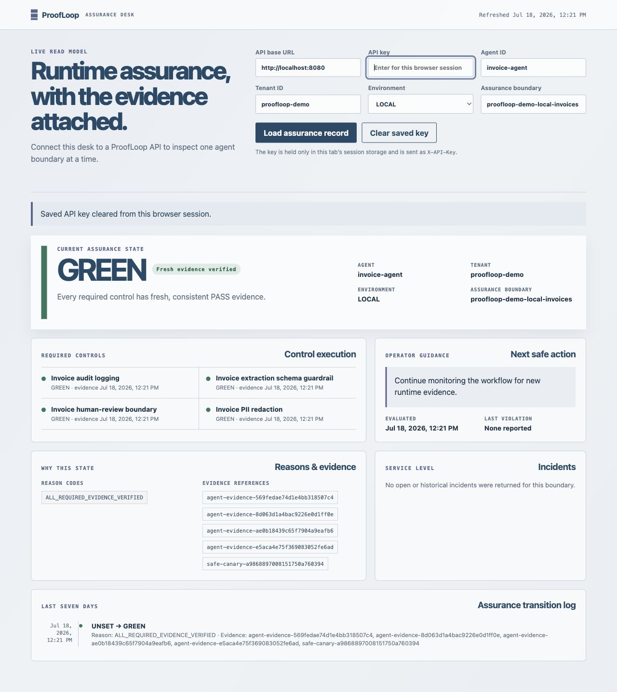

# ProofLoop PS-6.2 Manual QA Evidence

**Run date:** 2026-07-18  
**Track:** D2 manual QA with E2 local release-blocker revalidation  
**Repository:** `/Users/srisruthi/Aivar Project`  
**Verdict:** 14/14 required scenarios exercised; 14 passed at the stated test
boundary. The Track E2 Python 3.12 local code gate passes; target-runtime, SAM,
CI, repository-baseline and deployment gates remain open.

## Evidence rules

- Only reserved synthetic invoice data was used.
- The local API used `PROOFLOOP_MODEL_PROVIDER=fake`; no AWS or real Bedrock call
  was made.
- The API key was ephemeral, cleared before the screenshot, and is not recorded
  here.
- HTTP scenarios exercised the real local WSGI boundary. Failure injection and
  virtual-time scenarios exercised the same runner/service contracts in process,
  because the public server intentionally has no endpoint for replacing its
  model or tool adapters.
- No response, log, screenshot, or artifact contains an invoice body, raw PII,
  model prompt/output, tool payload, hidden reasoning, or API key.

## Environment

| Component | Observed |
|---|---|
| Host Python | 3.12.7 |
| Disposable Track E2 environment | Python 3.12.7 at `/tmp/proofloop-e2-venv.bezb1z` |
| Node / npm | 22.18.0 / 10.9.3 |
| pytest | 9.1.1; declared policy `>=9.0.3,<10` |
| mypy | 1.20.2 |
| Ruff | 0.15.22 |
| Bandit | 1.9.4 |
| pip-audit | 2.10.1 |
| pip | 26.1.2 in the disposable environment |
| Poppler | 26.05.0 |
| AWS SAM CLI | Not installed; SAM validate/build not run |
| Python 3.13 | Not installed; target-runtime execution not run |

## Required scenario ledger

| # | Scenario and boundary | Observable result | Verdict |
|---:|---|---|---|
| 1 | Authenticated happy path, real HTTP | `200`; workflow `COMPLETED`; disposition `ACCEPT_FOR_POLICY_EVALUATION`; one fake-model call; four runtime receipts `ACCEPTED`; compliance `GREEN` with the independent canary | PASS |
| 2 | Missing and incorrect API key, real HTTP | Missing key returned `401 AUTHENTICATION_REQUIRED`; incorrect key returned `403 AUTHENTICATION_FAILED`; neither response exposed request data | PASS |
| 3 | Invalid and oversized input, real HTTP | Missing required fields and a 100,001-character `invoice_content` each returned `400 INVALID_REQUEST`; stable safe errors, no input echo | PASS |
| 4 | Poisoned invoice with synthetic PII patterns and prompt injection, real HTTP | Workflow completed `GREEN`; forbidden values were absent from the safe response; one model call and four evidence receipts were reported | PASS |
| 5 | Malformed fake-model output, deterministic injected adapter | `EXTRACTION_FAILED`; three available evidence receipts; `RED`; reasons `CONTROL_FAILURE_OBSERVED`, `REQUIRED_EVIDENCE_MISSING` | PASS |
| 6 | Purchase-order tool timeout, deterministic injected adapter | `RECONCILIATION_FAILED`; `get_purchase_order` reported `TIMEOUT`; fail-safe `AMBER`; reason `REQUIRED_EVIDENCE_MISSING` | PASS |
| 7 | Confirmed duplicate, deterministic injected adapter | Disposition `BLOCK`; HITL configured; human-review tool invoked; no payment tool present | PASS |
| 8 | Exact replay, fixed clock | First evidence receipts `ACCEPTED`; replay receipts `DUPLICATE`; persisted evidence remained five; state stayed `GREEN` | PASS |
| 9 | Contradictory replay, fixed clock | Stable `EVIDENCE_CONFLICT`; conflicting observation quarantined; subsequent sync `AMBER` with `EVIDENCE_CONFLICT` | PASS |
| 10 | Safe canary failure, fixed clock | Baseline `GREEN` changed to `RED`; reason `CONTROL_FAILURE_OBSERVED` | PASS |
| 11 | Remediation declaration without fresh proof, fixed clock | State changed only to `AMBER`; reason `REMEDIATION_UNVERIFIED` | PASS |
| 12 | Fresh post-remediation runtime plus canary proof, fixed clock | State returned to `GREEN`; transition sequence `GREEN -> RED -> AMBER -> GREEN` | PASS |
| 13 | Real dashboard against real local API | Rendered `GREEN`, four controls, reason/evidence references, operator action, seven-day `UNSET -> GREEN` transition, and the no-incidents state; no browser warnings/errors | PASS |
| 14 | Response and captured-log privacy inspection | WSGI logs contained only method, path, status, and length; browser warning/error count was zero; focused cross-layer privacy tests passed `2/2` | PASS |

### Boundary note for scenario 8

The exact replay result is an evidence-event replay under an injected fixed
clock, not a claim that retrying the invoice HTTP command is idempotent. The
current invoice endpoint does not accept a caller-supplied run/idempotency key;
wall-clock retries can produce a new execution identity. Evidence re-emission
for the same identity and the human-review write are idempotent.

### Dashboard evidence

The empty incident panel is a real rendered state for this boundary. Incident
open/escalate/resolve semantics are covered by the full automated suite and
deterministic demos; this Track D2 run does not mislabel a UI fixture as live
incident data.

## Clean local command gate

| Check | Command boundary | Result |
|---|---|---|
| Dependency integrity | isolated `python -m pip check` | PASS: no broken requirements |
| Full test suite | isolated `python -m pytest -q` | PASS: **266 passed in 3.01s** under pytest 9.1.1 |
| Type checking | isolated `python -m mypy src/proofloop tests` | PASS: no issues in 88 source files |
| Ruff, CI scope | `python -m ruff check src tests` | PASS: all checks passed |
| Ruff, extended scope | `python -m ruff check src tests scripts infra/scripts` | PASS: all checks passed |
| Bandit | `python -m bandit -q -r src/proofloop` | PASS: exit zero; only line-level B105 suppressions for the two public enum literals |
| Dependency audit | `python -m pip_audit --strict --progress-spinner off` | PASS: no known vulnerabilities after disposable-environment pip upgrade |
| Byte compilation | `python -m compileall -q src tests scripts infra/scripts` | PASS |
| Domain demo | `python scripts/demo_proofloop.py` | PASS: `GREEN -> AMBER -> RED -> AMBER -> GREEN`; resolved incident |
| Integrated agent demo | `python scripts/demo_agent_to_compliance.py` | PASS: safe poisoned run, duplicate/HITL, replay/conflict, canary/recovery and failure modes |
| Template validator | `python infra/scripts/validate_template.py` | PASS: `SAM package guardrails passed.` |
| Lambda source imports | import `proofloop.infrastructure.lambda_handler` and `scheduled_handler` | PASS |
| Dashboard syntax | `node --check dashboard/app.js` | PASS |
| Agent import isolation | scan domain/application for `proofloop.agents` | PASS: no matches |
| AWS SDK isolation | scan domain/application/API for AWS SDK imports | PASS: no matches |
| Dangerous-code scan | scan `src` for `eval`, `exec`, unsafe deserialization and shell execution patterns | PASS: no matches |
| Secret-shaped content | scan for AWS access keys and private-key headers | PASS: no matches |
| Environment files | enumerate `.env*` | PASS: only `.env.example` |
| Large files | files larger than 5 MB | only ignored `.mypy_cache/3.12/cache.db` |
| SAM validate/build | conditional on installed SAM | **UNAVAILABLE: SAM CLI not installed** |
| Python 3.13 parity | conditional on local runtime | **UNAVAILABLE: Python 3.13 not installed** |
| CI | GitHub Actions | **NOT RUN**; workflow-file presence is not execution evidence |

## Track E2 blocker closure

### RUFF-01 - closed by authorized owners

- Claude removed the unused `ExtractedInvoice` import from the agent workflow.
- Codex replaced both assigned lambdas in `infrastructure/composition.py` with
  typed named functions while preserving branch-local captures and a fresh
  Bedrock provider per request.
- Focused factory-name tests failed on `<lambda>` before the repair and passed
  afterward. Full Ruff exits zero.

Track E2 did not edit the Claude-owned workflow file.

### BANDIT-01 - closed by authorized owners

Both `PASS = "PASS"` serialization contracts remain unchanged. Claude and Codex
added documented `# nosec B105` annotations only on their respective enum
member lines. No global Bandit rule was disabled; the full command exits zero.

### AUDIT-01 - closed after pytest 9 compatibility validation

A disposable environment installed pytest 9.1.1 and ran the complete local
gate before the declaration changed. After that passed, `pyproject.toml` was
updated to `pytest>=9.0.3,<10`, reinstalled from `.[dev]`, and revalidated. The
first strict audit identified only the environment's bootstrap pip 24.2; after
upgrading that disposable pip to 26.1.2, strict audit reported no known
vulnerabilities.

## Remaining predeployment blockers

- Python 3.13 is unavailable locally, so target-runtime parity is not claimed.
- SAM CLI is unavailable, so SAM validation, container build and built-handler
  verification are not claimed.
- GitHub CI has not run and the repository has no baseline commit/private
  remote.
- The product owner states that AWS activation is complete and Lambda is
  accessible in `ap-south-1`; Track E2 made no AWS call, deployment, resource
  creation or real Bedrock request.

## Repository hygiene

The worktree has no Git baseline commit: branch `main`, no `git log`, and the
repository tree appears untracked. Consequently Git cannot prove a Track E2
diff against a baseline. Track E2 changed only its authorized Codex-owned code,
tests, dependency declaration and release documentation. No commit, push,
branch, repository or cloud resource was created.

## Overall evidence verdict

- **Functional and manual behavior:** PASS locally under Python 3.12.7.
- **Release-candidate local code gate:** PASS; RUFF-01, BANDIT-01 and AUDIT-01
  are closed.
- **Target-cloud validation:** NOT RUN; account activation is complete, but
  Python 3.13/SAM/CI evidence and separate deployment authorization are absent.
- **Production readiness:** NOT CLAIMED.
