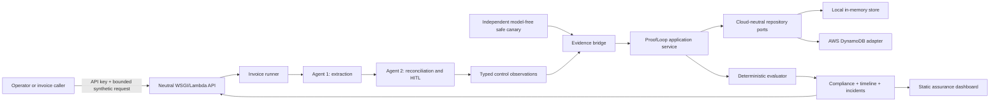
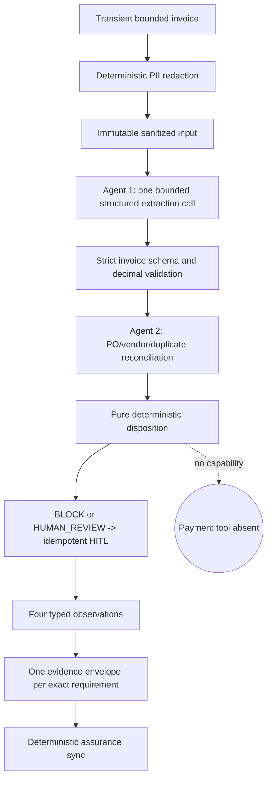
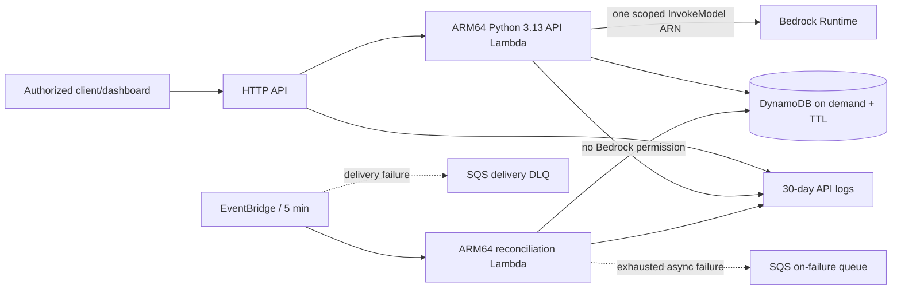

# ProofLoop

## Runtime-to-Compliance Evidence Assurance for Production AI Agents

**Problem statement:** PS-6.2  
**Submission status:** local code gate passed; ready for a bounded local demo;
blocked for deployment verification; not deployed  
**Evidence date:** 2026-07-18  
**Verified runtime:** Python 3.12.7, Node 22.18.0  
**Target runtime:** AWS Lambda Python 3.13 (planned, not yet verified)

> ProofLoop does not ask whether a guardrail is configured. It asks whether the
> guardrail executed, produced the intended outcome, and supplied fresh,
> consistent evidence for this exact customer boundary.

## 1. Selected problem and customer need

The original PS-6.2 assignment describes a false-assurance failure: an AI
system's governance dashboard can remain green even when an enforcement control
has silently stopped firing. The requested bridge must synchronize runtime state
into compliance, expose whether guardrails, PII redaction, audit logging and
human-in-the-loop controls are active, retain a seven-day status timeline, and
detect a simulated failure through AMBER/RED before verified recovery.

The affected customer is not only a compliance officer. It is also the operator
who must decide whether a workflow is safe to continue, the control owner who
must repair a failed mechanism, the auditor who must reproduce a past decision,
and the finance/platform owner who must understand model and infrastructure
cost. A false GREEN can permit an unsafe release or invoice decision. An
over-reactive shutdown can stop legitimate operations. A black-box score cannot
support either decision.

ProofLoop therefore makes three fixed truth decisions:

- **GREEN** requires fresh, correlated, exact-provenance PASS evidence for every
  declared requirement.
- **RED** means current, unambiguous evidence shows a required control failed.
- **AMBER** means assurance is uncertain: evidence is missing, stale,
  unavailable, conflicting, uncorrelated, obsolete, or not yet verified after
  remediation.

PASS is the only outcome that can support GREEN. This rule is deterministic and
not customer-configurable because allowing another outcome to count as success
would recreate unsupported assurance.

## 2. Customer as the fifth element

The product rule is that every material decision identifies the persona, the
uncertainty or harm, the evidence/recovery mechanism, and how value is measured
without unacceptable privacy, latency or cost.

| Decision | Customer outcome or prevented harm | Evidence and reversible recovery | Privacy, latency and cost |
|---|---|---|---|
| One event proves exactly one requirement | Prevents a single redaction event from also claiming HITL or audit success | Missing requirement-bound proof is AMBER; emit the correct event | Small identifiers and approved booleans only; no model call |
| Exact tenant/environment/boundary correlation | Prevents staging or another customer from greening production | `EVIDENCE_UNCORRELATED`; repair routing and re-emit | Constant-time local comparison |
| Exact per-requirement provenance | Prevents old prompt/model/tool/guardrail versions from proving the new deployment | `OBSOLETE_PROVENANCE`; deploy current versions and produce new evidence | Version labels, not prompt content or payloads |
| Uncertainty is AMBER, not shutdown or GREEN | Gives operators a proportionate safe action without surprise automation | Reason codes, affected controls and next safe action | Deterministic evaluation; no hidden model cost |
| Model-free safe canary | Actively tests the strict schema without customer impact | Reserved inconsistent synthetic invoice must be rejected; repair then rerun | No customer data, model call or business tool |
| Fresh proof after remediation | Prevents a configuration toggle from restoring GREEN prematurely | Declaration produces AMBER; evidence strictly after repair restores GREEN | Existing evidence path, no additional sensitive data |
| Cloud-neutral core | Protects customer exit and architecture choice | Ports/adapters allow local memory or DynamoDB without changing truth logic | Avoids lock-in and duplicated evaluator cost |

These choices implement seven permanent promises: no unsupported green, no
surprise shutdown, no black-box score, no vendor lock-in, no hidden cost, no
unsafe canary, and no premature recovery.

## 3. What is implemented

### Status vocabulary

- **Implemented:** code exists in the current tree.
- **Tested:** executed locally through Track E2 or covered by the 266-test suite.
- **Reviewed:** inspected against project rules and architecture handoffs.
- **Planned:** designed/documented but not executed in the target environment.
- **Not deployed:** no AWS resource or real Bedrock request was created.

| Capability | Status | Evidence boundary |
|---|---|---|
| Requirement-bound evidence, deterministic evaluator and customer explanations | Implemented / Tested / Reviewed | full local suite plus fixed-clock manual scenarios |
| In-memory application service, compliance read model, timeline and incidents | Implemented / Tested | API/integration tests and both demos |
| Authenticated WSGI API and generated OpenAPI | Implemented / Tested | live local HTTP QA |
| Static assurance dashboard | Implemented / Tested | real browser against local API; customer-safe screenshot |
| Corrected invoice extraction/reconciliation reference workflow | Implemented / Tested | fake provider, deterministic tools, privacy and failure regressions |
| Observation-to-evidence bridge and independent safe canary | Implemented / Tested | integration suite and replay/recovery QA |
| DynamoDB adapter and serverless SAM package | Implemented / structurally tested / Reviewed | adapter tests and template validator; no target deployment |
| Bedrock provider boundary | Implemented as adapter / stub-tested | no real provider call |
| Python 3.13 artifact and target AWS behavior | Planned / Not verified | Python 3.13 and SAM unavailable locally |
| Production DLP, real ERP/AP integration, actual MCP runtime | Planned / Not implemented | explicitly outside this slice |
| Production readiness | Not claimed | target-environment, CI and operational gates remain open |

## 4. Implemented architecture



The dependency direction is deliberate:

```text
domain <- application <- neutral API contracts
                    ^
                    |
 infrastructure composition -> agents / WSGI / Lambda / DynamoDB / Bedrock
```

The domain imports no AWS SDK, LLM client, agent framework, MCP runtime or
network package. Infrastructure joins the otherwise independent agent and
assurance layers. Local memory and DynamoDB implement the same ports, so the
truth algorithm does not change with the deployment platform.

## 5. Two-agent invoice reference workflow

The assignment's reference workload is extraction followed by reconciliation,
behind a human-approval boundary.



The LLM performs only structured extraction over redacted, explicitly untrusted
input. It cannot approve or pay; there is no payment tool or approval field. It
cannot set disposition, override PO/vendor/duplicate facts, bypass strict
validation, declare assurance GREEN, or alter reason codes and next safe action.

The runner emits four runtime observations:

| Observation | Exact requirement | Persisted fact |
|---|---|---|
| PII redaction | `invoice-pii-redaction-runtime` | `redaction_applied` |
| audit logging | `invoice-audit-logging-runtime` | `audit_recorded` |
| HITL boundary | `invoice-hitl-boundary-runtime` | `control_active` |
| extraction schema | `invoice-extraction-schema-runtime` | `schema_valid` |

A fifth, separate requirement - `invoice-extraction-safe-canary` - proves the
strict schema rejects a reserved inconsistent invoice with no model or business
tool call and no side effect. Normal runtime schema PASS cannot be relabeled as
canary PASS.

## 6. Deterministic assurance logic

For each declared requirement, the evaluator applies the same gates:

1. exact tenant, environment, assurance boundary, agent, workflow, execution,
   trace, control, requirement, evidence type and required source;
2. scoped logical identity and collision handling;
3. exact provenance version-vector equality;
4. acceptable event/ingestion clock skew;
5. freshness and minimum evidence count;
6. strictly post-remediation timing when a repair/version boundary exists;
7. fixed outcome semantics.

The provenance vector includes component, policy, schema, orchestration and
runtime-config versions plus applicable prompt, model/provider, tool-catalog,
MCP-server and guardrail versions. Deterministic components use `None` only for
genuinely inapplicable optional fields. Equality is exact; partial version
matching cannot produce GREEN.

Evidence is evaluated by event time, not ingestion order. Exact replay is a
duplicate. Reusing the same logical identity with a different payload is an
`EVIDENCE_CONFLICT`, stored as quarantine evidence and reduced to AMBER.

### Failure and recovery semantics

```mermaid
stateDiagram-v2
    [*] --> GREEN: all required fresh PASS proof
    GREEN --> AMBER: missing/stale/unavailable/conflicting proof
    GREEN --> RED: current required-control FAIL
    AMBER --> RED: explicit current FAIL or SLA escalation
    RED --> AMBER: remediation declared; proof still unverified
    AMBER --> GREEN: fresh current-provenance PASS after repair
```



The Track D2 fixed-clock invoice path produced
`GREEN -> RED -> AMBER -> GREEN`. The assignment-focused foundation demo also
produced `GREEN -> AMBER -> RED -> AMBER -> GREEN`, including a resolved
incident. Neither sequence is claimed as deployed telemetry.

## 7. API, state, persistence and error handling

The same application is exposed through local WSGI and packaged Lambda adapters.
The contract includes:

```text
GET  /healthz
POST /v1/evidence
POST /v1/agents/{agent_id}/sync
POST /v1/agents/{agent_id}/runs/invoice
GET  /v1/agents/{agent_id}/compliance
GET  /v1/agents/{agent_id}/timeline
GET  /v1/agents/{agent_id}/incidents
GET  /openapi.json
```

The API key has no default. The invoice route has the global 256 KB pre-read
limit plus a 100,000-character invoice-content limit. Stable errors distinguish
authentication required/failed, invalid request, not found and evidence
conflict without echoing request bodies or exception text.

The invoice request is transient. The supported persistence boundary stores
only validated evidence metadata, idempotency/conflict records, the compliance
read model, state revision, seven-day timeline and incidents. In the DynamoDB
design, tenant/environment/assurance boundary form the partition boundary;
definition discovery uses an `AgentRegistryIndex` query rather than a full-table
scan. Evidence/conflict/compliance records expire after eight days, timeline
entries after seven days, and incidents 30 days after open/resolution. DynamoDB
TTL is asynchronous eligibility, not an exact deletion guarantee.

State revision, compliance, timeline and incident effects commit atomically.
Timeline revision preserves commit order when timestamps are equal. A scheduled
five-minute reconciler discovers active scopes, refreshes the independent safe
canary and synchronizes status.

## 8. Privacy and prompt-injection boundary

The privacy strategy is data minimization, not a claim of production DLP.

- Email, phone and account-like patterns in the bounded demonstration set are
  deterministically redacted before the model call.
- The new sanitized invoice is immutable; prompt injection remains in the
  provider's untrusted input channel and never enters trusted instructions.
- The bridge discards free-text observation reasons, PII kinds/counts, prompts,
  hashes of prompts, invoice/redacted text, model output, tool payloads,
  exception messages and human-review ticket IDs.
- Evidence stores opaque identifiers, enums, UTC timestamps, exact version
  labels and approved immutable scalar booleans.
- The run response returns document reference, workflow stage/status,
  disposition, bounded model usage, tool names with enum outcomes, evidence
  receipts, a static safe action and the compliance read model.
- Captured WSGI logs contained method, path, status and response length only.

The Track D2 poisoned-input scenario and focused cross-layer privacy regressions
found no forbidden values in safe responses, repositories, dashboard-bound JSON
or captured logs. This supports the slice's contract; it is not measured
real-world PII recall and does not replace enterprise DLP/localization work.

## 9. Replay, canary, recovery and incidents

- **Exact evidence replay:** returns `DUPLICATE` and does not increase persisted
  evidence count.
- **Contradictory replay:** returns stable `EVIDENCE_CONFLICT`, preserves the
  collision for investigation and makes assurance AMBER.
- **Invoice command retry:** not yet caller-idempotent; the endpoint lacks a
  caller-supplied run key, so a later execution is a fresh observation.
- **Safe canary failure:** explicit current FAIL drives RED.
- **Remediation declaration:** never directly restores GREEN; it produces AMBER
  with `REMEDIATION_UNVERIFIED`.
- **Recovery:** requires fresh runtime and canary PASS evidence strictly after
  the repair boundary and matching current provenance.
- **Incidents:** deterministic transitions open/escalate/resolve according to
  the configured SLA policy; resolved records require resolution evidence.

## 10. Model-call, token and cost controls

Local demonstrations use `FakeModelProvider`, so Track D2 incurred no model cost.
The AWS path parameterizes model/inference-profile ID, exact ARN and region.

- extraction is the only model-dependent stage;
- default maximum model calls is 2, retries 1, output tokens 2,000 and model
  timeout 30 seconds (hard template cap 40 seconds);
- SDK-level Bedrock retries are disabled, so hidden retries cannot evade the
  agent's visible cap;
- a fresh provider adapter per invoice run limits warm-Lambda diagnostic state;
- reconciliation, policy, HITL routing, evidence, canary and assurance are
  deterministic and model-free;
- the API Lambda has reserved concurrency 5; scheduled reconciliation has 1;
- the real-model smoke is opt-in guarded and was not run.

This is bounded design evidence, not a measured AWS bill. The deployment
checklist requires an account budget, alert thresholds, cost owner and post-smoke
measurement before any production claim.

## 11. AWS serverless architecture



The package chooses request-priced HTTP API, Lambda, DynamoDB on-demand and two
SQS failure queues. It adds no NAT Gateway, OpenSearch, EKS, ECS, AgentCore,
Cognito, React deployment or always-on database. IAM separates the API and
scheduled functions; only the API role receives one exact
`bedrock:InvokeModel` resource, while the scheduler can query the registry index
but cannot scan the table or call Bedrock.

Two failure planes are explicit: EventBridge delivery failures and accepted
Lambda invocation failures. Each has bounded age/retries and a separate queue.
The package does not auto-redrive; production requires named queue owners,
alarms, inspection and a verified customer-safe replay procedure.

**Status:** template implemented and structurally validated; SAM target build,
CloudFormation, IAM behavior, live DynamoDB, alarms, DLQs and rollback are not
deployed or target-tested.

## 12. Market comparison and honest differentiation

The project does not claim continuous AI governance is new. The comparison below
is based on the public product documentation linked in the repository's dated
source register (2026-07-16).

| Product class | Publicly described strength | ProofLoop's narrower emphasis |
|---|---|---|
| [ServiceNow AI Control Tower](https://www.servicenow.com/products/ai-control-tower.html) | enterprise AI inventory, lifecycle governance, runtime monitoring and workflow integration | lightweight requirement-bound proof, active canary and recovery semantics without requiring a broad CMDB/workflow suite |
| [IBM watsonx.governance](https://www.ibm.com/products/watsonx-governance/model-governance) | factsheets, third-party governance, production metrics, model/agent monitoring and GRC | deterministic per-control execution proof and customer-owned evidence bundle rather than enterprise-suite breadth |
| [OneTrust Dynamic Risk Scoring](https://www.onetrust.com/solutions/ai-governance/dymanic-risk-scoring/) | production telemetry plus policy/business context and dynamic risk | inspectable PASS-only state reduction with exact reasons, evidence and verified recovery |
| [MLflow production tracing](https://mlflow.org/docs/latest/genai/tracing/prod-tracing) | open tracing, sampling, quality evaluation, latency/cost and feedback | treats traces as possible evidence but focuses on whether governance obligations executed |
| [LangSmith evaluation](https://docs.langchain.com/langsmith/evaluation) | offline/online evaluation, production traces, sampling and alerts | not a trace viewer; binds runtime observations to assurance requirements and incidents |

ProofLoop does not exceed ServiceNow or IBM in breadth, integrations, enterprise
workflow maturity or market validation. Its defensible distinction is the
clarity of a narrow decision: every GREEN has fresh exact proof; missing or
conflicting proof is AMBER; a failure is RED; and a repair is not trusted until
new evidence arrives. Whether this produces superior customer outcomes requires
real pilots, operational measurements and market validation not performed here.

## 13. Test and manual-QA evidence

The isolated Track E2 gate, using pytest 9.1.1, observed:

| Evidence | Result |
|---|---|
| Full pytest suite | **266 passed in 3.01s** |
| mypy | no issues in 88 source files |
| Ruff | all checks passed across `src` and `tests` |
| Bandit | passed with only two documented line-level B105 enum suppressions |
| strict dependency audit | no known vulnerabilities after disposable pip upgrade |
| compileall | passed |
| foundation and integrated demos | passed with required transition/failure scenes |
| template validator and Lambda source imports | passed |
| dashboard JavaScript syntax | passed |
| import-isolation, dangerous-code and secret scans | passed |
| manual API/dashboard scenarios | 14/14 passed at labeled HTTP/in-process/browser boundaries |
| focused privacy regressions | 2/2 passed |

The three local code blockers are closed. Authorized owners removed the unused
agent import, replaced the two assigned infrastructure lambdas with typed named
functions, added narrow line-level B105 suppressions without changing either
`PASS` serialization contract, and validated the declared
`pytest>=9.0.3,<10` policy in a clean disposable environment.

Deployment verification remains blocked because SAM CLI and Python 3.13 were
unavailable, the repository has no baseline/private CI history, and GitHub CI,
SAM container build, AWS deployment and real Bedrock were not run.

See `MANUAL_QA_EVIDENCE.md` for the exact scenario ledger and finding ownership.

## 14. Deployment and rollback approach

No deployment action was authorized or performed. The product owner states that
AWS activation is complete and Lambda is accessible in `ap-south-1`; Track E2
did not independently call AWS. The release owner must next reproduce the gate
on Python 3.13, validate/build with SAM in a container and verify both handlers
resolve from their build artifacts.

Before a change set is approved, humans must select the AWS region, stack name,
exact Bedrock model/inference-profile ID and ARN, secure API-key channel, browser
origin, tenant/boundary IDs, budget/alerts, log and DLQ owners, rollback owner,
private GitHub policy and CI authorization. The proposed change set and least-
privilege IAM must be reviewed before resource creation.

Post-deploy smoke uses synthetic data and checks auth, size caps, bounded model
usage, independent canary/reconciliation, dashboard state, metadata-only
persistence, safe logs, alarms and both DLQ paths. Rollback triggers include any
sensitive data leakage, cross-boundary assurance, unsupported GREEN, failed
recovery semantics, exceeded model caps, unexpected IAM/resources or unowned
failure messages. Rollback stops input/schedule, preserves customer-safe
forensics, rolls back to an exact reviewed artifact or deletes the explicit
stack after audit-retention approval.

The executable-but-unrun sequence is in
`DEPLOYMENT_AND_ROLLBACK_CHECKLIST.md`.

## 15. Limitations and roadmap

### Current limitations

- no AWS deployment, target Python 3.13 execution or real Bedrock invocation;
- no measured extraction accuracy, calibration, latency, throughput or AWS cost;
- bounded demonstration redactors, not production DLP;
- deterministic in-memory business tools, not live ERP/AP integrations;
- tool contracts resemble MCP boundaries, but there is no actual MCP runtime;
- API-key authentication only; production tenant authorization, WAF/rate limits,
  rotation and browser-origin hardening remain;
- no caller-supplied invoice run/idempotency key;
- no operator conflict-resolution use case; quarantined ambiguity stays AMBER;
- no deployed load/backpressure, DynamoDB scale, TTL, alarm or DLQ replay proof;
- repository has no baseline commit/private CI history;
- Python 3.13, SAM, protected CI and target-cloud operational gates are open.

### Roadmap in order

1. establish an explicitly authorized private baseline and protected CI;
2. reproduce on Python 3.13 and complete SAM target-build verification;
3. approve exact AWS/Bedrock/IAM/budget/owner choices and review the change set;
4. deploy to DEVELOPMENT, run bounded real-provider connectivity smoke and
   verify privacy, costs, alarms, DLQs and rollback;
5. add tenant authorization, key rotation, rate limits/backpressure and
   operational dashboards;
6. implement production connectors/MCP runtime only after privacy/idempotency
   contracts and customer recovery workflows are approved;
7. conduct representative extraction evaluation, threat modeling, load/failure
   tests and a rollback drill before any production-readiness claim.

## 16. Exact local demonstration

From the repository root:

```bash
python -m venv /tmp/proofloop-demo-venv
source /tmp/proofloop-demo-venv/bin/activate
python -m pip install -e ".[dev]"
export PROOFLOOP_API_KEY="choose-a-new-local-session-key"
export PROOFLOOP_MODEL_PROVIDER="fake"
python -m proofloop.api.server
```

In a second terminal:

```bash
python -m http.server 8000 --directory dashboard
```

In a third terminal, activate the same environment/key and run:

```bash
curl -sS -X POST \
  "http://127.0.0.1:8080/v1/agents/invoice-agent/runs/invoice?tenant_id=proofloop-demo&environment=LOCAL&assurance_boundary_id=proofloop-demo-local-invoices" \
  -H "X-API-Key: $PROOFLOOP_API_KEY" \
  -H "Content-Type: application/json" \
  --data '{"document_id":"synthetic-local-1","content_type":"TEXT_PLAIN","source_system":"local-demo","received_at":"2026-07-18T09:00:00Z","invoice_content":"Synthetic Acme Supplies invoice INV-9 for PO-1, total 105 USD."}'

python scripts/demo_agent_to_compliance.py
python scripts/demo_proofloop.py
```

Open `http://localhost:8000`, enter the same local key in the password field and
load the prefilled identity. Expected happy-path state is GREEN with four
controls, five supporting evidence references, a transition entry and an empty
incident state. Clear the saved key before capture or closeout. Use only
synthetic data; do not enable the real-model smoke.

For the narrated 6-8 minute sequence, expected output and recovery steps, use
`DEMO_RUNBOOK.md`.

## 17. Final verdict

ProofLoop provides a coherent, locally verified answer to the core PS-6.2
failure: runtime evidence, not configuration alone, determines assurance. The
slice demonstrates deterministic status, exact evidence binding, privacy-aware
agent integration, active canary failure, explainable timeline/incidents and
fresh-proof recovery.

**Ready for bounded local demonstration:** yes.  
**Local code gate:** passed under Python 3.12.7 with pytest 9.1.1.  
**Ready to publish or deploy:** no; baseline/CI, Python 3.13, SAM and reviewed
target-environment gates remain open.  
**AWS deployed or real Bedrock tested:** no.  
**Production ready:** no claim.
