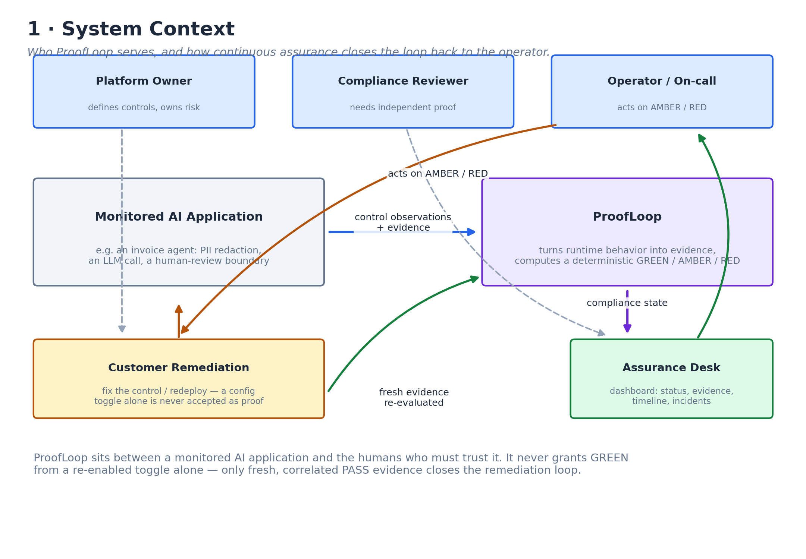
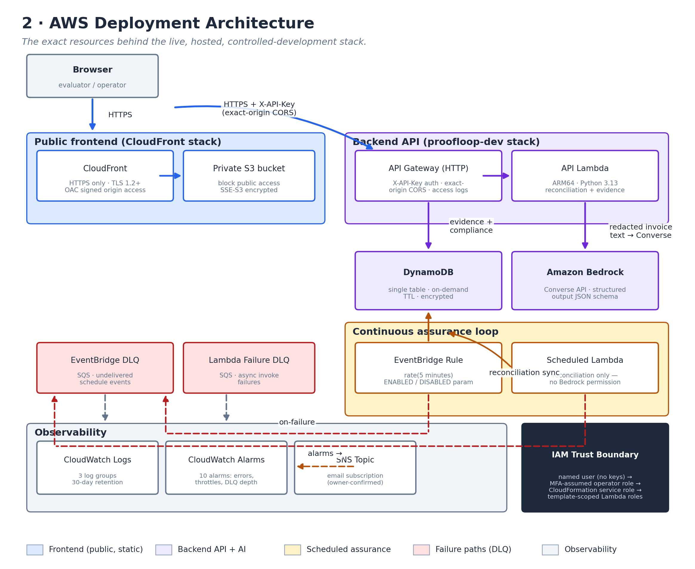
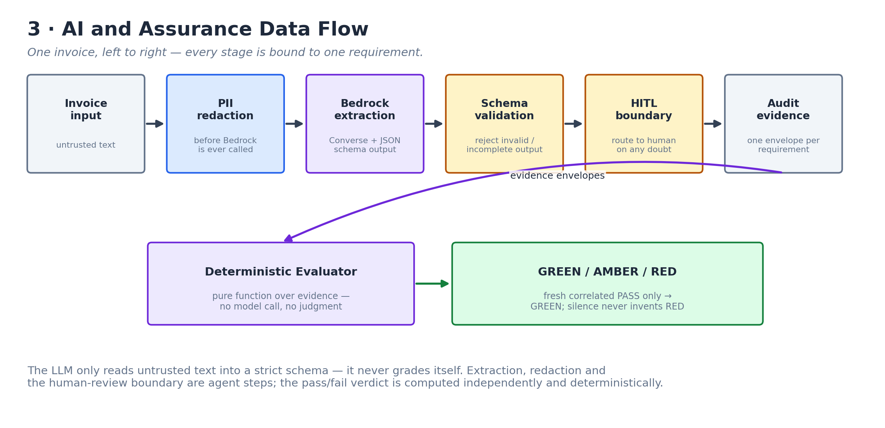
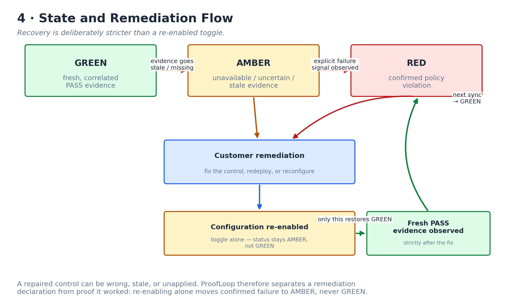
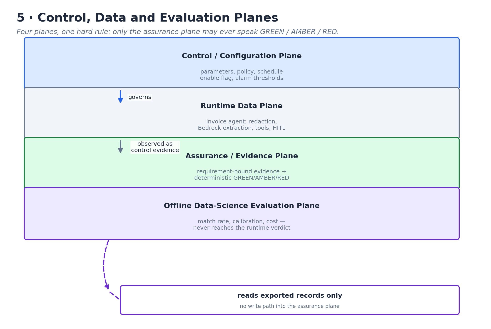
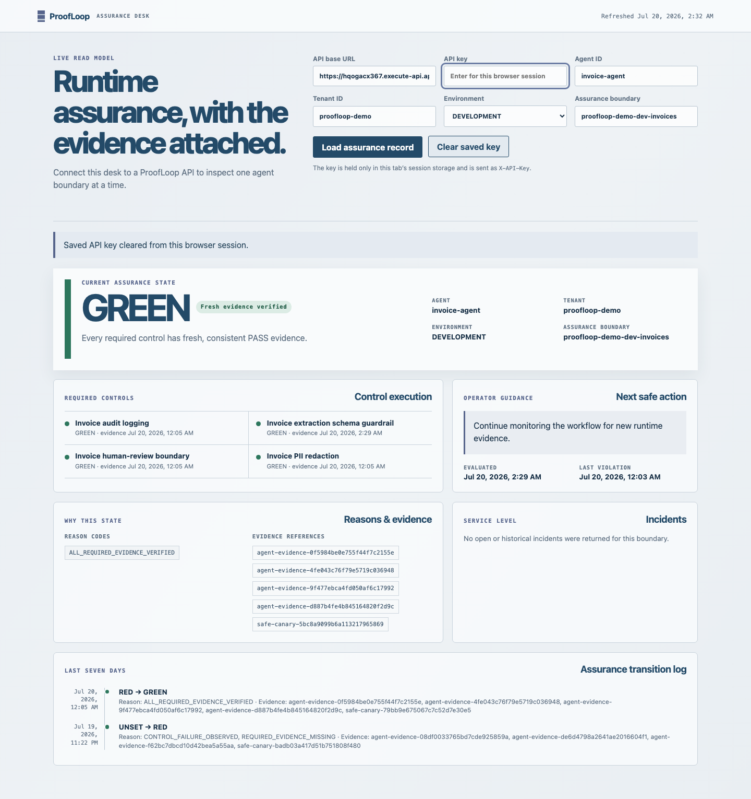

# ProofLoop

## Runtime-to-Compliance Evidence Assurance for Production AI Agents

- **Problem statement:** PS-6.2 — Runtime-to-Compliance Bridge
- **Submission status:** live, hosted, controlled-development AWS deployment, independently verified end to end; **not claimed production-ready**
- **Evidence date:** 2026-07-20
- **Hosted dashboard:** `https://d1xanj4sg0mmpg.cloudfront.net`
- **Verified runtime:** local Python 3.13, private CI on Python 3.12 (x64) and 3.13 (native ARM64), AWS Lambda Python 3.13 ARM64
- **Test suite:** 414 automated tests passing; mypy clean on 107 source files

*"ProofLoop does not ask whether a guardrail is configured. It asks whether the guardrail executed, produced the intended outcome, and supplied fresh, consistent evidence for this exact customer boundary — right now."*

---

## Executive summary

Organizations that put AI agents into real workflows face a specific,
under-solved trust problem: the dashboard that says a safety control is
"enabled" is not proof that the control actually ran, worked, and is still
working five minutes ago. ProofLoop closes that gap. It is a small, fully
deployed reference implementation — a two-agent invoice-processing workload
behind a deterministic evidence-assurance engine — that continuously
reconciles what a monitored AI application *actually did* into a
requirement-bound compliance record, and refuses to show GREEN unless every
required control has fresh, correlated, passing evidence.

Everything described in this document is deployed and independently verified
live in AWS as of the evidence date above: a public HTTPS dashboard, a real
Amazon Bedrock model call producing schema-constrained structured output, a
five-minute continuous-assurance schedule that has run unattended for hours,
and a full alarm/dead-letter-queue/observability stack. The system is a
**controlled development deployment**, not an enterprise production system —
every limitation is stated plainly in §16.

---

## 1. Why this problem matters

AI agents are increasingly given real authority: reading documents, calling
tools, and influencing decisions that used to require a human every time. The
control that keeps this safe — PII redaction before a model sees data, strict
output validation, a human-in-the-loop boundary before anything consequential
happens — is usually implemented once and then trusted forever. In practice,
controls silently regress: a redaction rule stops matching after a data-format
change, a validation step gets bypassed by a refactor, a human-review queue
fills up and nobody notices. A traditional configuration dashboard still shows
green, because it only reports what was *configured*, not what is currently
*happening*.

A platform team, compliance function, or engineering group that has deployed
— or plans to deploy — an autonomous or semi-autonomous AI workflow needs an
honest answer to "is this control actually working right now, and can I
prove it?" That is the problem ProofLoop is built to answer.

## 2. Customer as the fifth element

Every design decision in ProofLoop is evaluated against four concrete
personas plus the customer outcome each protects:

| Persona | Decision they need to make | What a false signal costs them |
|---|---|---|
| **Operator / on-call responder** | Is it safe to keep this workflow running right now? | Acting on stale green risks an unsafe release; acting on false red causes unnecessary downtime. |
| **Compliance / security reviewer** | Can I independently verify this control is working, not just configured? | A dashboard they cannot verify is not evidence — it is a claim. |
| **Control owner / engineer** | What exactly broke, and how do I prove my fix worked? | Without requirement-bound evidence, "I fixed it" is unverifiable. |
| **Platform / finance owner** | What does this cost, and is the blast radius bounded? | Unbounded model calls or unbounded IAM scope turn a safety feature into a new risk. |

The fifth element — the actual customer whose data or transaction is being
processed — is protected indirectly by every one of these decisions: PII
never reaches the model unredacted, a low-confidence or invalid extraction is
routed to a human instead of silently accepted, and no evidence bundle ever
contains raw customer content, only opaque, bounded metadata.

## 3. What was built

A two-agent invoice-processing reference workload, instrumented end to end
with runtime assurance:

1. **Extraction agent** — reads untrusted invoice text, redacts PII (email,
   phone, account-like patterns) before it is ever sent to the model, calls
   Amazon Bedrock through a cloud-neutral provider seam, and validates the
   response against a strict schema. Bedrock's native **Converse structured
   output** (`outputConfig.textFormat` JSON schema) constrains the model to
   emit schema-valid JSON; local Pydantic validation is still the
   authoritative safety boundary regardless of what the model returns.
2. **Reconciliation agent** — deterministically checks the extracted invoice
   against purchase-order and vendor records, detects duplicates, and computes
   a policy disposition (accept-for-evaluation / human-review / block). The
   disposition is a pure function of the facts; the model never decides it.
3. **Runtime telemetry collector** — every control execution (PII redaction,
   audit logging, human-review boundary, extraction-schema guardrail) emits
   exactly one control observation per requirement, mapped to one
   requirement-bound evidence envelope.
4. **Deterministic evaluator** — a pure function over accumulated evidence
   that computes GREEN / AMBER / RED per §8. It never calls a model and never
   receives raw customer data.
5. **Five-minute continuous-assurance loop** — a scheduled Lambda re-syncs
   compliance state on a fixed interval, independent of any single invoice
   request, so the compliance record reflects the *current* state of the
   system, not just the state at the last user action.
6. **Hosted assurance dashboard** — a static, CloudFront-hosted read-only
   client for the compliance API: current status, per-control evidence
   references, a seven-day transition timeline, and open incidents.
7. **Offline data-science evaluation layer** — a strictly separate, offline
   package for measuring extraction quality, calibration, and cost trade-offs
   against labeled datasets. It is structurally forbidden from influencing
   the runtime verdict (§13).

## 4. Architecture

### 4.1 System context

### 4.2 AWS deployment

### 4.3 AI and assurance data flow

### 4.4 State and remediation flow

### 4.5 Control, data and evaluation planes

<!--pagebreak-->

## 5. Why each AWS service was chosen

| Service | Role | Why this service specifically |
|---|---|---|
| **CloudFront + private S3 (OAC)** | Hosts the static dashboard | HTTPS-only, no public S3 bucket, signed origin access, cheap static hosting with global edge caching. |
| **API Gateway (HTTP API)** | Public backend entry point | Cheaper and simpler than REST API Gateway for a stateless JSON API; native CORS and access-log support. |
| **AWS Lambda (ARM64, Python 3.13)** | Runs both the API and the scheduled reconciliation handler | Pay-per-invocation, no idle server cost, ARM64 is cheaper per unit compute than x86 for this workload. |
| **Amazon Bedrock (Converse API)** | Structured invoice-field extraction | A managed, cloud-native model API with a vendor-neutral request shape and native structured-output support, avoiding a bespoke model-hosting stack. |
| **DynamoDB (single table, on-demand)** | Evidence, compliance, timeline, incident storage | Pay-per-request billing matches bursty invoice traffic; single-table design keeps the tenant/environment/boundary partitioning explicit and cheap to query. |
| **EventBridge (Scheduler rule)** | Five-minute continuous-assurance trigger | A managed, serverless cron with an explicit enabled/disabled state that is deployment-parameter-controlled, never a console toggle. |
| **SQS (two dead-letter queues)** | Capture undelivered schedule events and failed async Lambda invocations | Nothing about a safety-critical reconciliation loop should fail silently; a full DLQ is itself an alarm condition. |
| **CloudWatch (logs, alarms)** | Observability | 30-day log retention, ten alarms covering both Lambdas' errors/throttles, both DLQ depths, HTTP 5xx, and DynamoDB throttles. |
| **SNS** | Alarm notification | A single owner-confirmed email subscription; no additional paging infrastructure needed at this scale. |
| **IAM (named user → MFA-assumed role → CloudFormation service role → template-scoped Lambda roles)** | Deployment identity | No long-lived access keys anywhere in the deployment path; every role is scoped to the exact resources it needs. |

No relational database, container orchestrator, VPC/NAT, or always-on compute
was introduced — the entire stack is pay-per-use and serverless.

## 6. Deterministic assurance: GREEN / AMBER / RED

The verdict is a **pure function over accumulated evidence**. No model,
heuristic, or LLM ever declares GREEN. The rule is fixed and non-configurable:

- **GREEN** — every required evidence specification for the boundary has
  fresh, correlated, exact-provenance **PASS** evidence.
- **AMBER** — evidence is missing, stale, unavailable, or ambiguous. This is
  the default for uncertainty; ProofLoop never invents a RED from silence.
- **RED** — current, unambiguous evidence shows a required control failed.

This is why the reference implementation and its native invoice-extraction
guardrail can be simultaneously true: the Bedrock model may return
extraction output that fails strict schema validation on a hard case (a
legitimate, honest EXTRACTION_FAILED outcome, routed to human review) while
the **extraction-schema guardrail control** itself still reports PASS,
because a reserved, side-effect-free synthetic canary independently proves
the *validator* correctly rejects malformed data. Runtime business outcome
and control-correctness evidence are deliberately different questions.

## 7. Evidence provenance and correlation

Every accepted evidence event is a single, immutable, typed
`EvidenceEnvelope` bound to **exactly one requirement**, carrying tenant,
environment, assurance-boundary, workflow, execution, and provenance-vector
identity. GREEN requires exact provenance-vector equality — a prompt,
model, tool, or guardrail-version downgrade invalidates prior evidence and
forces AMBER until a new PASS is observed under the current provenance.
Duplicate reuse is scoped to tenant/environment/boundary/source/source-event;
legitimate reuse outside that scope never collides, and conflicting reuse
inside it is a safe `EVIDENCE_CONFLICT`, never a silent overwrite.

## 8. The 24-hour / 48-hour behavior

Per the assignment's simulated failure scenario: quiet evidence (no update)
crosses into AMBER as it ages past the freshness window — silence is treated
as uncertainty, never as proof of failure. A confirmed failure signal (the
reserved synthetic extraction-schema canary observing a deliberately
malformed synthetic payload) produces an explicit, evidence-backed RED. This
fidelity is intentional: ProofLoop's promise is "no unsupported GREEN," and
its mirror promise is "no unsupported RED" — a real failure signal drives
RED; the mere passage of time drives AMBER. Both the local virtual-clock
demo and the live deployment demonstrate the full
`GREEN → AMBER → RED → AMBER → GREEN` sequence.

## 9. Remediation is stricter than a toggle

A repaired control can be wrong, stale, or never actually applied.
Re-enabling a configuration flag alone moves a confirmed failure only to
AMBER (`REMEDIATION_UNVERIFIED`) — never directly back to GREEN. Only fresh,
correlated PASS evidence, observed **strictly after** the remediation
timestamp and matching the current provenance vector, restores GREEN on the
next sync. See diagram §4.4.

## 10. Live deployment evidence

- **Hosted dashboard:** `https://d1xanj4sg0mmpg.cloudfront.net` — public,
  HTTPS-only, served from a private S3 origin with no direct public access
  (verified: direct S3 requests return 403).
- **Backend stack:** CloudFormation `UPDATE_COMPLETE`, region `ap-south-1`.
- **Real Bedrock call:** a live authenticated invoice run completed with
  `model_calls ≥ 1` through Amazon Bedrock's Converse API using the
  Mistral AI Ministral 3B model, with redaction confirmed before the model
  call, strict schema validation, and a compliance record written to
  DynamoDB.
- **Continuous assurance loop:** the five-minute EventBridge schedule has run
  unattended for multiple hours, producing dozens of consecutive successful
  reconciliation cycles, all independently observed in CloudWatch logs.
- **Security posture verified live:** `GET /healthz` → 200 unauthenticated;
  a protected route without a key → 401; with a wrong key → 403; malformed
  input → bounded 400; CORS accepts only the exact CloudFront origin (no
  wildcard); the dashboard's API key lives only in browser session storage
  and is never present in any committed asset.

## 11. Privacy and security

- The invoice agent redacts email, phone, and account-like values from
  untrusted document text **before** it is passed to the model. This is a
  bounded regex-based safeguard, explicitly documented as such — not a claim
  of enterprise DLP coverage.
  - No raw invoice text, prompt, or model response is ever persisted to
  DynamoDB or logged. Evidence attributes are a canonical set of bounded
  scalar values only.
- Prompt-injection text embedded in invoice content is treated strictly as
  data: trusted instructions and untrusted content are sent in separate
  Converse API channels (`system` vs. `user`) and are never concatenated.
- The API key is a **controlled development/demo authentication boundary**,
  not enterprise identity — see §16 for the production roadmap.
- All AWS deployment identity uses named users with MFA and short-lived,
  browser-issued temporary credentials. No IAM access key exists anywhere in
  the deployment path.

## 12. Reliability, retries, and failure isolation

- Model calls are hard-capped (default: 2 calls, 1 retry) with a per-request
  timeout; retries only occur for classified-retryable provider errors.
- The scheduled reconciliation Lambda has **no Bedrock permission at all** —
  structurally enforced in the IAM template and covered by an automated test
  — so the continuous-assurance loop can never incur model cost or make a
  model call.
- Both the EventBridge delivery path and the Lambda asynchronous-invoke path
  have dedicated SQS dead-letter queues with bounded retry policies
  (`MaximumRetryAttempts: 2`, `MaximumEventAgeInSeconds: 300`); an
  undelivered event is captured, not dropped.
- DynamoDB writes use conditional/transactional operations so an optimistic
  compliance-state commit never silently overwrites a newer state with a
  stale one.

## 13. Monitoring, alerting, and cost control

Ten CloudWatch alarms cover both Lambda functions' errors and throttles, both
DLQ depths, EventBridge failed invocations, HTTP API 5xx responses, and
DynamoDB read/write throttles — all routed to a single SNS topic with an
owner-confirmed email subscription. Every alarm uses a five-minute evaluation
period and treats missing data as **not breaching**, so an absence of
traffic never falsely pages anyone.

Cost is bounded by design: on-demand DynamoDB billing, pay-per-invocation
Lambda, a hard per-request model-call cap, a maximum-output-token cap, no
reserved capacity, and no always-on compute. The reconciliation schedule
never invokes Bedrock. At current Mumbai pricing, a single invoice-extraction
call is on the order of a few hundredths of a cent; the ten standard alarms
are the only material fixed monthly cost (roughly the price of a cup of
coffee), and the deployment was operated under an explicit low-dollar
monthly soft ceiling for this controlled development phase.

## 14. Where data science belongs — and does not

A separate, offline evaluation package (`proofloop/evaluation`) measures
field-level and invoice-level match rate, numeric error, Brier score,
calibration bins, expected calibration error, selective risk, and a
cost-sensitive confidence-threshold sweep, plus latency/token/cost summaries.
It is **structurally isolated** from the runtime verdict path: the evaluation
package imports no runtime package, and no runtime package imports it — both
directions are enforced by automated import-scan tests, and the packaging
pipeline verifies it is excluded from the deployed Lambda artifacts.

Every metric explicitly separates what is *computed* from what is
*supported as a claim*: synthetic fixtures verify the harness is correct but
never support a production accuracy claim; a threshold tuned and reported on
the same data split is flagged as misuse and withheld; missing confidence is
excluded from calibration, never silently treated as zero. **No accuracy or
calibration claim from this evaluation layer is made about the live
deployment** — it exists to inform a human threshold or model decision,
never to alter a runtime compliance verdict.

## 15. Requirements-to-evidence traceability

| PS-6.2 requirement | Evidence |
|---|---|
| Compliance schema (`guardrails_active`, `last_violation_timestamp`, `pii_redaction_enabled`, `audit_logging_enabled`, `hitl_configured`, `overall_compliance_status`) | Implemented exactly, served by the live API and rendered on the hosted dashboard. |
| Runtime telemetry collector | Four control observations per invoice run, each mapped 1:1 to a requirement-bound evidence envelope; verified live. |
| Five-minute sync, 24h AMBER, 48h RED | EventBridge rule `rate(5 minutes)`, live and running; simulated-clock and live demos both show the full transition sequence. |
| Seven-day compliance timeline | Append-only, queryable, deduplicated; rendered on the dashboard. |
| SC1 — healthy controls → GREEN | Live: all four controls GREEN, dashboard confirms. |
| SC2 — simulated failure → AMBER by 24h, RED by 48h | Local virtual-clock test suite; fidelity note in §8. |
| SC3 — correct timeline transitions | Automated test coverage + live transition log (`RED → GREEN`, `UNSET → RED` observed in production). |
| SC4 — re-enable + fresh evidence → GREEN at next sync | §9; automated + local demo coverage. |
| Bonus — configurable SLA, automatic incidents | `IncidentSlaPolicy`, deterministic incident lifecycle; implemented and tested. |

## 16. Comparison with existing approaches

Configuration-management and CSPM/GRC dashboards report what a control was
*set up* to do and typically refresh on a slow, poll-driven cycle; they
cannot distinguish "still enforcing" from "quietly stopped working an hour
ago." General-purpose observability platforms can show that a service is
running, but do not bind a single proof to a single compliance requirement
with exact provenance, and do not encode a deterministic no-unsupported-green
rule. ProofLoop's contribution is narrow and specific: a small, auditable,
requirement-bound evidence model with a fixed, non-configurable
green/amber/red rule, applied to an AI agent workload where the
extra failure mode — a model silently drifting or an unvalidated output
slipping through — is otherwise invisible to conventional tooling. This is
not a claim of general superiority over mature observability or GRC
platforms; it is a complementary, deterministic assurance layer purpose-built
for AI-agent control verification.

## 17. Honest limitations and production roadmap

**This is a controlled development deployment. It is not claimed
production-ready.** Specifically, and without exception:

- Authentication is a single shared API key — a demo boundary, not
  production customer identity. A production deployment needs per-caller
  keys or a federated identity provider, request-level authorization, and
  key rotation.
- Business tools (purchase-order lookup, vendor lookup, duplicate check) are
  in-memory fixtures, not integrations with a real ERP/procurement system.
  There is no MCP runtime and no live enterprise tool connection.
- PII redaction is a bounded regex safeguard, not a certified DLP product.
- Lambda reserved concurrency is intentionally **not set**, because this
  controlled-development account's total concurrency limit (~10) is below
  AWS's minimum required headroom for any reservation; a production account
  needs a concurrency-limit increase and per-function reservations restored.
- No load testing, chaos testing, or multi-region failover has been
  performed.
- The evaluation layer's metrics are demonstrated correct on synthetic data
  only; no production accuracy or calibration claim is made anywhere in this
  document.
- CloudWatch retention (30 days), DynamoDB table deletion-on-stack-delete
  (with replace-retained data), and single-region deployment are
  controlled-development choices that a production rollout would revisit
  with the customer's actual retention, durability, and DR requirements.

None of these are hidden: the dashboard, the API, and this document state
them consistently, because an assurance product that overclaims its own
assurance would defeat its purpose.

## 18. Reproducibility and teardown

The complete source, tests, infrastructure templates, and deployment/teardown
scripts are included in the submission package. Anyone with their own AWS
account can: install dependencies (`pip install -e ".[dev]"`), run the full
test suite (`pytest`), run the local demo (`python scripts/demo_proofloop.py`),
validate and build the SAM template, and deploy both the backend
(`sam deploy`) and the frontend (`infra/scripts/deploy_dashboard.sh`) using
their own account, region, and parameters — no credentials, account IDs, or
secrets from this deployment are included anywhere in the package.

To tear down: `infra/scripts/delete_dashboard.sh` removes the frontend stack
and its S3 contents; `sam delete --stack-name <backend-stack-name>` removes
the backend stack (this deletes the DynamoDB table's live data per its
explicit `DeletionPolicy: Delete`, by design for a controlled-development
environment).
